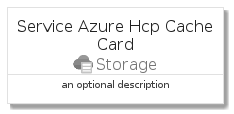
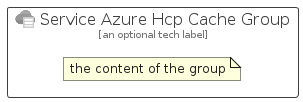

# ServiceAzureHcpCache


```text
azure-4/Item/Storage/ServiceAzureHcpCache
```

```text
include('azure-4/Item/Storage/ServiceAzureHcpCache')
```


| Illustration | ServiceAzureHcpCache | ServiceAzureHcpCacheCard | ServiceAzureHcpCacheGroup |
| :---: | :---: | :---: | :---: |
|  |  |  |  |


## ServiceAzureHcpCache

### Load remotely
```plantuml
@startuml
' configures the library
!global $LIB_BASE_LOCATION="https://github.com/tmorin/plantuml-libs/distribution"

' loads the library's bootstrap
!include $LIB_BASE_LOCATION/bootstrap.puml

' loads the package bootstrap
include('azure-4/bootstrap')

' loads the Item which embeds the element ServiceAzureHcpCache
include('azure-4/Item/Storage/ServiceAzureHcpCache')

' renders the element
ServiceAzureHcpCache('ServiceAzureHcpCache', 'Service Azure Hcp Cache', 'an optional tech label')
@enduml
```

### Load locally
```plantuml
@startuml
' configures the library
!global $INCLUSION_MODE="local"
!global $LIB_BASE_LOCATION="../../.."

' loads the library's bootstrap
!include $LIB_BASE_LOCATION/bootstrap.puml

' loads the package bootstrap
include('azure-4/bootstrap')

' loads the Item which embeds the element ServiceAzureHcpCache
include('azure-4/Item/Storage/ServiceAzureHcpCache')

' renders the element
ServiceAzureHcpCache('ServiceAzureHcpCache', 'Service Azure Hcp Cache', 'an optional tech label')
@enduml
```

## ServiceAzureHcpCacheCard

### Load remotely
```plantuml
@startuml
' configures the library
!global $LIB_BASE_LOCATION="https://github.com/tmorin/plantuml-libs/distribution"

' loads the library's bootstrap
!include $LIB_BASE_LOCATION/bootstrap.puml

' loads the package bootstrap
include('azure-4/bootstrap')

' loads the Item which embeds the element ServiceAzureHcpCacheCard
include('azure-4/Item/Storage/ServiceAzureHcpCache')

' renders the element
ServiceAzureHcpCacheCard('ServiceAzureHcpCacheCard', 'Service Azure Hcp Cache Card', 'an optional description')
@enduml
```

### Load locally
```plantuml
@startuml
' configures the library
!global $INCLUSION_MODE="local"
!global $LIB_BASE_LOCATION="../../.."

' loads the library's bootstrap
!include $LIB_BASE_LOCATION/bootstrap.puml

' loads the package bootstrap
include('azure-4/bootstrap')

' loads the Item which embeds the element ServiceAzureHcpCacheCard
include('azure-4/Item/Storage/ServiceAzureHcpCache')

' renders the element
ServiceAzureHcpCacheCard('ServiceAzureHcpCacheCard', 'Service Azure Hcp Cache Card', 'an optional description')
@enduml
```

## ServiceAzureHcpCacheGroup

### Load remotely
```plantuml
@startuml
' configures the library
!global $LIB_BASE_LOCATION="https://github.com/tmorin/plantuml-libs/distribution"

' loads the library's bootstrap
!include $LIB_BASE_LOCATION/bootstrap.puml

' loads the package bootstrap
include('azure-4/bootstrap')

' loads the Item which embeds the element ServiceAzureHcpCacheGroup
include('azure-4/Item/Storage/ServiceAzureHcpCache')

' renders the element
ServiceAzureHcpCacheGroup('ServiceAzureHcpCacheGroup', 'Service Azure Hcp Cache Group', 'an optional tech label') {
    note as note
        the content of the group
    end note
}
@enduml
```

### Load locally
```plantuml
@startuml
' configures the library
!global $INCLUSION_MODE="local"
!global $LIB_BASE_LOCATION="../../.."

' loads the library's bootstrap
!include $LIB_BASE_LOCATION/bootstrap.puml

' loads the package bootstrap
include('azure-4/bootstrap')

' loads the Item which embeds the element ServiceAzureHcpCacheGroup
include('azure-4/Item/Storage/ServiceAzureHcpCache')

' renders the element
ServiceAzureHcpCacheGroup('ServiceAzureHcpCacheGroup', 'Service Azure Hcp Cache Group', 'an optional tech label') {
    note as note
        the content of the group
    end note
}
@enduml
```

