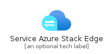
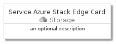
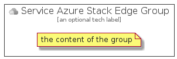

# ServiceAzureStackEdge


```text
azure-4/Item/Storage/ServiceAzureStackEdge
```

```text
include('azure-4/Item/Storage/ServiceAzureStackEdge')
```


| Illustration | ServiceAzureStackEdge | ServiceAzureStackEdgeCard | ServiceAzureStackEdgeGroup |
| :---: | :---: | :---: | :---: |
|  |  |  |  |


## ServiceAzureStackEdge

### Load remotely
```plantuml
@startuml
' configures the library
!global $LIB_BASE_LOCATION="https://github.com/tmorin/plantuml-libs/distribution"

' loads the library's bootstrap
!include $LIB_BASE_LOCATION/bootstrap.puml

' loads the package bootstrap
include('azure-4/bootstrap')

' loads the Item which embeds the element ServiceAzureStackEdge
include('azure-4/Item/Storage/ServiceAzureStackEdge')

' renders the element
ServiceAzureStackEdge('ServiceAzureStackEdge', 'Service Azure Stack Edge', 'an optional tech label')
@enduml
```

### Load locally
```plantuml
@startuml
' configures the library
!global $INCLUSION_MODE="local"
!global $LIB_BASE_LOCATION="../../.."

' loads the library's bootstrap
!include $LIB_BASE_LOCATION/bootstrap.puml

' loads the package bootstrap
include('azure-4/bootstrap')

' loads the Item which embeds the element ServiceAzureStackEdge
include('azure-4/Item/Storage/ServiceAzureStackEdge')

' renders the element
ServiceAzureStackEdge('ServiceAzureStackEdge', 'Service Azure Stack Edge', 'an optional tech label')
@enduml
```

## ServiceAzureStackEdgeCard

### Load remotely
```plantuml
@startuml
' configures the library
!global $LIB_BASE_LOCATION="https://github.com/tmorin/plantuml-libs/distribution"

' loads the library's bootstrap
!include $LIB_BASE_LOCATION/bootstrap.puml

' loads the package bootstrap
include('azure-4/bootstrap')

' loads the Item which embeds the element ServiceAzureStackEdgeCard
include('azure-4/Item/Storage/ServiceAzureStackEdge')

' renders the element
ServiceAzureStackEdgeCard('ServiceAzureStackEdgeCard', 'Service Azure Stack Edge Card', 'an optional description')
@enduml
```

### Load locally
```plantuml
@startuml
' configures the library
!global $INCLUSION_MODE="local"
!global $LIB_BASE_LOCATION="../../.."

' loads the library's bootstrap
!include $LIB_BASE_LOCATION/bootstrap.puml

' loads the package bootstrap
include('azure-4/bootstrap')

' loads the Item which embeds the element ServiceAzureStackEdgeCard
include('azure-4/Item/Storage/ServiceAzureStackEdge')

' renders the element
ServiceAzureStackEdgeCard('ServiceAzureStackEdgeCard', 'Service Azure Stack Edge Card', 'an optional description')
@enduml
```

## ServiceAzureStackEdgeGroup

### Load remotely
```plantuml
@startuml
' configures the library
!global $LIB_BASE_LOCATION="https://github.com/tmorin/plantuml-libs/distribution"

' loads the library's bootstrap
!include $LIB_BASE_LOCATION/bootstrap.puml

' loads the package bootstrap
include('azure-4/bootstrap')

' loads the Item which embeds the element ServiceAzureStackEdgeGroup
include('azure-4/Item/Storage/ServiceAzureStackEdge')

' renders the element
ServiceAzureStackEdgeGroup('ServiceAzureStackEdgeGroup', 'Service Azure Stack Edge Group', 'an optional tech label') {
    note as note
        the content of the group
    end note
}
@enduml
```

### Load locally
```plantuml
@startuml
' configures the library
!global $INCLUSION_MODE="local"
!global $LIB_BASE_LOCATION="../../.."

' loads the library's bootstrap
!include $LIB_BASE_LOCATION/bootstrap.puml

' loads the package bootstrap
include('azure-4/bootstrap')

' loads the Item which embeds the element ServiceAzureStackEdgeGroup
include('azure-4/Item/Storage/ServiceAzureStackEdge')

' renders the element
ServiceAzureStackEdgeGroup('ServiceAzureStackEdgeGroup', 'Service Azure Stack Edge Group', 'an optional tech label') {
    note as note
        the content of the group
    end note
}
@enduml
```

