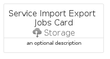
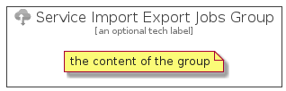

# ServiceImportExportJobs


```text
azure-4/Item/Storage/ServiceImportExportJobs
```

```text
include('azure-4/Item/Storage/ServiceImportExportJobs')
```


| Illustration | ServiceImportExportJobs | ServiceImportExportJobsCard | ServiceImportExportJobsGroup |
| :---: | :---: | :---: | :---: |
|  |  |  |  |


## ServiceImportExportJobs

### Load remotely
```plantuml
@startuml
' configures the library
!global $LIB_BASE_LOCATION="https://raw.githubusercontent.com/tmorin/plantuml-libs/master/distribution"

' loads the library's bootstrap
!include $LIB_BASE_LOCATION/bootstrap.puml

' loads the package bootstrap
include('azure-4/bootstrap')

' loads the Item which embeds the element ServiceImportExportJobs
include('azure-4/Item/Storage/ServiceImportExportJobs')

' renders the element
ServiceImportExportJobs('ServiceImportExportJobs', 'Service Import Export Jobs', 'an optional tech label', 'an optional description')
@enduml
```

### Load locally
```plantuml
@startuml
' configures the library
!global $INCLUSION_MODE="local"
!global $LIB_BASE_LOCATION="../../.."

' loads the library's bootstrap
!include $LIB_BASE_LOCATION/bootstrap.puml

' loads the package bootstrap
include('azure-4/bootstrap')

' loads the Item which embeds the element ServiceImportExportJobs
include('azure-4/Item/Storage/ServiceImportExportJobs')

' renders the element
ServiceImportExportJobs('ServiceImportExportJobs', 'Service Import Export Jobs', 'an optional tech label', 'an optional description')
@enduml
```

## ServiceImportExportJobsCard

### Load remotely
```plantuml
@startuml
' configures the library
!global $LIB_BASE_LOCATION="https://raw.githubusercontent.com/tmorin/plantuml-libs/master/distribution"

' loads the library's bootstrap
!include $LIB_BASE_LOCATION/bootstrap.puml

' loads the package bootstrap
include('azure-4/bootstrap')

' loads the Item which embeds the element ServiceImportExportJobsCard
include('azure-4/Item/Storage/ServiceImportExportJobs')

' renders the element
ServiceImportExportJobsCard('ServiceImportExportJobsCard', 'Service Import Export Jobs Card', 'an optional description')
@enduml
```

### Load locally
```plantuml
@startuml
' configures the library
!global $INCLUSION_MODE="local"
!global $LIB_BASE_LOCATION="../../.."

' loads the library's bootstrap
!include $LIB_BASE_LOCATION/bootstrap.puml

' loads the package bootstrap
include('azure-4/bootstrap')

' loads the Item which embeds the element ServiceImportExportJobsCard
include('azure-4/Item/Storage/ServiceImportExportJobs')

' renders the element
ServiceImportExportJobsCard('ServiceImportExportJobsCard', 'Service Import Export Jobs Card', 'an optional description')
@enduml
```

## ServiceImportExportJobsGroup

### Load remotely
```plantuml
@startuml
' configures the library
!global $LIB_BASE_LOCATION="https://raw.githubusercontent.com/tmorin/plantuml-libs/master/distribution"

' loads the library's bootstrap
!include $LIB_BASE_LOCATION/bootstrap.puml

' loads the package bootstrap
include('azure-4/bootstrap')

' loads the Item which embeds the element ServiceImportExportJobsGroup
include('azure-4/Item/Storage/ServiceImportExportJobs')

' renders the element
ServiceImportExportJobsGroup('ServiceImportExportJobsGroup', 'Service Import Export Jobs Group', 'an optional tech label') {
    note as note
        the content of the group
    end note
}
@enduml
```

### Load locally
```plantuml
@startuml
' configures the library
!global $INCLUSION_MODE="local"
!global $LIB_BASE_LOCATION="../../.."

' loads the library's bootstrap
!include $LIB_BASE_LOCATION/bootstrap.puml

' loads the package bootstrap
include('azure-4/bootstrap')

' loads the Item which embeds the element ServiceImportExportJobsGroup
include('azure-4/Item/Storage/ServiceImportExportJobs')

' renders the element
ServiceImportExportJobsGroup('ServiceImportExportJobsGroup', 'Service Import Export Jobs Group', 'an optional tech label') {
    note as note
        the content of the group
    end note
}
@enduml
```

