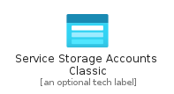
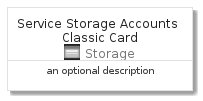
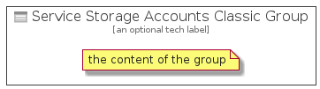

# ServiceStorageAccountsClassic


```text
azure-4/Item/Storage/ServiceStorageAccountsClassic
```

```text
include('azure-4/Item/Storage/ServiceStorageAccountsClassic')
```


| Illustration | ServiceStorageAccountsClassic | ServiceStorageAccountsClassicCard | ServiceStorageAccountsClassicGroup |
| :---: | :---: | :---: | :---: |
|  |  |  |  |


## ServiceStorageAccountsClassic

### Load remotely
```plantuml
@startuml
' configures the library
!global $LIB_BASE_LOCATION="https://raw.githubusercontent.com/tmorin/plantuml-libs/master/distribution"

' loads the library's bootstrap
!include $LIB_BASE_LOCATION/bootstrap.puml

' loads the package bootstrap
include('azure-4/bootstrap')

' loads the Item which embeds the element ServiceStorageAccountsClassic
include('azure-4/Item/Storage/ServiceStorageAccountsClassic')

' renders the element
ServiceStorageAccountsClassic('ServiceStorageAccountsClassic', 'Service Storage Accounts Classic', 'an optional tech label', 'an optional description')
@enduml
```

### Load locally
```plantuml
@startuml
' configures the library
!global $INCLUSION_MODE="local"
!global $LIB_BASE_LOCATION="../../.."

' loads the library's bootstrap
!include $LIB_BASE_LOCATION/bootstrap.puml

' loads the package bootstrap
include('azure-4/bootstrap')

' loads the Item which embeds the element ServiceStorageAccountsClassic
include('azure-4/Item/Storage/ServiceStorageAccountsClassic')

' renders the element
ServiceStorageAccountsClassic('ServiceStorageAccountsClassic', 'Service Storage Accounts Classic', 'an optional tech label', 'an optional description')
@enduml
```

## ServiceStorageAccountsClassicCard

### Load remotely
```plantuml
@startuml
' configures the library
!global $LIB_BASE_LOCATION="https://raw.githubusercontent.com/tmorin/plantuml-libs/master/distribution"

' loads the library's bootstrap
!include $LIB_BASE_LOCATION/bootstrap.puml

' loads the package bootstrap
include('azure-4/bootstrap')

' loads the Item which embeds the element ServiceStorageAccountsClassicCard
include('azure-4/Item/Storage/ServiceStorageAccountsClassic')

' renders the element
ServiceStorageAccountsClassicCard('ServiceStorageAccountsClassicCard', 'Service Storage Accounts Classic Card', 'an optional description')
@enduml
```

### Load locally
```plantuml
@startuml
' configures the library
!global $INCLUSION_MODE="local"
!global $LIB_BASE_LOCATION="../../.."

' loads the library's bootstrap
!include $LIB_BASE_LOCATION/bootstrap.puml

' loads the package bootstrap
include('azure-4/bootstrap')

' loads the Item which embeds the element ServiceStorageAccountsClassicCard
include('azure-4/Item/Storage/ServiceStorageAccountsClassic')

' renders the element
ServiceStorageAccountsClassicCard('ServiceStorageAccountsClassicCard', 'Service Storage Accounts Classic Card', 'an optional description')
@enduml
```

## ServiceStorageAccountsClassicGroup

### Load remotely
```plantuml
@startuml
' configures the library
!global $LIB_BASE_LOCATION="https://raw.githubusercontent.com/tmorin/plantuml-libs/master/distribution"

' loads the library's bootstrap
!include $LIB_BASE_LOCATION/bootstrap.puml

' loads the package bootstrap
include('azure-4/bootstrap')

' loads the Item which embeds the element ServiceStorageAccountsClassicGroup
include('azure-4/Item/Storage/ServiceStorageAccountsClassic')

' renders the element
ServiceStorageAccountsClassicGroup('ServiceStorageAccountsClassicGroup', 'Service Storage Accounts Classic Group', 'an optional tech label') {
    note as note
        the content of the group
    end note
}
@enduml
```

### Load locally
```plantuml
@startuml
' configures the library
!global $INCLUSION_MODE="local"
!global $LIB_BASE_LOCATION="../../.."

' loads the library's bootstrap
!include $LIB_BASE_LOCATION/bootstrap.puml

' loads the package bootstrap
include('azure-4/bootstrap')

' loads the Item which embeds the element ServiceStorageAccountsClassicGroup
include('azure-4/Item/Storage/ServiceStorageAccountsClassic')

' renders the element
ServiceStorageAccountsClassicGroup('ServiceStorageAccountsClassicGroup', 'Service Storage Accounts Classic Group', 'an optional tech label') {
    note as note
        the content of the group
    end note
}
@enduml
```

