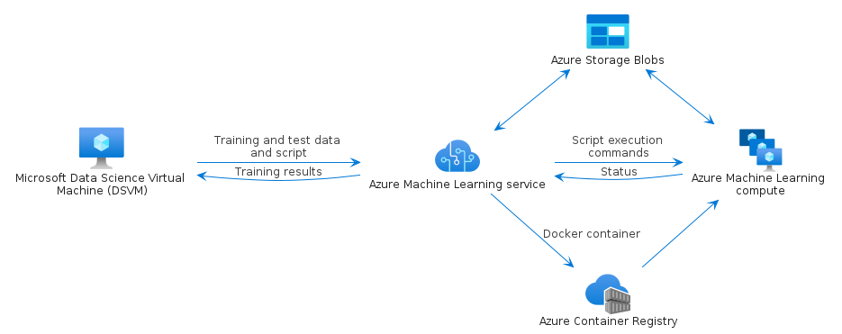

# azure-4

## Bootstrap

The bootstrap may provide PlantUML artifacts like constants, procedures or style statements.

```plantuml
' loads the azure-4 bootstrap
include('azure-4/bootstrap')
```


# Modules

The package provides 2 modules.

- [azure-4/Item](../azure-4/Item/README.md) with 342 items
- [azure-4/Group](../azure-4/Group/README.md) with 7 items


# Examples

The package provides 1 examples.

## Scikit Learn and Deep Learning

<br>
[The source file.](../azure-4/scikit_learn_and_deep_learning.puml)


