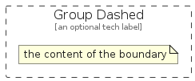
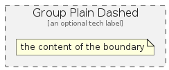
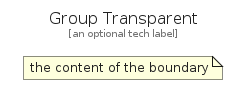

# Group

The module contains 7 items.

| |Name|
|:---:|---|
|  | [azure-6/Group/GroupDashed](../../azure-6/Group/GroupDashed.md) |
|  | [azure-6/Group/GroupDotted](../../azure-6/Group/GroupDotted.md) |
|  | [azure-6/Group/GroupNetwork](../../azure-6/Group/GroupNetwork.md) |
|  | [azure-6/Group/GroupPlain](../../azure-6/Group/GroupPlain.md) |
|  | [azure-6/Group/GroupPlainDashed](../../azure-6/Group/GroupPlainDashed.md) |
|  | [azure-6/Group/GroupPlainDotted](../../azure-6/Group/GroupPlainDotted.md) |
|  | [azure-6/Group/GroupTransparent](../../azure-6/Group/GroupTransparent.md) |

