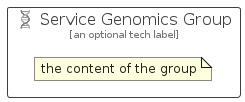

# ServiceGenomics


```text
azure-6/Item/AiMachineLearning/ServiceGenomics
```

```text
include('azure-6/Item/AiMachineLearning/ServiceGenomics')
```


| Illustration | ServiceGenomics | ServiceGenomicsCard | ServiceGenomicsGroup |
| :---: | :---: | :---: | :---: |
|  |  |  |  |


## ServiceGenomics

### Load remotely
```plantuml
@startuml
' configures the library
!global $LIB_BASE_LOCATION="https://raw.githubusercontent.com/tmorin/plantuml-libs/master/distribution"

' loads the library's bootstrap
!include $LIB_BASE_LOCATION/bootstrap.puml

' loads the package bootstrap
include('azure-6/bootstrap')

' loads the Item which embeds the element ServiceGenomics
include('azure-6/Item/AiMachineLearning/ServiceGenomics')

' renders the element
ServiceGenomics('ServiceGenomics', 'Service Genomics', 'an optional tech label', 'an optional description')
@enduml
```

### Load locally
```plantuml
@startuml
' configures the library
!global $INCLUSION_MODE="local"
!global $LIB_BASE_LOCATION="../../.."

' loads the library's bootstrap
!include $LIB_BASE_LOCATION/bootstrap.puml

' loads the package bootstrap
include('azure-6/bootstrap')

' loads the Item which embeds the element ServiceGenomics
include('azure-6/Item/AiMachineLearning/ServiceGenomics')

' renders the element
ServiceGenomics('ServiceGenomics', 'Service Genomics', 'an optional tech label', 'an optional description')
@enduml
```

## ServiceGenomicsCard

### Load remotely
```plantuml
@startuml
' configures the library
!global $LIB_BASE_LOCATION="https://raw.githubusercontent.com/tmorin/plantuml-libs/master/distribution"

' loads the library's bootstrap
!include $LIB_BASE_LOCATION/bootstrap.puml

' loads the package bootstrap
include('azure-6/bootstrap')

' loads the Item which embeds the element ServiceGenomicsCard
include('azure-6/Item/AiMachineLearning/ServiceGenomics')

' renders the element
ServiceGenomicsCard('ServiceGenomicsCard', 'Service Genomics Card', 'an optional description')
@enduml
```

### Load locally
```plantuml
@startuml
' configures the library
!global $INCLUSION_MODE="local"
!global $LIB_BASE_LOCATION="../../.."

' loads the library's bootstrap
!include $LIB_BASE_LOCATION/bootstrap.puml

' loads the package bootstrap
include('azure-6/bootstrap')

' loads the Item which embeds the element ServiceGenomicsCard
include('azure-6/Item/AiMachineLearning/ServiceGenomics')

' renders the element
ServiceGenomicsCard('ServiceGenomicsCard', 'Service Genomics Card', 'an optional description')
@enduml
```

## ServiceGenomicsGroup

### Load remotely
```plantuml
@startuml
' configures the library
!global $LIB_BASE_LOCATION="https://raw.githubusercontent.com/tmorin/plantuml-libs/master/distribution"

' loads the library's bootstrap
!include $LIB_BASE_LOCATION/bootstrap.puml

' loads the package bootstrap
include('azure-6/bootstrap')

' loads the Item which embeds the element ServiceGenomicsGroup
include('azure-6/Item/AiMachineLearning/ServiceGenomics')

' renders the element
ServiceGenomicsGroup('ServiceGenomicsGroup', 'Service Genomics Group', 'an optional tech label') {
    note as note
        the content of the group
    end note
}
@enduml
```

### Load locally
```plantuml
@startuml
' configures the library
!global $INCLUSION_MODE="local"
!global $LIB_BASE_LOCATION="../../.."

' loads the library's bootstrap
!include $LIB_BASE_LOCATION/bootstrap.puml

' loads the package bootstrap
include('azure-6/bootstrap')

' loads the Item which embeds the element ServiceGenomicsGroup
include('azure-6/Item/AiMachineLearning/ServiceGenomics')

' renders the element
ServiceGenomicsGroup('ServiceGenomicsGroup', 'Service Genomics Group', 'an optional tech label') {
    note as note
        the content of the group
    end note
}
@enduml
```

