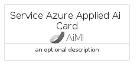
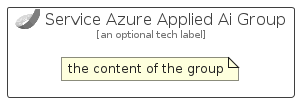

# ServiceAzureAppliedAi


```text
azure-6/Item/AiMl/ServiceAzureAppliedAi
```

```text
include('azure-6/Item/AiMl/ServiceAzureAppliedAi')
```


| Illustration | ServiceAzureAppliedAi | ServiceAzureAppliedAiCard | ServiceAzureAppliedAiGroup |
| :---: | :---: | :---: | :---: |
|  |  |  |  |


## ServiceAzureAppliedAi

### Load remotely
```plantuml
@startuml
' configures the library
!global $LIB_BASE_LOCATION="https://raw.githubusercontent.com/tmorin/plantuml-libs/master/distribution"

' loads the library's bootstrap
!include $LIB_BASE_LOCATION/bootstrap.puml

' loads the package bootstrap
include('azure-6/bootstrap')

' loads the Item which embeds the element ServiceAzureAppliedAi
include('azure-6/Item/AiMl/ServiceAzureAppliedAi')

' renders the element
ServiceAzureAppliedAi('ServiceAzureAppliedAi', 'Service Azure Applied Ai', 'an optional tech label', 'an optional description')
@enduml
```

### Load locally
```plantuml
@startuml
' configures the library
!global $INCLUSION_MODE="local"
!global $LIB_BASE_LOCATION="../../.."

' loads the library's bootstrap
!include $LIB_BASE_LOCATION/bootstrap.puml

' loads the package bootstrap
include('azure-6/bootstrap')

' loads the Item which embeds the element ServiceAzureAppliedAi
include('azure-6/Item/AiMl/ServiceAzureAppliedAi')

' renders the element
ServiceAzureAppliedAi('ServiceAzureAppliedAi', 'Service Azure Applied Ai', 'an optional tech label', 'an optional description')
@enduml
```

## ServiceAzureAppliedAiCard

### Load remotely
```plantuml
@startuml
' configures the library
!global $LIB_BASE_LOCATION="https://raw.githubusercontent.com/tmorin/plantuml-libs/master/distribution"

' loads the library's bootstrap
!include $LIB_BASE_LOCATION/bootstrap.puml

' loads the package bootstrap
include('azure-6/bootstrap')

' loads the Item which embeds the element ServiceAzureAppliedAiCard
include('azure-6/Item/AiMl/ServiceAzureAppliedAi')

' renders the element
ServiceAzureAppliedAiCard('ServiceAzureAppliedAiCard', 'Service Azure Applied Ai Card', 'an optional description')
@enduml
```

### Load locally
```plantuml
@startuml
' configures the library
!global $INCLUSION_MODE="local"
!global $LIB_BASE_LOCATION="../../.."

' loads the library's bootstrap
!include $LIB_BASE_LOCATION/bootstrap.puml

' loads the package bootstrap
include('azure-6/bootstrap')

' loads the Item which embeds the element ServiceAzureAppliedAiCard
include('azure-6/Item/AiMl/ServiceAzureAppliedAi')

' renders the element
ServiceAzureAppliedAiCard('ServiceAzureAppliedAiCard', 'Service Azure Applied Ai Card', 'an optional description')
@enduml
```

## ServiceAzureAppliedAiGroup

### Load remotely
```plantuml
@startuml
' configures the library
!global $LIB_BASE_LOCATION="https://raw.githubusercontent.com/tmorin/plantuml-libs/master/distribution"

' loads the library's bootstrap
!include $LIB_BASE_LOCATION/bootstrap.puml

' loads the package bootstrap
include('azure-6/bootstrap')

' loads the Item which embeds the element ServiceAzureAppliedAiGroup
include('azure-6/Item/AiMl/ServiceAzureAppliedAi')

' renders the element
ServiceAzureAppliedAiGroup('ServiceAzureAppliedAiGroup', 'Service Azure Applied Ai Group', 'an optional tech label') {
    note as note
        the content of the group
    end note
}
@enduml
```

### Load locally
```plantuml
@startuml
' configures the library
!global $INCLUSION_MODE="local"
!global $LIB_BASE_LOCATION="../../.."

' loads the library's bootstrap
!include $LIB_BASE_LOCATION/bootstrap.puml

' loads the package bootstrap
include('azure-6/bootstrap')

' loads the Item which embeds the element ServiceAzureAppliedAiGroup
include('azure-6/Item/AiMl/ServiceAzureAppliedAi')

' renders the element
ServiceAzureAppliedAiGroup('ServiceAzureAppliedAiGroup', 'Service Azure Applied Ai Group', 'an optional tech label') {
    note as note
        the content of the group
    end note
}
@enduml
```

