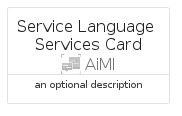

# ServiceLanguageServices


```text
azure-6/Item/AiMl/ServiceLanguageServices
```

```text
include('azure-6/Item/AiMl/ServiceLanguageServices')
```


| Illustration | ServiceLanguageServices | ServiceLanguageServicesCard | ServiceLanguageServicesGroup |
| :---: | :---: | :---: | :---: |
|  |  |  |  |


## ServiceLanguageServices

### Load remotely
```plantuml
@startuml
' configures the library
!global $LIB_BASE_LOCATION="https://raw.githubusercontent.com/tmorin/plantuml-libs/master/distribution"

' loads the library's bootstrap
!include $LIB_BASE_LOCATION/bootstrap.puml

' loads the package bootstrap
include('azure-6/bootstrap')

' loads the Item which embeds the element ServiceLanguageServices
include('azure-6/Item/AiMl/ServiceLanguageServices')

' renders the element
ServiceLanguageServices('ServiceLanguageServices', 'Service Language Services', 'an optional tech label', 'an optional description')
@enduml
```

### Load locally
```plantuml
@startuml
' configures the library
!global $INCLUSION_MODE="local"
!global $LIB_BASE_LOCATION="../../.."

' loads the library's bootstrap
!include $LIB_BASE_LOCATION/bootstrap.puml

' loads the package bootstrap
include('azure-6/bootstrap')

' loads the Item which embeds the element ServiceLanguageServices
include('azure-6/Item/AiMl/ServiceLanguageServices')

' renders the element
ServiceLanguageServices('ServiceLanguageServices', 'Service Language Services', 'an optional tech label', 'an optional description')
@enduml
```

## ServiceLanguageServicesCard

### Load remotely
```plantuml
@startuml
' configures the library
!global $LIB_BASE_LOCATION="https://raw.githubusercontent.com/tmorin/plantuml-libs/master/distribution"

' loads the library's bootstrap
!include $LIB_BASE_LOCATION/bootstrap.puml

' loads the package bootstrap
include('azure-6/bootstrap')

' loads the Item which embeds the element ServiceLanguageServicesCard
include('azure-6/Item/AiMl/ServiceLanguageServices')

' renders the element
ServiceLanguageServicesCard('ServiceLanguageServicesCard', 'Service Language Services Card', 'an optional description')
@enduml
```

### Load locally
```plantuml
@startuml
' configures the library
!global $INCLUSION_MODE="local"
!global $LIB_BASE_LOCATION="../../.."

' loads the library's bootstrap
!include $LIB_BASE_LOCATION/bootstrap.puml

' loads the package bootstrap
include('azure-6/bootstrap')

' loads the Item which embeds the element ServiceLanguageServicesCard
include('azure-6/Item/AiMl/ServiceLanguageServices')

' renders the element
ServiceLanguageServicesCard('ServiceLanguageServicesCard', 'Service Language Services Card', 'an optional description')
@enduml
```

## ServiceLanguageServicesGroup

### Load remotely
```plantuml
@startuml
' configures the library
!global $LIB_BASE_LOCATION="https://raw.githubusercontent.com/tmorin/plantuml-libs/master/distribution"

' loads the library's bootstrap
!include $LIB_BASE_LOCATION/bootstrap.puml

' loads the package bootstrap
include('azure-6/bootstrap')

' loads the Item which embeds the element ServiceLanguageServicesGroup
include('azure-6/Item/AiMl/ServiceLanguageServices')

' renders the element
ServiceLanguageServicesGroup('ServiceLanguageServicesGroup', 'Service Language Services Group', 'an optional tech label') {
    note as note
        the content of the group
    end note
}
@enduml
```

### Load locally
```plantuml
@startuml
' configures the library
!global $INCLUSION_MODE="local"
!global $LIB_BASE_LOCATION="../../.."

' loads the library's bootstrap
!include $LIB_BASE_LOCATION/bootstrap.puml

' loads the package bootstrap
include('azure-6/bootstrap')

' loads the Item which embeds the element ServiceLanguageServicesGroup
include('azure-6/Item/AiMl/ServiceLanguageServices')

' renders the element
ServiceLanguageServicesGroup('ServiceLanguageServicesGroup', 'Service Language Services Group', 'an optional tech label') {
    note as note
        the content of the group
    end note
}
@enduml
```

