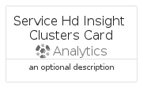
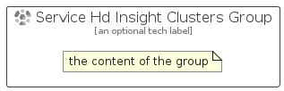

# ServiceHdInsightClusters


```text
azure-6/Item/Analytics/ServiceHdInsightClusters
```

```text
include('azure-6/Item/Analytics/ServiceHdInsightClusters')
```


| Illustration | ServiceHdInsightClusters | ServiceHdInsightClustersCard | ServiceHdInsightClustersGroup |
| :---: | :---: | :---: | :---: |
|  |  |  |  |


## ServiceHdInsightClusters

### Load remotely
```plantuml
@startuml
' configures the library
!global $LIB_BASE_LOCATION="https://raw.githubusercontent.com/tmorin/plantuml-libs/master/distribution"

' loads the library's bootstrap
!include $LIB_BASE_LOCATION/bootstrap.puml

' loads the package bootstrap
include('azure-6/bootstrap')

' loads the Item which embeds the element ServiceHdInsightClusters
include('azure-6/Item/Analytics/ServiceHdInsightClusters')

' renders the element
ServiceHdInsightClusters('ServiceHdInsightClusters', 'Service Hd Insight Clusters', 'an optional tech label', 'an optional description')
@enduml
```

### Load locally
```plantuml
@startuml
' configures the library
!global $INCLUSION_MODE="local"
!global $LIB_BASE_LOCATION="../../.."

' loads the library's bootstrap
!include $LIB_BASE_LOCATION/bootstrap.puml

' loads the package bootstrap
include('azure-6/bootstrap')

' loads the Item which embeds the element ServiceHdInsightClusters
include('azure-6/Item/Analytics/ServiceHdInsightClusters')

' renders the element
ServiceHdInsightClusters('ServiceHdInsightClusters', 'Service Hd Insight Clusters', 'an optional tech label', 'an optional description')
@enduml
```

## ServiceHdInsightClustersCard

### Load remotely
```plantuml
@startuml
' configures the library
!global $LIB_BASE_LOCATION="https://raw.githubusercontent.com/tmorin/plantuml-libs/master/distribution"

' loads the library's bootstrap
!include $LIB_BASE_LOCATION/bootstrap.puml

' loads the package bootstrap
include('azure-6/bootstrap')

' loads the Item which embeds the element ServiceHdInsightClustersCard
include('azure-6/Item/Analytics/ServiceHdInsightClusters')

' renders the element
ServiceHdInsightClustersCard('ServiceHdInsightClustersCard', 'Service Hd Insight Clusters Card', 'an optional description')
@enduml
```

### Load locally
```plantuml
@startuml
' configures the library
!global $INCLUSION_MODE="local"
!global $LIB_BASE_LOCATION="../../.."

' loads the library's bootstrap
!include $LIB_BASE_LOCATION/bootstrap.puml

' loads the package bootstrap
include('azure-6/bootstrap')

' loads the Item which embeds the element ServiceHdInsightClustersCard
include('azure-6/Item/Analytics/ServiceHdInsightClusters')

' renders the element
ServiceHdInsightClustersCard('ServiceHdInsightClustersCard', 'Service Hd Insight Clusters Card', 'an optional description')
@enduml
```

## ServiceHdInsightClustersGroup

### Load remotely
```plantuml
@startuml
' configures the library
!global $LIB_BASE_LOCATION="https://raw.githubusercontent.com/tmorin/plantuml-libs/master/distribution"

' loads the library's bootstrap
!include $LIB_BASE_LOCATION/bootstrap.puml

' loads the package bootstrap
include('azure-6/bootstrap')

' loads the Item which embeds the element ServiceHdInsightClustersGroup
include('azure-6/Item/Analytics/ServiceHdInsightClusters')

' renders the element
ServiceHdInsightClustersGroup('ServiceHdInsightClustersGroup', 'Service Hd Insight Clusters Group', 'an optional tech label') {
    note as note
        the content of the group
    end note
}
@enduml
```

### Load locally
```plantuml
@startuml
' configures the library
!global $INCLUSION_MODE="local"
!global $LIB_BASE_LOCATION="../../.."

' loads the library's bootstrap
!include $LIB_BASE_LOCATION/bootstrap.puml

' loads the package bootstrap
include('azure-6/bootstrap')

' loads the Item which embeds the element ServiceHdInsightClustersGroup
include('azure-6/Item/Analytics/ServiceHdInsightClusters')

' renders the element
ServiceHdInsightClustersGroup('ServiceHdInsightClustersGroup', 'Service Hd Insight Clusters Group', 'an optional tech label') {
    note as note
        the content of the group
    end note
}
@enduml
```

