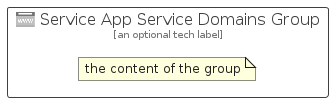

# ServiceAppServiceDomains


```text
azure-6/Item/AppServices/ServiceAppServiceDomains
```

```text
include('azure-6/Item/AppServices/ServiceAppServiceDomains')
```


| Illustration | ServiceAppServiceDomains | ServiceAppServiceDomainsCard | ServiceAppServiceDomainsGroup |
| :---: | :---: | :---: | :---: |
|  |  |  |  |


## ServiceAppServiceDomains

### Load remotely
```plantuml
@startuml
' configures the library
!global $LIB_BASE_LOCATION="https://raw.githubusercontent.com/tmorin/plantuml-libs/master/distribution"

' loads the library's bootstrap
!include $LIB_BASE_LOCATION/bootstrap.puml

' loads the package bootstrap
include('azure-6/bootstrap')

' loads the Item which embeds the element ServiceAppServiceDomains
include('azure-6/Item/AppServices/ServiceAppServiceDomains')

' renders the element
ServiceAppServiceDomains('ServiceAppServiceDomains', 'Service App Service Domains', 'an optional tech label', 'an optional description')
@enduml
```

### Load locally
```plantuml
@startuml
' configures the library
!global $INCLUSION_MODE="local"
!global $LIB_BASE_LOCATION="../../.."

' loads the library's bootstrap
!include $LIB_BASE_LOCATION/bootstrap.puml

' loads the package bootstrap
include('azure-6/bootstrap')

' loads the Item which embeds the element ServiceAppServiceDomains
include('azure-6/Item/AppServices/ServiceAppServiceDomains')

' renders the element
ServiceAppServiceDomains('ServiceAppServiceDomains', 'Service App Service Domains', 'an optional tech label', 'an optional description')
@enduml
```

## ServiceAppServiceDomainsCard

### Load remotely
```plantuml
@startuml
' configures the library
!global $LIB_BASE_LOCATION="https://raw.githubusercontent.com/tmorin/plantuml-libs/master/distribution"

' loads the library's bootstrap
!include $LIB_BASE_LOCATION/bootstrap.puml

' loads the package bootstrap
include('azure-6/bootstrap')

' loads the Item which embeds the element ServiceAppServiceDomainsCard
include('azure-6/Item/AppServices/ServiceAppServiceDomains')

' renders the element
ServiceAppServiceDomainsCard('ServiceAppServiceDomainsCard', 'Service App Service Domains Card', 'an optional description')
@enduml
```

### Load locally
```plantuml
@startuml
' configures the library
!global $INCLUSION_MODE="local"
!global $LIB_BASE_LOCATION="../../.."

' loads the library's bootstrap
!include $LIB_BASE_LOCATION/bootstrap.puml

' loads the package bootstrap
include('azure-6/bootstrap')

' loads the Item which embeds the element ServiceAppServiceDomainsCard
include('azure-6/Item/AppServices/ServiceAppServiceDomains')

' renders the element
ServiceAppServiceDomainsCard('ServiceAppServiceDomainsCard', 'Service App Service Domains Card', 'an optional description')
@enduml
```

## ServiceAppServiceDomainsGroup

### Load remotely
```plantuml
@startuml
' configures the library
!global $LIB_BASE_LOCATION="https://raw.githubusercontent.com/tmorin/plantuml-libs/master/distribution"

' loads the library's bootstrap
!include $LIB_BASE_LOCATION/bootstrap.puml

' loads the package bootstrap
include('azure-6/bootstrap')

' loads the Item which embeds the element ServiceAppServiceDomainsGroup
include('azure-6/Item/AppServices/ServiceAppServiceDomains')

' renders the element
ServiceAppServiceDomainsGroup('ServiceAppServiceDomainsGroup', 'Service App Service Domains Group', 'an optional tech label') {
    note as note
        the content of the group
    end note
}
@enduml
```

### Load locally
```plantuml
@startuml
' configures the library
!global $INCLUSION_MODE="local"
!global $LIB_BASE_LOCATION="../../.."

' loads the library's bootstrap
!include $LIB_BASE_LOCATION/bootstrap.puml

' loads the package bootstrap
include('azure-6/bootstrap')

' loads the Item which embeds the element ServiceAppServiceDomainsGroup
include('azure-6/Item/AppServices/ServiceAppServiceDomains')

' renders the element
ServiceAppServiceDomainsGroup('ServiceAppServiceDomainsGroup', 'Service App Service Domains Group', 'an optional tech label') {
    note as note
        the content of the group
    end note
}
@enduml
```

