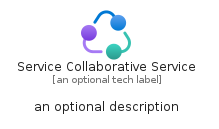
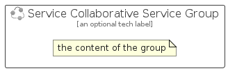

# ServiceCollaborativeService


```text
azure-6/Item/AzureEcosystem/ServiceCollaborativeService
```

```text
include('azure-6/Item/AzureEcosystem/ServiceCollaborativeService')
```


| Illustration | ServiceCollaborativeService | ServiceCollaborativeServiceCard | ServiceCollaborativeServiceGroup |
| :---: | :---: | :---: | :---: |
|  |  |  |  |


## ServiceCollaborativeService

### Load remotely
```plantuml
@startuml
' configures the library
!global $LIB_BASE_LOCATION="https://raw.githubusercontent.com/tmorin/plantuml-libs/master/distribution"

' loads the library's bootstrap
!include $LIB_BASE_LOCATION/bootstrap.puml

' loads the package bootstrap
include('azure-6/bootstrap')

' loads the Item which embeds the element ServiceCollaborativeService
include('azure-6/Item/AzureEcosystem/ServiceCollaborativeService')

' renders the element
ServiceCollaborativeService('ServiceCollaborativeService', 'Service Collaborative Service', 'an optional tech label', 'an optional description')
@enduml
```

### Load locally
```plantuml
@startuml
' configures the library
!global $INCLUSION_MODE="local"
!global $LIB_BASE_LOCATION="../../.."

' loads the library's bootstrap
!include $LIB_BASE_LOCATION/bootstrap.puml

' loads the package bootstrap
include('azure-6/bootstrap')

' loads the Item which embeds the element ServiceCollaborativeService
include('azure-6/Item/AzureEcosystem/ServiceCollaborativeService')

' renders the element
ServiceCollaborativeService('ServiceCollaborativeService', 'Service Collaborative Service', 'an optional tech label', 'an optional description')
@enduml
```

## ServiceCollaborativeServiceCard

### Load remotely
```plantuml
@startuml
' configures the library
!global $LIB_BASE_LOCATION="https://raw.githubusercontent.com/tmorin/plantuml-libs/master/distribution"

' loads the library's bootstrap
!include $LIB_BASE_LOCATION/bootstrap.puml

' loads the package bootstrap
include('azure-6/bootstrap')

' loads the Item which embeds the element ServiceCollaborativeServiceCard
include('azure-6/Item/AzureEcosystem/ServiceCollaborativeService')

' renders the element
ServiceCollaborativeServiceCard('ServiceCollaborativeServiceCard', 'Service Collaborative Service Card', 'an optional description')
@enduml
```

### Load locally
```plantuml
@startuml
' configures the library
!global $INCLUSION_MODE="local"
!global $LIB_BASE_LOCATION="../../.."

' loads the library's bootstrap
!include $LIB_BASE_LOCATION/bootstrap.puml

' loads the package bootstrap
include('azure-6/bootstrap')

' loads the Item which embeds the element ServiceCollaborativeServiceCard
include('azure-6/Item/AzureEcosystem/ServiceCollaborativeService')

' renders the element
ServiceCollaborativeServiceCard('ServiceCollaborativeServiceCard', 'Service Collaborative Service Card', 'an optional description')
@enduml
```

## ServiceCollaborativeServiceGroup

### Load remotely
```plantuml
@startuml
' configures the library
!global $LIB_BASE_LOCATION="https://raw.githubusercontent.com/tmorin/plantuml-libs/master/distribution"

' loads the library's bootstrap
!include $LIB_BASE_LOCATION/bootstrap.puml

' loads the package bootstrap
include('azure-6/bootstrap')

' loads the Item which embeds the element ServiceCollaborativeServiceGroup
include('azure-6/Item/AzureEcosystem/ServiceCollaborativeService')

' renders the element
ServiceCollaborativeServiceGroup('ServiceCollaborativeServiceGroup', 'Service Collaborative Service Group', 'an optional tech label') {
    note as note
        the content of the group
    end note
}
@enduml
```

### Load locally
```plantuml
@startuml
' configures the library
!global $INCLUSION_MODE="local"
!global $LIB_BASE_LOCATION="../../.."

' loads the library's bootstrap
!include $LIB_BASE_LOCATION/bootstrap.puml

' loads the package bootstrap
include('azure-6/bootstrap')

' loads the Item which embeds the element ServiceCollaborativeServiceGroup
include('azure-6/Item/AzureEcosystem/ServiceCollaborativeService')

' renders the element
ServiceCollaborativeServiceGroup('ServiceCollaborativeServiceGroup', 'Service Collaborative Service Group', 'an optional tech label') {
    note as note
        the content of the group
    end note
}
@enduml
```

