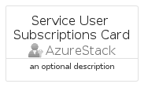

# ServiceUserSubscriptions


```text
azure-6/Item/AzureStack/ServiceUserSubscriptions
```

```text
include('azure-6/Item/AzureStack/ServiceUserSubscriptions')
```


| Illustration | ServiceUserSubscriptions | ServiceUserSubscriptionsCard | ServiceUserSubscriptionsGroup |
| :---: | :---: | :---: | :---: |
|  |  |  |  |


## ServiceUserSubscriptions

### Load remotely
```plantuml
@startuml
' configures the library
!global $LIB_BASE_LOCATION="https://raw.githubusercontent.com/tmorin/plantuml-libs/master/distribution"

' loads the library's bootstrap
!include $LIB_BASE_LOCATION/bootstrap.puml

' loads the package bootstrap
include('azure-6/bootstrap')

' loads the Item which embeds the element ServiceUserSubscriptions
include('azure-6/Item/AzureStack/ServiceUserSubscriptions')

' renders the element
ServiceUserSubscriptions('ServiceUserSubscriptions', 'Service User Subscriptions', 'an optional tech label', 'an optional description')
@enduml
```

### Load locally
```plantuml
@startuml
' configures the library
!global $INCLUSION_MODE="local"
!global $LIB_BASE_LOCATION="../../.."

' loads the library's bootstrap
!include $LIB_BASE_LOCATION/bootstrap.puml

' loads the package bootstrap
include('azure-6/bootstrap')

' loads the Item which embeds the element ServiceUserSubscriptions
include('azure-6/Item/AzureStack/ServiceUserSubscriptions')

' renders the element
ServiceUserSubscriptions('ServiceUserSubscriptions', 'Service User Subscriptions', 'an optional tech label', 'an optional description')
@enduml
```

## ServiceUserSubscriptionsCard

### Load remotely
```plantuml
@startuml
' configures the library
!global $LIB_BASE_LOCATION="https://raw.githubusercontent.com/tmorin/plantuml-libs/master/distribution"

' loads the library's bootstrap
!include $LIB_BASE_LOCATION/bootstrap.puml

' loads the package bootstrap
include('azure-6/bootstrap')

' loads the Item which embeds the element ServiceUserSubscriptionsCard
include('azure-6/Item/AzureStack/ServiceUserSubscriptions')

' renders the element
ServiceUserSubscriptionsCard('ServiceUserSubscriptionsCard', 'Service User Subscriptions Card', 'an optional description')
@enduml
```

### Load locally
```plantuml
@startuml
' configures the library
!global $INCLUSION_MODE="local"
!global $LIB_BASE_LOCATION="../../.."

' loads the library's bootstrap
!include $LIB_BASE_LOCATION/bootstrap.puml

' loads the package bootstrap
include('azure-6/bootstrap')

' loads the Item which embeds the element ServiceUserSubscriptionsCard
include('azure-6/Item/AzureStack/ServiceUserSubscriptions')

' renders the element
ServiceUserSubscriptionsCard('ServiceUserSubscriptionsCard', 'Service User Subscriptions Card', 'an optional description')
@enduml
```

## ServiceUserSubscriptionsGroup

### Load remotely
```plantuml
@startuml
' configures the library
!global $LIB_BASE_LOCATION="https://raw.githubusercontent.com/tmorin/plantuml-libs/master/distribution"

' loads the library's bootstrap
!include $LIB_BASE_LOCATION/bootstrap.puml

' loads the package bootstrap
include('azure-6/bootstrap')

' loads the Item which embeds the element ServiceUserSubscriptionsGroup
include('azure-6/Item/AzureStack/ServiceUserSubscriptions')

' renders the element
ServiceUserSubscriptionsGroup('ServiceUserSubscriptionsGroup', 'Service User Subscriptions Group', 'an optional tech label') {
    note as note
        the content of the group
    end note
}
@enduml
```

### Load locally
```plantuml
@startuml
' configures the library
!global $INCLUSION_MODE="local"
!global $LIB_BASE_LOCATION="../../.."

' loads the library's bootstrap
!include $LIB_BASE_LOCATION/bootstrap.puml

' loads the package bootstrap
include('azure-6/bootstrap')

' loads the Item which embeds the element ServiceUserSubscriptionsGroup
include('azure-6/Item/AzureStack/ServiceUserSubscriptions')

' renders the element
ServiceUserSubscriptionsGroup('ServiceUserSubscriptionsGroup', 'Service User Subscriptions Group', 'an optional tech label') {
    note as note
        the content of the group
    end note
}
@enduml
```

