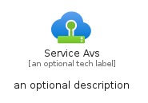
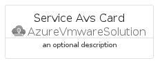
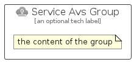

# ServiceAvs


```text
azure-6/Item/AzureVmwareSolution/ServiceAvs
```

```text
include('azure-6/Item/AzureVmwareSolution/ServiceAvs')
```


| Illustration | ServiceAvs | ServiceAvsCard | ServiceAvsGroup |
| :---: | :---: | :---: | :---: |
|  |  |  |  |


## ServiceAvs

### Load remotely
```plantuml
@startuml
' configures the library
!global $LIB_BASE_LOCATION="https://raw.githubusercontent.com/tmorin/plantuml-libs/master/distribution"

' loads the library's bootstrap
!include $LIB_BASE_LOCATION/bootstrap.puml

' loads the package bootstrap
include('azure-6/bootstrap')

' loads the Item which embeds the element ServiceAvs
include('azure-6/Item/AzureVmwareSolution/ServiceAvs')

' renders the element
ServiceAvs('ServiceAvs', 'Service Avs', 'an optional tech label', 'an optional description')
@enduml
```

### Load locally
```plantuml
@startuml
' configures the library
!global $INCLUSION_MODE="local"
!global $LIB_BASE_LOCATION="../../.."

' loads the library's bootstrap
!include $LIB_BASE_LOCATION/bootstrap.puml

' loads the package bootstrap
include('azure-6/bootstrap')

' loads the Item which embeds the element ServiceAvs
include('azure-6/Item/AzureVmwareSolution/ServiceAvs')

' renders the element
ServiceAvs('ServiceAvs', 'Service Avs', 'an optional tech label', 'an optional description')
@enduml
```

## ServiceAvsCard

### Load remotely
```plantuml
@startuml
' configures the library
!global $LIB_BASE_LOCATION="https://raw.githubusercontent.com/tmorin/plantuml-libs/master/distribution"

' loads the library's bootstrap
!include $LIB_BASE_LOCATION/bootstrap.puml

' loads the package bootstrap
include('azure-6/bootstrap')

' loads the Item which embeds the element ServiceAvsCard
include('azure-6/Item/AzureVmwareSolution/ServiceAvs')

' renders the element
ServiceAvsCard('ServiceAvsCard', 'Service Avs Card', 'an optional description')
@enduml
```

### Load locally
```plantuml
@startuml
' configures the library
!global $INCLUSION_MODE="local"
!global $LIB_BASE_LOCATION="../../.."

' loads the library's bootstrap
!include $LIB_BASE_LOCATION/bootstrap.puml

' loads the package bootstrap
include('azure-6/bootstrap')

' loads the Item which embeds the element ServiceAvsCard
include('azure-6/Item/AzureVmwareSolution/ServiceAvs')

' renders the element
ServiceAvsCard('ServiceAvsCard', 'Service Avs Card', 'an optional description')
@enduml
```

## ServiceAvsGroup

### Load remotely
```plantuml
@startuml
' configures the library
!global $LIB_BASE_LOCATION="https://raw.githubusercontent.com/tmorin/plantuml-libs/master/distribution"

' loads the library's bootstrap
!include $LIB_BASE_LOCATION/bootstrap.puml

' loads the package bootstrap
include('azure-6/bootstrap')

' loads the Item which embeds the element ServiceAvsGroup
include('azure-6/Item/AzureVmwareSolution/ServiceAvs')

' renders the element
ServiceAvsGroup('ServiceAvsGroup', 'Service Avs Group', 'an optional tech label') {
    note as note
        the content of the group
    end note
}
@enduml
```

### Load locally
```plantuml
@startuml
' configures the library
!global $INCLUSION_MODE="local"
!global $LIB_BASE_LOCATION="../../.."

' loads the library's bootstrap
!include $LIB_BASE_LOCATION/bootstrap.puml

' loads the package bootstrap
include('azure-6/bootstrap')

' loads the Item which embeds the element ServiceAvsGroup
include('azure-6/Item/AzureVmwareSolution/ServiceAvs')

' renders the element
ServiceAvsGroup('ServiceAvsGroup', 'Service Avs Group', 'an optional tech label') {
    note as note
        the content of the group
    end note
}
@enduml
```

