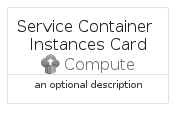
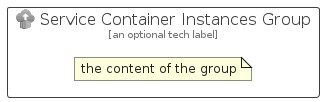

# ServiceContainerInstances


```text
azure-6/Item/Compute/ServiceContainerInstances
```

```text
include('azure-6/Item/Compute/ServiceContainerInstances')
```


| Illustration | ServiceContainerInstances | ServiceContainerInstancesCard | ServiceContainerInstancesGroup |
| :---: | :---: | :---: | :---: |
|  |  |  |  |


## ServiceContainerInstances

### Load remotely
```plantuml
@startuml
' configures the library
!global $LIB_BASE_LOCATION="https://raw.githubusercontent.com/tmorin/plantuml-libs/master/distribution"

' loads the library's bootstrap
!include $LIB_BASE_LOCATION/bootstrap.puml

' loads the package bootstrap
include('azure-6/bootstrap')

' loads the Item which embeds the element ServiceContainerInstances
include('azure-6/Item/Compute/ServiceContainerInstances')

' renders the element
ServiceContainerInstances('ServiceContainerInstances', 'Service Container Instances', 'an optional tech label', 'an optional description')
@enduml
```

### Load locally
```plantuml
@startuml
' configures the library
!global $INCLUSION_MODE="local"
!global $LIB_BASE_LOCATION="../../.."

' loads the library's bootstrap
!include $LIB_BASE_LOCATION/bootstrap.puml

' loads the package bootstrap
include('azure-6/bootstrap')

' loads the Item which embeds the element ServiceContainerInstances
include('azure-6/Item/Compute/ServiceContainerInstances')

' renders the element
ServiceContainerInstances('ServiceContainerInstances', 'Service Container Instances', 'an optional tech label', 'an optional description')
@enduml
```

## ServiceContainerInstancesCard

### Load remotely
```plantuml
@startuml
' configures the library
!global $LIB_BASE_LOCATION="https://raw.githubusercontent.com/tmorin/plantuml-libs/master/distribution"

' loads the library's bootstrap
!include $LIB_BASE_LOCATION/bootstrap.puml

' loads the package bootstrap
include('azure-6/bootstrap')

' loads the Item which embeds the element ServiceContainerInstancesCard
include('azure-6/Item/Compute/ServiceContainerInstances')

' renders the element
ServiceContainerInstancesCard('ServiceContainerInstancesCard', 'Service Container Instances Card', 'an optional description')
@enduml
```

### Load locally
```plantuml
@startuml
' configures the library
!global $INCLUSION_MODE="local"
!global $LIB_BASE_LOCATION="../../.."

' loads the library's bootstrap
!include $LIB_BASE_LOCATION/bootstrap.puml

' loads the package bootstrap
include('azure-6/bootstrap')

' loads the Item which embeds the element ServiceContainerInstancesCard
include('azure-6/Item/Compute/ServiceContainerInstances')

' renders the element
ServiceContainerInstancesCard('ServiceContainerInstancesCard', 'Service Container Instances Card', 'an optional description')
@enduml
```

## ServiceContainerInstancesGroup

### Load remotely
```plantuml
@startuml
' configures the library
!global $LIB_BASE_LOCATION="https://raw.githubusercontent.com/tmorin/plantuml-libs/master/distribution"

' loads the library's bootstrap
!include $LIB_BASE_LOCATION/bootstrap.puml

' loads the package bootstrap
include('azure-6/bootstrap')

' loads the Item which embeds the element ServiceContainerInstancesGroup
include('azure-6/Item/Compute/ServiceContainerInstances')

' renders the element
ServiceContainerInstancesGroup('ServiceContainerInstancesGroup', 'Service Container Instances Group', 'an optional tech label') {
    note as note
        the content of the group
    end note
}
@enduml
```

### Load locally
```plantuml
@startuml
' configures the library
!global $INCLUSION_MODE="local"
!global $LIB_BASE_LOCATION="../../.."

' loads the library's bootstrap
!include $LIB_BASE_LOCATION/bootstrap.puml

' loads the package bootstrap
include('azure-6/bootstrap')

' loads the Item which embeds the element ServiceContainerInstancesGroup
include('azure-6/Item/Compute/ServiceContainerInstances')

' renders the element
ServiceContainerInstancesGroup('ServiceContainerInstancesGroup', 'Service Container Instances Group', 'an optional tech label') {
    note as note
        the content of the group
    end note
}
@enduml
```

