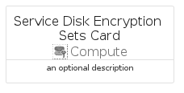
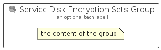

# ServiceDiskEncryptionSets


```text
azure-6/Item/Compute/ServiceDiskEncryptionSets
```

```text
include('azure-6/Item/Compute/ServiceDiskEncryptionSets')
```


| Illustration | ServiceDiskEncryptionSets | ServiceDiskEncryptionSetsCard | ServiceDiskEncryptionSetsGroup |
| :---: | :---: | :---: | :---: |
|  |  |  |  |


## ServiceDiskEncryptionSets

### Load remotely
```plantuml
@startuml
' configures the library
!global $LIB_BASE_LOCATION="https://raw.githubusercontent.com/tmorin/plantuml-libs/master/distribution"

' loads the library's bootstrap
!include $LIB_BASE_LOCATION/bootstrap.puml

' loads the package bootstrap
include('azure-6/bootstrap')

' loads the Item which embeds the element ServiceDiskEncryptionSets
include('azure-6/Item/Compute/ServiceDiskEncryptionSets')

' renders the element
ServiceDiskEncryptionSets('ServiceDiskEncryptionSets', 'Service Disk Encryption Sets', 'an optional tech label', 'an optional description')
@enduml
```

### Load locally
```plantuml
@startuml
' configures the library
!global $INCLUSION_MODE="local"
!global $LIB_BASE_LOCATION="../../.."

' loads the library's bootstrap
!include $LIB_BASE_LOCATION/bootstrap.puml

' loads the package bootstrap
include('azure-6/bootstrap')

' loads the Item which embeds the element ServiceDiskEncryptionSets
include('azure-6/Item/Compute/ServiceDiskEncryptionSets')

' renders the element
ServiceDiskEncryptionSets('ServiceDiskEncryptionSets', 'Service Disk Encryption Sets', 'an optional tech label', 'an optional description')
@enduml
```

## ServiceDiskEncryptionSetsCard

### Load remotely
```plantuml
@startuml
' configures the library
!global $LIB_BASE_LOCATION="https://raw.githubusercontent.com/tmorin/plantuml-libs/master/distribution"

' loads the library's bootstrap
!include $LIB_BASE_LOCATION/bootstrap.puml

' loads the package bootstrap
include('azure-6/bootstrap')

' loads the Item which embeds the element ServiceDiskEncryptionSetsCard
include('azure-6/Item/Compute/ServiceDiskEncryptionSets')

' renders the element
ServiceDiskEncryptionSetsCard('ServiceDiskEncryptionSetsCard', 'Service Disk Encryption Sets Card', 'an optional description')
@enduml
```

### Load locally
```plantuml
@startuml
' configures the library
!global $INCLUSION_MODE="local"
!global $LIB_BASE_LOCATION="../../.."

' loads the library's bootstrap
!include $LIB_BASE_LOCATION/bootstrap.puml

' loads the package bootstrap
include('azure-6/bootstrap')

' loads the Item which embeds the element ServiceDiskEncryptionSetsCard
include('azure-6/Item/Compute/ServiceDiskEncryptionSets')

' renders the element
ServiceDiskEncryptionSetsCard('ServiceDiskEncryptionSetsCard', 'Service Disk Encryption Sets Card', 'an optional description')
@enduml
```

## ServiceDiskEncryptionSetsGroup

### Load remotely
```plantuml
@startuml
' configures the library
!global $LIB_BASE_LOCATION="https://raw.githubusercontent.com/tmorin/plantuml-libs/master/distribution"

' loads the library's bootstrap
!include $LIB_BASE_LOCATION/bootstrap.puml

' loads the package bootstrap
include('azure-6/bootstrap')

' loads the Item which embeds the element ServiceDiskEncryptionSetsGroup
include('azure-6/Item/Compute/ServiceDiskEncryptionSets')

' renders the element
ServiceDiskEncryptionSetsGroup('ServiceDiskEncryptionSetsGroup', 'Service Disk Encryption Sets Group', 'an optional tech label') {
    note as note
        the content of the group
    end note
}
@enduml
```

### Load locally
```plantuml
@startuml
' configures the library
!global $INCLUSION_MODE="local"
!global $LIB_BASE_LOCATION="../../.."

' loads the library's bootstrap
!include $LIB_BASE_LOCATION/bootstrap.puml

' loads the package bootstrap
include('azure-6/bootstrap')

' loads the Item which embeds the element ServiceDiskEncryptionSetsGroup
include('azure-6/Item/Compute/ServiceDiskEncryptionSets')

' renders the element
ServiceDiskEncryptionSetsGroup('ServiceDiskEncryptionSetsGroup', 'Service Disk Encryption Sets Group', 'an optional tech label') {
    note as note
        the content of the group
    end note
}
@enduml
```

