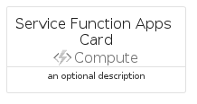

# ServiceFunctionApps


```text
azure-6/Item/Compute/ServiceFunctionApps
```

```text
include('azure-6/Item/Compute/ServiceFunctionApps')
```


| Illustration | ServiceFunctionApps | ServiceFunctionAppsCard | ServiceFunctionAppsGroup |
| :---: | :---: | :---: | :---: |
|  |  |  |  |


## ServiceFunctionApps

### Load remotely
```plantuml
@startuml
' configures the library
!global $LIB_BASE_LOCATION="https://raw.githubusercontent.com/tmorin/plantuml-libs/master/distribution"

' loads the library's bootstrap
!include $LIB_BASE_LOCATION/bootstrap.puml

' loads the package bootstrap
include('azure-6/bootstrap')

' loads the Item which embeds the element ServiceFunctionApps
include('azure-6/Item/Compute/ServiceFunctionApps')

' renders the element
ServiceFunctionApps('ServiceFunctionApps', 'Service Function Apps', 'an optional tech label', 'an optional description')
@enduml
```

### Load locally
```plantuml
@startuml
' configures the library
!global $INCLUSION_MODE="local"
!global $LIB_BASE_LOCATION="../../.."

' loads the library's bootstrap
!include $LIB_BASE_LOCATION/bootstrap.puml

' loads the package bootstrap
include('azure-6/bootstrap')

' loads the Item which embeds the element ServiceFunctionApps
include('azure-6/Item/Compute/ServiceFunctionApps')

' renders the element
ServiceFunctionApps('ServiceFunctionApps', 'Service Function Apps', 'an optional tech label', 'an optional description')
@enduml
```

## ServiceFunctionAppsCard

### Load remotely
```plantuml
@startuml
' configures the library
!global $LIB_BASE_LOCATION="https://raw.githubusercontent.com/tmorin/plantuml-libs/master/distribution"

' loads the library's bootstrap
!include $LIB_BASE_LOCATION/bootstrap.puml

' loads the package bootstrap
include('azure-6/bootstrap')

' loads the Item which embeds the element ServiceFunctionAppsCard
include('azure-6/Item/Compute/ServiceFunctionApps')

' renders the element
ServiceFunctionAppsCard('ServiceFunctionAppsCard', 'Service Function Apps Card', 'an optional description')
@enduml
```

### Load locally
```plantuml
@startuml
' configures the library
!global $INCLUSION_MODE="local"
!global $LIB_BASE_LOCATION="../../.."

' loads the library's bootstrap
!include $LIB_BASE_LOCATION/bootstrap.puml

' loads the package bootstrap
include('azure-6/bootstrap')

' loads the Item which embeds the element ServiceFunctionAppsCard
include('azure-6/Item/Compute/ServiceFunctionApps')

' renders the element
ServiceFunctionAppsCard('ServiceFunctionAppsCard', 'Service Function Apps Card', 'an optional description')
@enduml
```

## ServiceFunctionAppsGroup

### Load remotely
```plantuml
@startuml
' configures the library
!global $LIB_BASE_LOCATION="https://raw.githubusercontent.com/tmorin/plantuml-libs/master/distribution"

' loads the library's bootstrap
!include $LIB_BASE_LOCATION/bootstrap.puml

' loads the package bootstrap
include('azure-6/bootstrap')

' loads the Item which embeds the element ServiceFunctionAppsGroup
include('azure-6/Item/Compute/ServiceFunctionApps')

' renders the element
ServiceFunctionAppsGroup('ServiceFunctionAppsGroup', 'Service Function Apps Group', 'an optional tech label') {
    note as note
        the content of the group
    end note
}
@enduml
```

### Load locally
```plantuml
@startuml
' configures the library
!global $INCLUSION_MODE="local"
!global $LIB_BASE_LOCATION="../../.."

' loads the library's bootstrap
!include $LIB_BASE_LOCATION/bootstrap.puml

' loads the package bootstrap
include('azure-6/bootstrap')

' loads the Item which embeds the element ServiceFunctionAppsGroup
include('azure-6/Item/Compute/ServiceFunctionApps')

' renders the element
ServiceFunctionAppsGroup('ServiceFunctionAppsGroup', 'Service Function Apps Group', 'an optional tech label') {
    note as note
        the content of the group
    end note
}
@enduml
```

