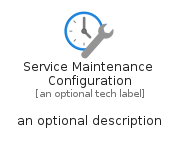

# ServiceMaintenanceConfiguration


```text
azure-6/Item/Compute/ServiceMaintenanceConfiguration
```

```text
include('azure-6/Item/Compute/ServiceMaintenanceConfiguration')
```


| Illustration | ServiceMaintenanceConfiguration | ServiceMaintenanceConfigurationCard | ServiceMaintenanceConfigurationGroup |
| :---: | :---: | :---: | :---: |
|  |  |  |  |


## ServiceMaintenanceConfiguration

### Load remotely
```plantuml
@startuml
' configures the library
!global $LIB_BASE_LOCATION="https://raw.githubusercontent.com/tmorin/plantuml-libs/master/distribution"

' loads the library's bootstrap
!include $LIB_BASE_LOCATION/bootstrap.puml

' loads the package bootstrap
include('azure-6/bootstrap')

' loads the Item which embeds the element ServiceMaintenanceConfiguration
include('azure-6/Item/Compute/ServiceMaintenanceConfiguration')

' renders the element
ServiceMaintenanceConfiguration('ServiceMaintenanceConfiguration', 'Service Maintenance Configuration', 'an optional tech label', 'an optional description')
@enduml
```

### Load locally
```plantuml
@startuml
' configures the library
!global $INCLUSION_MODE="local"
!global $LIB_BASE_LOCATION="../../.."

' loads the library's bootstrap
!include $LIB_BASE_LOCATION/bootstrap.puml

' loads the package bootstrap
include('azure-6/bootstrap')

' loads the Item which embeds the element ServiceMaintenanceConfiguration
include('azure-6/Item/Compute/ServiceMaintenanceConfiguration')

' renders the element
ServiceMaintenanceConfiguration('ServiceMaintenanceConfiguration', 'Service Maintenance Configuration', 'an optional tech label', 'an optional description')
@enduml
```

## ServiceMaintenanceConfigurationCard

### Load remotely
```plantuml
@startuml
' configures the library
!global $LIB_BASE_LOCATION="https://raw.githubusercontent.com/tmorin/plantuml-libs/master/distribution"

' loads the library's bootstrap
!include $LIB_BASE_LOCATION/bootstrap.puml

' loads the package bootstrap
include('azure-6/bootstrap')

' loads the Item which embeds the element ServiceMaintenanceConfigurationCard
include('azure-6/Item/Compute/ServiceMaintenanceConfiguration')

' renders the element
ServiceMaintenanceConfigurationCard('ServiceMaintenanceConfigurationCard', 'Service Maintenance Configuration Card', 'an optional description')
@enduml
```

### Load locally
```plantuml
@startuml
' configures the library
!global $INCLUSION_MODE="local"
!global $LIB_BASE_LOCATION="../../.."

' loads the library's bootstrap
!include $LIB_BASE_LOCATION/bootstrap.puml

' loads the package bootstrap
include('azure-6/bootstrap')

' loads the Item which embeds the element ServiceMaintenanceConfigurationCard
include('azure-6/Item/Compute/ServiceMaintenanceConfiguration')

' renders the element
ServiceMaintenanceConfigurationCard('ServiceMaintenanceConfigurationCard', 'Service Maintenance Configuration Card', 'an optional description')
@enduml
```

## ServiceMaintenanceConfigurationGroup

### Load remotely
```plantuml
@startuml
' configures the library
!global $LIB_BASE_LOCATION="https://raw.githubusercontent.com/tmorin/plantuml-libs/master/distribution"

' loads the library's bootstrap
!include $LIB_BASE_LOCATION/bootstrap.puml

' loads the package bootstrap
include('azure-6/bootstrap')

' loads the Item which embeds the element ServiceMaintenanceConfigurationGroup
include('azure-6/Item/Compute/ServiceMaintenanceConfiguration')

' renders the element
ServiceMaintenanceConfigurationGroup('ServiceMaintenanceConfigurationGroup', 'Service Maintenance Configuration Group', 'an optional tech label') {
    note as note
        the content of the group
    end note
}
@enduml
```

### Load locally
```plantuml
@startuml
' configures the library
!global $INCLUSION_MODE="local"
!global $LIB_BASE_LOCATION="../../.."

' loads the library's bootstrap
!include $LIB_BASE_LOCATION/bootstrap.puml

' loads the package bootstrap
include('azure-6/bootstrap')

' loads the Item which embeds the element ServiceMaintenanceConfigurationGroup
include('azure-6/Item/Compute/ServiceMaintenanceConfiguration')

' renders the element
ServiceMaintenanceConfigurationGroup('ServiceMaintenanceConfigurationGroup', 'Service Maintenance Configuration Group', 'an optional tech label') {
    note as note
        the content of the group
    end note
}
@enduml
```

