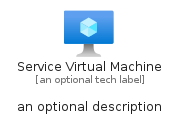

# ServiceVirtualMachine


```text
azure-6/Item/Compute/ServiceVirtualMachine
```

```text
include('azure-6/Item/Compute/ServiceVirtualMachine')
```


| Illustration | ServiceVirtualMachine | ServiceVirtualMachineCard | ServiceVirtualMachineGroup |
| :---: | :---: | :---: | :---: |
|  |  |  |  |


## ServiceVirtualMachine

### Load remotely
```plantuml
@startuml
' configures the library
!global $LIB_BASE_LOCATION="https://raw.githubusercontent.com/tmorin/plantuml-libs/master/distribution"

' loads the library's bootstrap
!include $LIB_BASE_LOCATION/bootstrap.puml

' loads the package bootstrap
include('azure-6/bootstrap')

' loads the Item which embeds the element ServiceVirtualMachine
include('azure-6/Item/Compute/ServiceVirtualMachine')

' renders the element
ServiceVirtualMachine('ServiceVirtualMachine', 'Service Virtual Machine', 'an optional tech label', 'an optional description')
@enduml
```

### Load locally
```plantuml
@startuml
' configures the library
!global $INCLUSION_MODE="local"
!global $LIB_BASE_LOCATION="../../.."

' loads the library's bootstrap
!include $LIB_BASE_LOCATION/bootstrap.puml

' loads the package bootstrap
include('azure-6/bootstrap')

' loads the Item which embeds the element ServiceVirtualMachine
include('azure-6/Item/Compute/ServiceVirtualMachine')

' renders the element
ServiceVirtualMachine('ServiceVirtualMachine', 'Service Virtual Machine', 'an optional tech label', 'an optional description')
@enduml
```

## ServiceVirtualMachineCard

### Load remotely
```plantuml
@startuml
' configures the library
!global $LIB_BASE_LOCATION="https://raw.githubusercontent.com/tmorin/plantuml-libs/master/distribution"

' loads the library's bootstrap
!include $LIB_BASE_LOCATION/bootstrap.puml

' loads the package bootstrap
include('azure-6/bootstrap')

' loads the Item which embeds the element ServiceVirtualMachineCard
include('azure-6/Item/Compute/ServiceVirtualMachine')

' renders the element
ServiceVirtualMachineCard('ServiceVirtualMachineCard', 'Service Virtual Machine Card', 'an optional description')
@enduml
```

### Load locally
```plantuml
@startuml
' configures the library
!global $INCLUSION_MODE="local"
!global $LIB_BASE_LOCATION="../../.."

' loads the library's bootstrap
!include $LIB_BASE_LOCATION/bootstrap.puml

' loads the package bootstrap
include('azure-6/bootstrap')

' loads the Item which embeds the element ServiceVirtualMachineCard
include('azure-6/Item/Compute/ServiceVirtualMachine')

' renders the element
ServiceVirtualMachineCard('ServiceVirtualMachineCard', 'Service Virtual Machine Card', 'an optional description')
@enduml
```

## ServiceVirtualMachineGroup

### Load remotely
```plantuml
@startuml
' configures the library
!global $LIB_BASE_LOCATION="https://raw.githubusercontent.com/tmorin/plantuml-libs/master/distribution"

' loads the library's bootstrap
!include $LIB_BASE_LOCATION/bootstrap.puml

' loads the package bootstrap
include('azure-6/bootstrap')

' loads the Item which embeds the element ServiceVirtualMachineGroup
include('azure-6/Item/Compute/ServiceVirtualMachine')

' renders the element
ServiceVirtualMachineGroup('ServiceVirtualMachineGroup', 'Service Virtual Machine Group', 'an optional tech label') {
    note as note
        the content of the group
    end note
}
@enduml
```

### Load locally
```plantuml
@startuml
' configures the library
!global $INCLUSION_MODE="local"
!global $LIB_BASE_LOCATION="../../.."

' loads the library's bootstrap
!include $LIB_BASE_LOCATION/bootstrap.puml

' loads the package bootstrap
include('azure-6/bootstrap')

' loads the Item which embeds the element ServiceVirtualMachineGroup
include('azure-6/Item/Compute/ServiceVirtualMachine')

' renders the element
ServiceVirtualMachineGroup('ServiceVirtualMachineGroup', 'Service Virtual Machine Group', 'an optional tech label') {
    note as note
        the content of the group
    end note
}
@enduml
```

