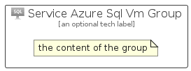

# ServiceAzureSqlVm


```text
azure-6/Item/Databases/ServiceAzureSqlVm
```

```text
include('azure-6/Item/Databases/ServiceAzureSqlVm')
```


| Illustration | ServiceAzureSqlVm | ServiceAzureSqlVmCard | ServiceAzureSqlVmGroup |
| :---: | :---: | :---: | :---: |
|  |  |  |  |


## ServiceAzureSqlVm

### Load remotely
```plantuml
@startuml
' configures the library
!global $LIB_BASE_LOCATION="https://raw.githubusercontent.com/tmorin/plantuml-libs/master/distribution"

' loads the library's bootstrap
!include $LIB_BASE_LOCATION/bootstrap.puml

' loads the package bootstrap
include('azure-6/bootstrap')

' loads the Item which embeds the element ServiceAzureSqlVm
include('azure-6/Item/Databases/ServiceAzureSqlVm')

' renders the element
ServiceAzureSqlVm('ServiceAzureSqlVm', 'Service Azure Sql Vm', 'an optional tech label', 'an optional description')
@enduml
```

### Load locally
```plantuml
@startuml
' configures the library
!global $INCLUSION_MODE="local"
!global $LIB_BASE_LOCATION="../../.."

' loads the library's bootstrap
!include $LIB_BASE_LOCATION/bootstrap.puml

' loads the package bootstrap
include('azure-6/bootstrap')

' loads the Item which embeds the element ServiceAzureSqlVm
include('azure-6/Item/Databases/ServiceAzureSqlVm')

' renders the element
ServiceAzureSqlVm('ServiceAzureSqlVm', 'Service Azure Sql Vm', 'an optional tech label', 'an optional description')
@enduml
```

## ServiceAzureSqlVmCard

### Load remotely
```plantuml
@startuml
' configures the library
!global $LIB_BASE_LOCATION="https://raw.githubusercontent.com/tmorin/plantuml-libs/master/distribution"

' loads the library's bootstrap
!include $LIB_BASE_LOCATION/bootstrap.puml

' loads the package bootstrap
include('azure-6/bootstrap')

' loads the Item which embeds the element ServiceAzureSqlVmCard
include('azure-6/Item/Databases/ServiceAzureSqlVm')

' renders the element
ServiceAzureSqlVmCard('ServiceAzureSqlVmCard', 'Service Azure Sql Vm Card', 'an optional description')
@enduml
```

### Load locally
```plantuml
@startuml
' configures the library
!global $INCLUSION_MODE="local"
!global $LIB_BASE_LOCATION="../../.."

' loads the library's bootstrap
!include $LIB_BASE_LOCATION/bootstrap.puml

' loads the package bootstrap
include('azure-6/bootstrap')

' loads the Item which embeds the element ServiceAzureSqlVmCard
include('azure-6/Item/Databases/ServiceAzureSqlVm')

' renders the element
ServiceAzureSqlVmCard('ServiceAzureSqlVmCard', 'Service Azure Sql Vm Card', 'an optional description')
@enduml
```

## ServiceAzureSqlVmGroup

### Load remotely
```plantuml
@startuml
' configures the library
!global $LIB_BASE_LOCATION="https://raw.githubusercontent.com/tmorin/plantuml-libs/master/distribution"

' loads the library's bootstrap
!include $LIB_BASE_LOCATION/bootstrap.puml

' loads the package bootstrap
include('azure-6/bootstrap')

' loads the Item which embeds the element ServiceAzureSqlVmGroup
include('azure-6/Item/Databases/ServiceAzureSqlVm')

' renders the element
ServiceAzureSqlVmGroup('ServiceAzureSqlVmGroup', 'Service Azure Sql Vm Group', 'an optional tech label') {
    note as note
        the content of the group
    end note
}
@enduml
```

### Load locally
```plantuml
@startuml
' configures the library
!global $INCLUSION_MODE="local"
!global $LIB_BASE_LOCATION="../../.."

' loads the library's bootstrap
!include $LIB_BASE_LOCATION/bootstrap.puml

' loads the package bootstrap
include('azure-6/bootstrap')

' loads the Item which embeds the element ServiceAzureSqlVmGroup
include('azure-6/Item/Databases/ServiceAzureSqlVm')

' renders the element
ServiceAzureSqlVmGroup('ServiceAzureSqlVmGroup', 'Service Azure Sql Vm Group', 'an optional tech label') {
    note as note
        the content of the group
    end note
}
@enduml
```

