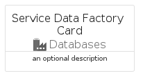

# ServiceDataFactory


```text
azure-6/Item/Databases/ServiceDataFactory
```

```text
include('azure-6/Item/Databases/ServiceDataFactory')
```


| Illustration | ServiceDataFactory | ServiceDataFactoryCard | ServiceDataFactoryGroup |
| :---: | :---: | :---: | :---: |
|  |  |  |  |


## ServiceDataFactory

### Load remotely
```plantuml
@startuml
' configures the library
!global $LIB_BASE_LOCATION="https://raw.githubusercontent.com/tmorin/plantuml-libs/master/distribution"

' loads the library's bootstrap
!include $LIB_BASE_LOCATION/bootstrap.puml

' loads the package bootstrap
include('azure-6/bootstrap')

' loads the Item which embeds the element ServiceDataFactory
include('azure-6/Item/Databases/ServiceDataFactory')

' renders the element
ServiceDataFactory('ServiceDataFactory', 'Service Data Factory', 'an optional tech label', 'an optional description')
@enduml
```

### Load locally
```plantuml
@startuml
' configures the library
!global $INCLUSION_MODE="local"
!global $LIB_BASE_LOCATION="../../.."

' loads the library's bootstrap
!include $LIB_BASE_LOCATION/bootstrap.puml

' loads the package bootstrap
include('azure-6/bootstrap')

' loads the Item which embeds the element ServiceDataFactory
include('azure-6/Item/Databases/ServiceDataFactory')

' renders the element
ServiceDataFactory('ServiceDataFactory', 'Service Data Factory', 'an optional tech label', 'an optional description')
@enduml
```

## ServiceDataFactoryCard

### Load remotely
```plantuml
@startuml
' configures the library
!global $LIB_BASE_LOCATION="https://raw.githubusercontent.com/tmorin/plantuml-libs/master/distribution"

' loads the library's bootstrap
!include $LIB_BASE_LOCATION/bootstrap.puml

' loads the package bootstrap
include('azure-6/bootstrap')

' loads the Item which embeds the element ServiceDataFactoryCard
include('azure-6/Item/Databases/ServiceDataFactory')

' renders the element
ServiceDataFactoryCard('ServiceDataFactoryCard', 'Service Data Factory Card', 'an optional description')
@enduml
```

### Load locally
```plantuml
@startuml
' configures the library
!global $INCLUSION_MODE="local"
!global $LIB_BASE_LOCATION="../../.."

' loads the library's bootstrap
!include $LIB_BASE_LOCATION/bootstrap.puml

' loads the package bootstrap
include('azure-6/bootstrap')

' loads the Item which embeds the element ServiceDataFactoryCard
include('azure-6/Item/Databases/ServiceDataFactory')

' renders the element
ServiceDataFactoryCard('ServiceDataFactoryCard', 'Service Data Factory Card', 'an optional description')
@enduml
```

## ServiceDataFactoryGroup

### Load remotely
```plantuml
@startuml
' configures the library
!global $LIB_BASE_LOCATION="https://raw.githubusercontent.com/tmorin/plantuml-libs/master/distribution"

' loads the library's bootstrap
!include $LIB_BASE_LOCATION/bootstrap.puml

' loads the package bootstrap
include('azure-6/bootstrap')

' loads the Item which embeds the element ServiceDataFactoryGroup
include('azure-6/Item/Databases/ServiceDataFactory')

' renders the element
ServiceDataFactoryGroup('ServiceDataFactoryGroup', 'Service Data Factory Group', 'an optional tech label') {
    note as note
        the content of the group
    end note
}
@enduml
```

### Load locally
```plantuml
@startuml
' configures the library
!global $INCLUSION_MODE="local"
!global $LIB_BASE_LOCATION="../../.."

' loads the library's bootstrap
!include $LIB_BASE_LOCATION/bootstrap.puml

' loads the package bootstrap
include('azure-6/bootstrap')

' loads the Item which embeds the element ServiceDataFactoryGroup
include('azure-6/Item/Databases/ServiceDataFactory')

' renders the element
ServiceDataFactoryGroup('ServiceDataFactoryGroup', 'Service Data Factory Group', 'an optional tech label') {
    note as note
        the content of the group
    end note
}
@enduml
```

