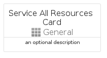

# ServiceAllResources


```text
azure-6/Item/General/ServiceAllResources
```

```text
include('azure-6/Item/General/ServiceAllResources')
```


| Illustration | ServiceAllResources | ServiceAllResourcesCard | ServiceAllResourcesGroup |
| :---: | :---: | :---: | :---: |
|  |  |  |  |


## ServiceAllResources

### Load remotely
```plantuml
@startuml
' configures the library
!global $LIB_BASE_LOCATION="https://raw.githubusercontent.com/tmorin/plantuml-libs/master/distribution"

' loads the library's bootstrap
!include $LIB_BASE_LOCATION/bootstrap.puml

' loads the package bootstrap
include('azure-6/bootstrap')

' loads the Item which embeds the element ServiceAllResources
include('azure-6/Item/General/ServiceAllResources')

' renders the element
ServiceAllResources('ServiceAllResources', 'Service All Resources', 'an optional tech label', 'an optional description')
@enduml
```

### Load locally
```plantuml
@startuml
' configures the library
!global $INCLUSION_MODE="local"
!global $LIB_BASE_LOCATION="../../.."

' loads the library's bootstrap
!include $LIB_BASE_LOCATION/bootstrap.puml

' loads the package bootstrap
include('azure-6/bootstrap')

' loads the Item which embeds the element ServiceAllResources
include('azure-6/Item/General/ServiceAllResources')

' renders the element
ServiceAllResources('ServiceAllResources', 'Service All Resources', 'an optional tech label', 'an optional description')
@enduml
```

## ServiceAllResourcesCard

### Load remotely
```plantuml
@startuml
' configures the library
!global $LIB_BASE_LOCATION="https://raw.githubusercontent.com/tmorin/plantuml-libs/master/distribution"

' loads the library's bootstrap
!include $LIB_BASE_LOCATION/bootstrap.puml

' loads the package bootstrap
include('azure-6/bootstrap')

' loads the Item which embeds the element ServiceAllResourcesCard
include('azure-6/Item/General/ServiceAllResources')

' renders the element
ServiceAllResourcesCard('ServiceAllResourcesCard', 'Service All Resources Card', 'an optional description')
@enduml
```

### Load locally
```plantuml
@startuml
' configures the library
!global $INCLUSION_MODE="local"
!global $LIB_BASE_LOCATION="../../.."

' loads the library's bootstrap
!include $LIB_BASE_LOCATION/bootstrap.puml

' loads the package bootstrap
include('azure-6/bootstrap')

' loads the Item which embeds the element ServiceAllResourcesCard
include('azure-6/Item/General/ServiceAllResources')

' renders the element
ServiceAllResourcesCard('ServiceAllResourcesCard', 'Service All Resources Card', 'an optional description')
@enduml
```

## ServiceAllResourcesGroup

### Load remotely
```plantuml
@startuml
' configures the library
!global $LIB_BASE_LOCATION="https://raw.githubusercontent.com/tmorin/plantuml-libs/master/distribution"

' loads the library's bootstrap
!include $LIB_BASE_LOCATION/bootstrap.puml

' loads the package bootstrap
include('azure-6/bootstrap')

' loads the Item which embeds the element ServiceAllResourcesGroup
include('azure-6/Item/General/ServiceAllResources')

' renders the element
ServiceAllResourcesGroup('ServiceAllResourcesGroup', 'Service All Resources Group', 'an optional tech label') {
    note as note
        the content of the group
    end note
}
@enduml
```

### Load locally
```plantuml
@startuml
' configures the library
!global $INCLUSION_MODE="local"
!global $LIB_BASE_LOCATION="../../.."

' loads the library's bootstrap
!include $LIB_BASE_LOCATION/bootstrap.puml

' loads the package bootstrap
include('azure-6/bootstrap')

' loads the Item which embeds the element ServiceAllResourcesGroup
include('azure-6/Item/General/ServiceAllResources')

' renders the element
ServiceAllResourcesGroup('ServiceAllResourcesGroup', 'Service All Resources Group', 'an optional tech label') {
    note as note
        the content of the group
    end note
}
@enduml
```

