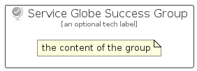

# ServiceGlobeSuccess


```text
azure-6/Item/General/ServiceGlobeSuccess
```

```text
include('azure-6/Item/General/ServiceGlobeSuccess')
```


| Illustration | ServiceGlobeSuccess | ServiceGlobeSuccessCard | ServiceGlobeSuccessGroup |
| :---: | :---: | :---: | :---: |
|  |  |  |  |


## ServiceGlobeSuccess

### Load remotely
```plantuml
@startuml
' configures the library
!global $LIB_BASE_LOCATION="https://raw.githubusercontent.com/tmorin/plantuml-libs/master/distribution"

' loads the library's bootstrap
!include $LIB_BASE_LOCATION/bootstrap.puml

' loads the package bootstrap
include('azure-6/bootstrap')

' loads the Item which embeds the element ServiceGlobeSuccess
include('azure-6/Item/General/ServiceGlobeSuccess')

' renders the element
ServiceGlobeSuccess('ServiceGlobeSuccess', 'Service Globe Success', 'an optional tech label', 'an optional description')
@enduml
```

### Load locally
```plantuml
@startuml
' configures the library
!global $INCLUSION_MODE="local"
!global $LIB_BASE_LOCATION="../../.."

' loads the library's bootstrap
!include $LIB_BASE_LOCATION/bootstrap.puml

' loads the package bootstrap
include('azure-6/bootstrap')

' loads the Item which embeds the element ServiceGlobeSuccess
include('azure-6/Item/General/ServiceGlobeSuccess')

' renders the element
ServiceGlobeSuccess('ServiceGlobeSuccess', 'Service Globe Success', 'an optional tech label', 'an optional description')
@enduml
```

## ServiceGlobeSuccessCard

### Load remotely
```plantuml
@startuml
' configures the library
!global $LIB_BASE_LOCATION="https://raw.githubusercontent.com/tmorin/plantuml-libs/master/distribution"

' loads the library's bootstrap
!include $LIB_BASE_LOCATION/bootstrap.puml

' loads the package bootstrap
include('azure-6/bootstrap')

' loads the Item which embeds the element ServiceGlobeSuccessCard
include('azure-6/Item/General/ServiceGlobeSuccess')

' renders the element
ServiceGlobeSuccessCard('ServiceGlobeSuccessCard', 'Service Globe Success Card', 'an optional description')
@enduml
```

### Load locally
```plantuml
@startuml
' configures the library
!global $INCLUSION_MODE="local"
!global $LIB_BASE_LOCATION="../../.."

' loads the library's bootstrap
!include $LIB_BASE_LOCATION/bootstrap.puml

' loads the package bootstrap
include('azure-6/bootstrap')

' loads the Item which embeds the element ServiceGlobeSuccessCard
include('azure-6/Item/General/ServiceGlobeSuccess')

' renders the element
ServiceGlobeSuccessCard('ServiceGlobeSuccessCard', 'Service Globe Success Card', 'an optional description')
@enduml
```

## ServiceGlobeSuccessGroup

### Load remotely
```plantuml
@startuml
' configures the library
!global $LIB_BASE_LOCATION="https://raw.githubusercontent.com/tmorin/plantuml-libs/master/distribution"

' loads the library's bootstrap
!include $LIB_BASE_LOCATION/bootstrap.puml

' loads the package bootstrap
include('azure-6/bootstrap')

' loads the Item which embeds the element ServiceGlobeSuccessGroup
include('azure-6/Item/General/ServiceGlobeSuccess')

' renders the element
ServiceGlobeSuccessGroup('ServiceGlobeSuccessGroup', 'Service Globe Success Group', 'an optional tech label') {
    note as note
        the content of the group
    end note
}
@enduml
```

### Load locally
```plantuml
@startuml
' configures the library
!global $INCLUSION_MODE="local"
!global $LIB_BASE_LOCATION="../../.."

' loads the library's bootstrap
!include $LIB_BASE_LOCATION/bootstrap.puml

' loads the package bootstrap
include('azure-6/bootstrap')

' loads the Item which embeds the element ServiceGlobeSuccessGroup
include('azure-6/Item/General/ServiceGlobeSuccess')

' renders the element
ServiceGlobeSuccessGroup('ServiceGlobeSuccessGroup', 'Service Globe Success Group', 'an optional tech label') {
    note as note
        the content of the group
    end note
}
@enduml
```

