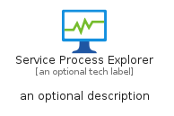

# ServiceProcessExplorer


```text
azure-6/Item/General/ServiceProcessExplorer
```

```text
include('azure-6/Item/General/ServiceProcessExplorer')
```


| Illustration | ServiceProcessExplorer | ServiceProcessExplorerCard | ServiceProcessExplorerGroup |
| :---: | :---: | :---: | :---: |
|  |  |  |  |


## ServiceProcessExplorer

### Load remotely
```plantuml
@startuml
' configures the library
!global $LIB_BASE_LOCATION="https://raw.githubusercontent.com/tmorin/plantuml-libs/master/distribution"

' loads the library's bootstrap
!include $LIB_BASE_LOCATION/bootstrap.puml

' loads the package bootstrap
include('azure-6/bootstrap')

' loads the Item which embeds the element ServiceProcessExplorer
include('azure-6/Item/General/ServiceProcessExplorer')

' renders the element
ServiceProcessExplorer('ServiceProcessExplorer', 'Service Process Explorer', 'an optional tech label', 'an optional description')
@enduml
```

### Load locally
```plantuml
@startuml
' configures the library
!global $INCLUSION_MODE="local"
!global $LIB_BASE_LOCATION="../../.."

' loads the library's bootstrap
!include $LIB_BASE_LOCATION/bootstrap.puml

' loads the package bootstrap
include('azure-6/bootstrap')

' loads the Item which embeds the element ServiceProcessExplorer
include('azure-6/Item/General/ServiceProcessExplorer')

' renders the element
ServiceProcessExplorer('ServiceProcessExplorer', 'Service Process Explorer', 'an optional tech label', 'an optional description')
@enduml
```

## ServiceProcessExplorerCard

### Load remotely
```plantuml
@startuml
' configures the library
!global $LIB_BASE_LOCATION="https://raw.githubusercontent.com/tmorin/plantuml-libs/master/distribution"

' loads the library's bootstrap
!include $LIB_BASE_LOCATION/bootstrap.puml

' loads the package bootstrap
include('azure-6/bootstrap')

' loads the Item which embeds the element ServiceProcessExplorerCard
include('azure-6/Item/General/ServiceProcessExplorer')

' renders the element
ServiceProcessExplorerCard('ServiceProcessExplorerCard', 'Service Process Explorer Card', 'an optional description')
@enduml
```

### Load locally
```plantuml
@startuml
' configures the library
!global $INCLUSION_MODE="local"
!global $LIB_BASE_LOCATION="../../.."

' loads the library's bootstrap
!include $LIB_BASE_LOCATION/bootstrap.puml

' loads the package bootstrap
include('azure-6/bootstrap')

' loads the Item which embeds the element ServiceProcessExplorerCard
include('azure-6/Item/General/ServiceProcessExplorer')

' renders the element
ServiceProcessExplorerCard('ServiceProcessExplorerCard', 'Service Process Explorer Card', 'an optional description')
@enduml
```

## ServiceProcessExplorerGroup

### Load remotely
```plantuml
@startuml
' configures the library
!global $LIB_BASE_LOCATION="https://raw.githubusercontent.com/tmorin/plantuml-libs/master/distribution"

' loads the library's bootstrap
!include $LIB_BASE_LOCATION/bootstrap.puml

' loads the package bootstrap
include('azure-6/bootstrap')

' loads the Item which embeds the element ServiceProcessExplorerGroup
include('azure-6/Item/General/ServiceProcessExplorer')

' renders the element
ServiceProcessExplorerGroup('ServiceProcessExplorerGroup', 'Service Process Explorer Group', 'an optional tech label') {
    note as note
        the content of the group
    end note
}
@enduml
```

### Load locally
```plantuml
@startuml
' configures the library
!global $INCLUSION_MODE="local"
!global $LIB_BASE_LOCATION="../../.."

' loads the library's bootstrap
!include $LIB_BASE_LOCATION/bootstrap.puml

' loads the package bootstrap
include('azure-6/bootstrap')

' loads the Item which embeds the element ServiceProcessExplorerGroup
include('azure-6/Item/General/ServiceProcessExplorer')

' renders the element
ServiceProcessExplorerGroup('ServiceProcessExplorerGroup', 'Service Process Explorer Group', 'an optional tech label') {
    note as note
        the content of the group
    end note
}
@enduml
```

