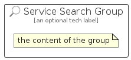

# ServiceSearch


```text
azure-6/Item/General/ServiceSearch
```

```text
include('azure-6/Item/General/ServiceSearch')
```


| Illustration | ServiceSearch | ServiceSearchCard | ServiceSearchGroup |
| :---: | :---: | :---: | :---: |
|  |  |  |  |


## ServiceSearch

### Load remotely
```plantuml
@startuml
' configures the library
!global $LIB_BASE_LOCATION="https://raw.githubusercontent.com/tmorin/plantuml-libs/master/distribution"

' loads the library's bootstrap
!include $LIB_BASE_LOCATION/bootstrap.puml

' loads the package bootstrap
include('azure-6/bootstrap')

' loads the Item which embeds the element ServiceSearch
include('azure-6/Item/General/ServiceSearch')

' renders the element
ServiceSearch('ServiceSearch', 'Service Search', 'an optional tech label', 'an optional description')
@enduml
```

### Load locally
```plantuml
@startuml
' configures the library
!global $INCLUSION_MODE="local"
!global $LIB_BASE_LOCATION="../../.."

' loads the library's bootstrap
!include $LIB_BASE_LOCATION/bootstrap.puml

' loads the package bootstrap
include('azure-6/bootstrap')

' loads the Item which embeds the element ServiceSearch
include('azure-6/Item/General/ServiceSearch')

' renders the element
ServiceSearch('ServiceSearch', 'Service Search', 'an optional tech label', 'an optional description')
@enduml
```

## ServiceSearchCard

### Load remotely
```plantuml
@startuml
' configures the library
!global $LIB_BASE_LOCATION="https://raw.githubusercontent.com/tmorin/plantuml-libs/master/distribution"

' loads the library's bootstrap
!include $LIB_BASE_LOCATION/bootstrap.puml

' loads the package bootstrap
include('azure-6/bootstrap')

' loads the Item which embeds the element ServiceSearchCard
include('azure-6/Item/General/ServiceSearch')

' renders the element
ServiceSearchCard('ServiceSearchCard', 'Service Search Card', 'an optional description')
@enduml
```

### Load locally
```plantuml
@startuml
' configures the library
!global $INCLUSION_MODE="local"
!global $LIB_BASE_LOCATION="../../.."

' loads the library's bootstrap
!include $LIB_BASE_LOCATION/bootstrap.puml

' loads the package bootstrap
include('azure-6/bootstrap')

' loads the Item which embeds the element ServiceSearchCard
include('azure-6/Item/General/ServiceSearch')

' renders the element
ServiceSearchCard('ServiceSearchCard', 'Service Search Card', 'an optional description')
@enduml
```

## ServiceSearchGroup

### Load remotely
```plantuml
@startuml
' configures the library
!global $LIB_BASE_LOCATION="https://raw.githubusercontent.com/tmorin/plantuml-libs/master/distribution"

' loads the library's bootstrap
!include $LIB_BASE_LOCATION/bootstrap.puml

' loads the package bootstrap
include('azure-6/bootstrap')

' loads the Item which embeds the element ServiceSearchGroup
include('azure-6/Item/General/ServiceSearch')

' renders the element
ServiceSearchGroup('ServiceSearchGroup', 'Service Search Group', 'an optional tech label') {
    note as note
        the content of the group
    end note
}
@enduml
```

### Load locally
```plantuml
@startuml
' configures the library
!global $INCLUSION_MODE="local"
!global $LIB_BASE_LOCATION="../../.."

' loads the library's bootstrap
!include $LIB_BASE_LOCATION/bootstrap.puml

' loads the package bootstrap
include('azure-6/bootstrap')

' loads the Item which embeds the element ServiceSearchGroup
include('azure-6/Item/General/ServiceSearch')

' renders the element
ServiceSearchGroup('ServiceSearchGroup', 'Service Search Group', 'an optional tech label') {
    note as note
        the content of the group
    end note
}
@enduml
```

