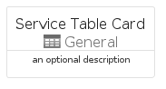
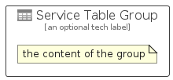

# ServiceTable


```text
azure-6/Item/General/ServiceTable
```

```text
include('azure-6/Item/General/ServiceTable')
```


| Illustration | ServiceTable | ServiceTableCard | ServiceTableGroup |
| :---: | :---: | :---: | :---: |
|  |  |  |  |


## ServiceTable

### Load remotely
```plantuml
@startuml
' configures the library
!global $LIB_BASE_LOCATION="https://raw.githubusercontent.com/tmorin/plantuml-libs/master/distribution"

' loads the library's bootstrap
!include $LIB_BASE_LOCATION/bootstrap.puml

' loads the package bootstrap
include('azure-6/bootstrap')

' loads the Item which embeds the element ServiceTable
include('azure-6/Item/General/ServiceTable')

' renders the element
ServiceTable('ServiceTable', 'Service Table', 'an optional tech label', 'an optional description')
@enduml
```

### Load locally
```plantuml
@startuml
' configures the library
!global $INCLUSION_MODE="local"
!global $LIB_BASE_LOCATION="../../.."

' loads the library's bootstrap
!include $LIB_BASE_LOCATION/bootstrap.puml

' loads the package bootstrap
include('azure-6/bootstrap')

' loads the Item which embeds the element ServiceTable
include('azure-6/Item/General/ServiceTable')

' renders the element
ServiceTable('ServiceTable', 'Service Table', 'an optional tech label', 'an optional description')
@enduml
```

## ServiceTableCard

### Load remotely
```plantuml
@startuml
' configures the library
!global $LIB_BASE_LOCATION="https://raw.githubusercontent.com/tmorin/plantuml-libs/master/distribution"

' loads the library's bootstrap
!include $LIB_BASE_LOCATION/bootstrap.puml

' loads the package bootstrap
include('azure-6/bootstrap')

' loads the Item which embeds the element ServiceTableCard
include('azure-6/Item/General/ServiceTable')

' renders the element
ServiceTableCard('ServiceTableCard', 'Service Table Card', 'an optional description')
@enduml
```

### Load locally
```plantuml
@startuml
' configures the library
!global $INCLUSION_MODE="local"
!global $LIB_BASE_LOCATION="../../.."

' loads the library's bootstrap
!include $LIB_BASE_LOCATION/bootstrap.puml

' loads the package bootstrap
include('azure-6/bootstrap')

' loads the Item which embeds the element ServiceTableCard
include('azure-6/Item/General/ServiceTable')

' renders the element
ServiceTableCard('ServiceTableCard', 'Service Table Card', 'an optional description')
@enduml
```

## ServiceTableGroup

### Load remotely
```plantuml
@startuml
' configures the library
!global $LIB_BASE_LOCATION="https://raw.githubusercontent.com/tmorin/plantuml-libs/master/distribution"

' loads the library's bootstrap
!include $LIB_BASE_LOCATION/bootstrap.puml

' loads the package bootstrap
include('azure-6/bootstrap')

' loads the Item which embeds the element ServiceTableGroup
include('azure-6/Item/General/ServiceTable')

' renders the element
ServiceTableGroup('ServiceTableGroup', 'Service Table Group', 'an optional tech label') {
    note as note
        the content of the group
    end note
}
@enduml
```

### Load locally
```plantuml
@startuml
' configures the library
!global $INCLUSION_MODE="local"
!global $LIB_BASE_LOCATION="../../.."

' loads the library's bootstrap
!include $LIB_BASE_LOCATION/bootstrap.puml

' loads the package bootstrap
include('azure-6/bootstrap')

' loads the Item which embeds the element ServiceTableGroup
include('azure-6/Item/General/ServiceTable')

' renders the element
ServiceTableGroup('ServiceTableGroup', 'Service Table Group', 'an optional tech label') {
    note as note
        the content of the group
    end note
}
@enduml
```

