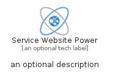

# ServiceWebsitePower


```text
azure-6/Item/General/ServiceWebsitePower
```

```text
include('azure-6/Item/General/ServiceWebsitePower')
```


| Illustration | ServiceWebsitePower | ServiceWebsitePowerCard | ServiceWebsitePowerGroup |
| :---: | :---: | :---: | :---: |
|  |  |  |  |


## ServiceWebsitePower

### Load remotely
```plantuml
@startuml
' configures the library
!global $LIB_BASE_LOCATION="https://raw.githubusercontent.com/tmorin/plantuml-libs/master/distribution"

' loads the library's bootstrap
!include $LIB_BASE_LOCATION/bootstrap.puml

' loads the package bootstrap
include('azure-6/bootstrap')

' loads the Item which embeds the element ServiceWebsitePower
include('azure-6/Item/General/ServiceWebsitePower')

' renders the element
ServiceWebsitePower('ServiceWebsitePower', 'Service Website Power', 'an optional tech label', 'an optional description')
@enduml
```

### Load locally
```plantuml
@startuml
' configures the library
!global $INCLUSION_MODE="local"
!global $LIB_BASE_LOCATION="../../.."

' loads the library's bootstrap
!include $LIB_BASE_LOCATION/bootstrap.puml

' loads the package bootstrap
include('azure-6/bootstrap')

' loads the Item which embeds the element ServiceWebsitePower
include('azure-6/Item/General/ServiceWebsitePower')

' renders the element
ServiceWebsitePower('ServiceWebsitePower', 'Service Website Power', 'an optional tech label', 'an optional description')
@enduml
```

## ServiceWebsitePowerCard

### Load remotely
```plantuml
@startuml
' configures the library
!global $LIB_BASE_LOCATION="https://raw.githubusercontent.com/tmorin/plantuml-libs/master/distribution"

' loads the library's bootstrap
!include $LIB_BASE_LOCATION/bootstrap.puml

' loads the package bootstrap
include('azure-6/bootstrap')

' loads the Item which embeds the element ServiceWebsitePowerCard
include('azure-6/Item/General/ServiceWebsitePower')

' renders the element
ServiceWebsitePowerCard('ServiceWebsitePowerCard', 'Service Website Power Card', 'an optional description')
@enduml
```

### Load locally
```plantuml
@startuml
' configures the library
!global $INCLUSION_MODE="local"
!global $LIB_BASE_LOCATION="../../.."

' loads the library's bootstrap
!include $LIB_BASE_LOCATION/bootstrap.puml

' loads the package bootstrap
include('azure-6/bootstrap')

' loads the Item which embeds the element ServiceWebsitePowerCard
include('azure-6/Item/General/ServiceWebsitePower')

' renders the element
ServiceWebsitePowerCard('ServiceWebsitePowerCard', 'Service Website Power Card', 'an optional description')
@enduml
```

## ServiceWebsitePowerGroup

### Load remotely
```plantuml
@startuml
' configures the library
!global $LIB_BASE_LOCATION="https://raw.githubusercontent.com/tmorin/plantuml-libs/master/distribution"

' loads the library's bootstrap
!include $LIB_BASE_LOCATION/bootstrap.puml

' loads the package bootstrap
include('azure-6/bootstrap')

' loads the Item which embeds the element ServiceWebsitePowerGroup
include('azure-6/Item/General/ServiceWebsitePower')

' renders the element
ServiceWebsitePowerGroup('ServiceWebsitePowerGroup', 'Service Website Power Group', 'an optional tech label') {
    note as note
        the content of the group
    end note
}
@enduml
```

### Load locally
```plantuml
@startuml
' configures the library
!global $INCLUSION_MODE="local"
!global $LIB_BASE_LOCATION="../../.."

' loads the library's bootstrap
!include $LIB_BASE_LOCATION/bootstrap.puml

' loads the package bootstrap
include('azure-6/bootstrap')

' loads the Item which embeds the element ServiceWebsitePowerGroup
include('azure-6/Item/General/ServiceWebsitePower')

' renders the element
ServiceWebsitePowerGroup('ServiceWebsitePowerGroup', 'Service Website Power Group', 'an optional tech label') {
    note as note
        the content of the group
    end note
}
@enduml
```

