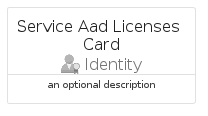

# ServiceAadLicenses


```text
azure-6/Item/Identity/ServiceAadLicenses
```

```text
include('azure-6/Item/Identity/ServiceAadLicenses')
```


| Illustration | ServiceAadLicenses | ServiceAadLicensesCard | ServiceAadLicensesGroup |
| :---: | :---: | :---: | :---: |
|  |  |  |  |


## ServiceAadLicenses

### Load remotely
```plantuml
@startuml
' configures the library
!global $LIB_BASE_LOCATION="https://raw.githubusercontent.com/tmorin/plantuml-libs/master/distribution"

' loads the library's bootstrap
!include $LIB_BASE_LOCATION/bootstrap.puml

' loads the package bootstrap
include('azure-6/bootstrap')

' loads the Item which embeds the element ServiceAadLicenses
include('azure-6/Item/Identity/ServiceAadLicenses')

' renders the element
ServiceAadLicenses('ServiceAadLicenses', 'Service Aad Licenses', 'an optional tech label', 'an optional description')
@enduml
```

### Load locally
```plantuml
@startuml
' configures the library
!global $INCLUSION_MODE="local"
!global $LIB_BASE_LOCATION="../../.."

' loads the library's bootstrap
!include $LIB_BASE_LOCATION/bootstrap.puml

' loads the package bootstrap
include('azure-6/bootstrap')

' loads the Item which embeds the element ServiceAadLicenses
include('azure-6/Item/Identity/ServiceAadLicenses')

' renders the element
ServiceAadLicenses('ServiceAadLicenses', 'Service Aad Licenses', 'an optional tech label', 'an optional description')
@enduml
```

## ServiceAadLicensesCard

### Load remotely
```plantuml
@startuml
' configures the library
!global $LIB_BASE_LOCATION="https://raw.githubusercontent.com/tmorin/plantuml-libs/master/distribution"

' loads the library's bootstrap
!include $LIB_BASE_LOCATION/bootstrap.puml

' loads the package bootstrap
include('azure-6/bootstrap')

' loads the Item which embeds the element ServiceAadLicensesCard
include('azure-6/Item/Identity/ServiceAadLicenses')

' renders the element
ServiceAadLicensesCard('ServiceAadLicensesCard', 'Service Aad Licenses Card', 'an optional description')
@enduml
```

### Load locally
```plantuml
@startuml
' configures the library
!global $INCLUSION_MODE="local"
!global $LIB_BASE_LOCATION="../../.."

' loads the library's bootstrap
!include $LIB_BASE_LOCATION/bootstrap.puml

' loads the package bootstrap
include('azure-6/bootstrap')

' loads the Item which embeds the element ServiceAadLicensesCard
include('azure-6/Item/Identity/ServiceAadLicenses')

' renders the element
ServiceAadLicensesCard('ServiceAadLicensesCard', 'Service Aad Licenses Card', 'an optional description')
@enduml
```

## ServiceAadLicensesGroup

### Load remotely
```plantuml
@startuml
' configures the library
!global $LIB_BASE_LOCATION="https://raw.githubusercontent.com/tmorin/plantuml-libs/master/distribution"

' loads the library's bootstrap
!include $LIB_BASE_LOCATION/bootstrap.puml

' loads the package bootstrap
include('azure-6/bootstrap')

' loads the Item which embeds the element ServiceAadLicensesGroup
include('azure-6/Item/Identity/ServiceAadLicenses')

' renders the element
ServiceAadLicensesGroup('ServiceAadLicensesGroup', 'Service Aad Licenses Group', 'an optional tech label') {
    note as note
        the content of the group
    end note
}
@enduml
```

### Load locally
```plantuml
@startuml
' configures the library
!global $INCLUSION_MODE="local"
!global $LIB_BASE_LOCATION="../../.."

' loads the library's bootstrap
!include $LIB_BASE_LOCATION/bootstrap.puml

' loads the package bootstrap
include('azure-6/bootstrap')

' loads the Item which embeds the element ServiceAadLicensesGroup
include('azure-6/Item/Identity/ServiceAadLicenses')

' renders the element
ServiceAadLicensesGroup('ServiceAadLicensesGroup', 'Service Aad Licenses Group', 'an optional tech label') {
    note as note
        the content of the group
    end note
}
@enduml
```

