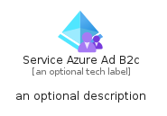
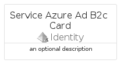

# ServiceAzureAdB2C


```text
azure-6/Item/Identity/ServiceAzureAdB2C
```

```text
include('azure-6/Item/Identity/ServiceAzureAdB2C')
```


| Illustration | ServiceAzureAdB2C | ServiceAzureAdB2CCard | ServiceAzureAdB2CGroup |
| :---: | :---: | :---: | :---: |
|  |  |  |  |


## ServiceAzureAdB2C

### Load remotely
```plantuml
@startuml
' configures the library
!global $LIB_BASE_LOCATION="https://raw.githubusercontent.com/tmorin/plantuml-libs/master/distribution"

' loads the library's bootstrap
!include $LIB_BASE_LOCATION/bootstrap.puml

' loads the package bootstrap
include('azure-6/bootstrap')

' loads the Item which embeds the element ServiceAzureAdB2C
include('azure-6/Item/Identity/ServiceAzureAdB2C')

' renders the element
ServiceAzureAdB2C('ServiceAzureAdB2c', 'Service Azure Ad B2c', 'an optional tech label', 'an optional description')
@enduml
```

### Load locally
```plantuml
@startuml
' configures the library
!global $INCLUSION_MODE="local"
!global $LIB_BASE_LOCATION="../../.."

' loads the library's bootstrap
!include $LIB_BASE_LOCATION/bootstrap.puml

' loads the package bootstrap
include('azure-6/bootstrap')

' loads the Item which embeds the element ServiceAzureAdB2C
include('azure-6/Item/Identity/ServiceAzureAdB2C')

' renders the element
ServiceAzureAdB2C('ServiceAzureAdB2c', 'Service Azure Ad B2c', 'an optional tech label', 'an optional description')
@enduml
```

## ServiceAzureAdB2CCard

### Load remotely
```plantuml
@startuml
' configures the library
!global $LIB_BASE_LOCATION="https://raw.githubusercontent.com/tmorin/plantuml-libs/master/distribution"

' loads the library's bootstrap
!include $LIB_BASE_LOCATION/bootstrap.puml

' loads the package bootstrap
include('azure-6/bootstrap')

' loads the Item which embeds the element ServiceAzureAdB2CCard
include('azure-6/Item/Identity/ServiceAzureAdB2C')

' renders the element
ServiceAzureAdB2CCard('ServiceAzureAdB2cCard', 'Service Azure Ad B2c Card', 'an optional description')
@enduml
```

### Load locally
```plantuml
@startuml
' configures the library
!global $INCLUSION_MODE="local"
!global $LIB_BASE_LOCATION="../../.."

' loads the library's bootstrap
!include $LIB_BASE_LOCATION/bootstrap.puml

' loads the package bootstrap
include('azure-6/bootstrap')

' loads the Item which embeds the element ServiceAzureAdB2CCard
include('azure-6/Item/Identity/ServiceAzureAdB2C')

' renders the element
ServiceAzureAdB2CCard('ServiceAzureAdB2cCard', 'Service Azure Ad B2c Card', 'an optional description')
@enduml
```

## ServiceAzureAdB2CGroup

### Load remotely
```plantuml
@startuml
' configures the library
!global $LIB_BASE_LOCATION="https://raw.githubusercontent.com/tmorin/plantuml-libs/master/distribution"

' loads the library's bootstrap
!include $LIB_BASE_LOCATION/bootstrap.puml

' loads the package bootstrap
include('azure-6/bootstrap')

' loads the Item which embeds the element ServiceAzureAdB2CGroup
include('azure-6/Item/Identity/ServiceAzureAdB2C')

' renders the element
ServiceAzureAdB2CGroup('ServiceAzureAdB2cGroup', 'Service Azure Ad B2c Group', 'an optional tech label') {
    note as note
        the content of the group
    end note
}
@enduml
```

### Load locally
```plantuml
@startuml
' configures the library
!global $INCLUSION_MODE="local"
!global $LIB_BASE_LOCATION="../../.."

' loads the library's bootstrap
!include $LIB_BASE_LOCATION/bootstrap.puml

' loads the package bootstrap
include('azure-6/bootstrap')

' loads the Item which embeds the element ServiceAzureAdB2CGroup
include('azure-6/Item/Identity/ServiceAzureAdB2C')

' renders the element
ServiceAzureAdB2CGroup('ServiceAzureAdB2cGroup', 'Service Azure Ad B2c Group', 'an optional tech label') {
    note as note
        the content of the group
    end note
}
@enduml
```

