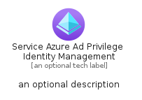
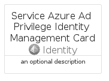
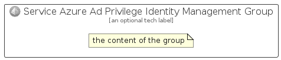

# ServiceAzureAdPrivilegeIdentityManagement


```text
azure-6/Item/Identity/ServiceAzureAdPrivilegeIdentityManagement
```

```text
include('azure-6/Item/Identity/ServiceAzureAdPrivilegeIdentityManagement')
```


| Illustration | ServiceAzureAdPrivilegeIdentityManagement | ServiceAzureAdPrivilegeIdentityManagementCard | ServiceAzureAdPrivilegeIdentityManagementGroup |
| :---: | :---: | :---: | :---: |
|  |  |  |  |


## ServiceAzureAdPrivilegeIdentityManagement

### Load remotely
```plantuml
@startuml
' configures the library
!global $LIB_BASE_LOCATION="https://raw.githubusercontent.com/tmorin/plantuml-libs/master/distribution"

' loads the library's bootstrap
!include $LIB_BASE_LOCATION/bootstrap.puml

' loads the package bootstrap
include('azure-6/bootstrap')

' loads the Item which embeds the element ServiceAzureAdPrivilegeIdentityManagement
include('azure-6/Item/Identity/ServiceAzureAdPrivilegeIdentityManagement')

' renders the element
ServiceAzureAdPrivilegeIdentityManagement('ServiceAzureAdPrivilegeIdentityManagement', 'Service Azure Ad Privilege Identity Management', 'an optional tech label', 'an optional description')
@enduml
```

### Load locally
```plantuml
@startuml
' configures the library
!global $INCLUSION_MODE="local"
!global $LIB_BASE_LOCATION="../../.."

' loads the library's bootstrap
!include $LIB_BASE_LOCATION/bootstrap.puml

' loads the package bootstrap
include('azure-6/bootstrap')

' loads the Item which embeds the element ServiceAzureAdPrivilegeIdentityManagement
include('azure-6/Item/Identity/ServiceAzureAdPrivilegeIdentityManagement')

' renders the element
ServiceAzureAdPrivilegeIdentityManagement('ServiceAzureAdPrivilegeIdentityManagement', 'Service Azure Ad Privilege Identity Management', 'an optional tech label', 'an optional description')
@enduml
```

## ServiceAzureAdPrivilegeIdentityManagementCard

### Load remotely
```plantuml
@startuml
' configures the library
!global $LIB_BASE_LOCATION="https://raw.githubusercontent.com/tmorin/plantuml-libs/master/distribution"

' loads the library's bootstrap
!include $LIB_BASE_LOCATION/bootstrap.puml

' loads the package bootstrap
include('azure-6/bootstrap')

' loads the Item which embeds the element ServiceAzureAdPrivilegeIdentityManagementCard
include('azure-6/Item/Identity/ServiceAzureAdPrivilegeIdentityManagement')

' renders the element
ServiceAzureAdPrivilegeIdentityManagementCard('ServiceAzureAdPrivilegeIdentityManagementCard', 'Service Azure Ad Privilege Identity Management Card', 'an optional description')
@enduml
```

### Load locally
```plantuml
@startuml
' configures the library
!global $INCLUSION_MODE="local"
!global $LIB_BASE_LOCATION="../../.."

' loads the library's bootstrap
!include $LIB_BASE_LOCATION/bootstrap.puml

' loads the package bootstrap
include('azure-6/bootstrap')

' loads the Item which embeds the element ServiceAzureAdPrivilegeIdentityManagementCard
include('azure-6/Item/Identity/ServiceAzureAdPrivilegeIdentityManagement')

' renders the element
ServiceAzureAdPrivilegeIdentityManagementCard('ServiceAzureAdPrivilegeIdentityManagementCard', 'Service Azure Ad Privilege Identity Management Card', 'an optional description')
@enduml
```

## ServiceAzureAdPrivilegeIdentityManagementGroup

### Load remotely
```plantuml
@startuml
' configures the library
!global $LIB_BASE_LOCATION="https://raw.githubusercontent.com/tmorin/plantuml-libs/master/distribution"

' loads the library's bootstrap
!include $LIB_BASE_LOCATION/bootstrap.puml

' loads the package bootstrap
include('azure-6/bootstrap')

' loads the Item which embeds the element ServiceAzureAdPrivilegeIdentityManagementGroup
include('azure-6/Item/Identity/ServiceAzureAdPrivilegeIdentityManagement')

' renders the element
ServiceAzureAdPrivilegeIdentityManagementGroup('ServiceAzureAdPrivilegeIdentityManagementGroup', 'Service Azure Ad Privilege Identity Management Group', 'an optional tech label') {
    note as note
        the content of the group
    end note
}
@enduml
```

### Load locally
```plantuml
@startuml
' configures the library
!global $INCLUSION_MODE="local"
!global $LIB_BASE_LOCATION="../../.."

' loads the library's bootstrap
!include $LIB_BASE_LOCATION/bootstrap.puml

' loads the package bootstrap
include('azure-6/bootstrap')

' loads the Item which embeds the element ServiceAzureAdPrivilegeIdentityManagementGroup
include('azure-6/Item/Identity/ServiceAzureAdPrivilegeIdentityManagement')

' renders the element
ServiceAzureAdPrivilegeIdentityManagementGroup('ServiceAzureAdPrivilegeIdentityManagementGroup', 'Service Azure Ad Privilege Identity Management Group', 'an optional tech label') {
    note as note
        the content of the group
    end note
}
@enduml
```

