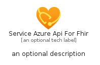
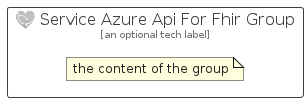

# ServiceAzureApiForFhir


```text
azure-6/Item/Integration/ServiceAzureApiForFhir
```

```text
include('azure-6/Item/Integration/ServiceAzureApiForFhir')
```


| Illustration | ServiceAzureApiForFhir | ServiceAzureApiForFhirCard | ServiceAzureApiForFhirGroup |
| :---: | :---: | :---: | :---: |
|  |  |  |  |


## ServiceAzureApiForFhir

### Load remotely
```plantuml
@startuml
' configures the library
!global $LIB_BASE_LOCATION="https://raw.githubusercontent.com/tmorin/plantuml-libs/master/distribution"

' loads the library's bootstrap
!include $LIB_BASE_LOCATION/bootstrap.puml

' loads the package bootstrap
include('azure-6/bootstrap')

' loads the Item which embeds the element ServiceAzureApiForFhir
include('azure-6/Item/Integration/ServiceAzureApiForFhir')

' renders the element
ServiceAzureApiForFhir('ServiceAzureApiForFhir', 'Service Azure Api For Fhir', 'an optional tech label', 'an optional description')
@enduml
```

### Load locally
```plantuml
@startuml
' configures the library
!global $INCLUSION_MODE="local"
!global $LIB_BASE_LOCATION="../../.."

' loads the library's bootstrap
!include $LIB_BASE_LOCATION/bootstrap.puml

' loads the package bootstrap
include('azure-6/bootstrap')

' loads the Item which embeds the element ServiceAzureApiForFhir
include('azure-6/Item/Integration/ServiceAzureApiForFhir')

' renders the element
ServiceAzureApiForFhir('ServiceAzureApiForFhir', 'Service Azure Api For Fhir', 'an optional tech label', 'an optional description')
@enduml
```

## ServiceAzureApiForFhirCard

### Load remotely
```plantuml
@startuml
' configures the library
!global $LIB_BASE_LOCATION="https://raw.githubusercontent.com/tmorin/plantuml-libs/master/distribution"

' loads the library's bootstrap
!include $LIB_BASE_LOCATION/bootstrap.puml

' loads the package bootstrap
include('azure-6/bootstrap')

' loads the Item which embeds the element ServiceAzureApiForFhirCard
include('azure-6/Item/Integration/ServiceAzureApiForFhir')

' renders the element
ServiceAzureApiForFhirCard('ServiceAzureApiForFhirCard', 'Service Azure Api For Fhir Card', 'an optional description')
@enduml
```

### Load locally
```plantuml
@startuml
' configures the library
!global $INCLUSION_MODE="local"
!global $LIB_BASE_LOCATION="../../.."

' loads the library's bootstrap
!include $LIB_BASE_LOCATION/bootstrap.puml

' loads the package bootstrap
include('azure-6/bootstrap')

' loads the Item which embeds the element ServiceAzureApiForFhirCard
include('azure-6/Item/Integration/ServiceAzureApiForFhir')

' renders the element
ServiceAzureApiForFhirCard('ServiceAzureApiForFhirCard', 'Service Azure Api For Fhir Card', 'an optional description')
@enduml
```

## ServiceAzureApiForFhirGroup

### Load remotely
```plantuml
@startuml
' configures the library
!global $LIB_BASE_LOCATION="https://raw.githubusercontent.com/tmorin/plantuml-libs/master/distribution"

' loads the library's bootstrap
!include $LIB_BASE_LOCATION/bootstrap.puml

' loads the package bootstrap
include('azure-6/bootstrap')

' loads the Item which embeds the element ServiceAzureApiForFhirGroup
include('azure-6/Item/Integration/ServiceAzureApiForFhir')

' renders the element
ServiceAzureApiForFhirGroup('ServiceAzureApiForFhirGroup', 'Service Azure Api For Fhir Group', 'an optional tech label') {
    note as note
        the content of the group
    end note
}
@enduml
```

### Load locally
```plantuml
@startuml
' configures the library
!global $INCLUSION_MODE="local"
!global $LIB_BASE_LOCATION="../../.."

' loads the library's bootstrap
!include $LIB_BASE_LOCATION/bootstrap.puml

' loads the package bootstrap
include('azure-6/bootstrap')

' loads the Item which embeds the element ServiceAzureApiForFhirGroup
include('azure-6/Item/Integration/ServiceAzureApiForFhir')

' renders the element
ServiceAzureApiForFhirGroup('ServiceAzureApiForFhirGroup', 'Service Azure Api For Fhir Group', 'an optional tech label') {
    note as note
        the content of the group
    end note
}
@enduml
```

