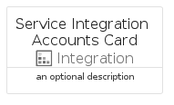

# ServiceIntegrationAccounts


```text
azure-6/Item/Integration/ServiceIntegrationAccounts
```

```text
include('azure-6/Item/Integration/ServiceIntegrationAccounts')
```


| Illustration | ServiceIntegrationAccounts | ServiceIntegrationAccountsCard | ServiceIntegrationAccountsGroup |
| :---: | :---: | :---: | :---: |
|  |  |  |  |


## ServiceIntegrationAccounts

### Load remotely
```plantuml
@startuml
' configures the library
!global $LIB_BASE_LOCATION="https://raw.githubusercontent.com/tmorin/plantuml-libs/master/distribution"

' loads the library's bootstrap
!include $LIB_BASE_LOCATION/bootstrap.puml

' loads the package bootstrap
include('azure-6/bootstrap')

' loads the Item which embeds the element ServiceIntegrationAccounts
include('azure-6/Item/Integration/ServiceIntegrationAccounts')

' renders the element
ServiceIntegrationAccounts('ServiceIntegrationAccounts', 'Service Integration Accounts', 'an optional tech label', 'an optional description')
@enduml
```

### Load locally
```plantuml
@startuml
' configures the library
!global $INCLUSION_MODE="local"
!global $LIB_BASE_LOCATION="../../.."

' loads the library's bootstrap
!include $LIB_BASE_LOCATION/bootstrap.puml

' loads the package bootstrap
include('azure-6/bootstrap')

' loads the Item which embeds the element ServiceIntegrationAccounts
include('azure-6/Item/Integration/ServiceIntegrationAccounts')

' renders the element
ServiceIntegrationAccounts('ServiceIntegrationAccounts', 'Service Integration Accounts', 'an optional tech label', 'an optional description')
@enduml
```

## ServiceIntegrationAccountsCard

### Load remotely
```plantuml
@startuml
' configures the library
!global $LIB_BASE_LOCATION="https://raw.githubusercontent.com/tmorin/plantuml-libs/master/distribution"

' loads the library's bootstrap
!include $LIB_BASE_LOCATION/bootstrap.puml

' loads the package bootstrap
include('azure-6/bootstrap')

' loads the Item which embeds the element ServiceIntegrationAccountsCard
include('azure-6/Item/Integration/ServiceIntegrationAccounts')

' renders the element
ServiceIntegrationAccountsCard('ServiceIntegrationAccountsCard', 'Service Integration Accounts Card', 'an optional description')
@enduml
```

### Load locally
```plantuml
@startuml
' configures the library
!global $INCLUSION_MODE="local"
!global $LIB_BASE_LOCATION="../../.."

' loads the library's bootstrap
!include $LIB_BASE_LOCATION/bootstrap.puml

' loads the package bootstrap
include('azure-6/bootstrap')

' loads the Item which embeds the element ServiceIntegrationAccountsCard
include('azure-6/Item/Integration/ServiceIntegrationAccounts')

' renders the element
ServiceIntegrationAccountsCard('ServiceIntegrationAccountsCard', 'Service Integration Accounts Card', 'an optional description')
@enduml
```

## ServiceIntegrationAccountsGroup

### Load remotely
```plantuml
@startuml
' configures the library
!global $LIB_BASE_LOCATION="https://raw.githubusercontent.com/tmorin/plantuml-libs/master/distribution"

' loads the library's bootstrap
!include $LIB_BASE_LOCATION/bootstrap.puml

' loads the package bootstrap
include('azure-6/bootstrap')

' loads the Item which embeds the element ServiceIntegrationAccountsGroup
include('azure-6/Item/Integration/ServiceIntegrationAccounts')

' renders the element
ServiceIntegrationAccountsGroup('ServiceIntegrationAccountsGroup', 'Service Integration Accounts Group', 'an optional tech label') {
    note as note
        the content of the group
    end note
}
@enduml
```

### Load locally
```plantuml
@startuml
' configures the library
!global $INCLUSION_MODE="local"
!global $LIB_BASE_LOCATION="../../.."

' loads the library's bootstrap
!include $LIB_BASE_LOCATION/bootstrap.puml

' loads the package bootstrap
include('azure-6/bootstrap')

' loads the Item which embeds the element ServiceIntegrationAccountsGroup
include('azure-6/Item/Integration/ServiceIntegrationAccounts')

' renders the element
ServiceIntegrationAccountsGroup('ServiceIntegrationAccountsGroup', 'Service Integration Accounts Group', 'an optional tech label') {
    note as note
        the content of the group
    end note
}
@enduml
```

