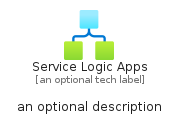

# ServiceLogicApps


```text
azure-6/Item/InternetOfThings/ServiceLogicApps
```

```text
include('azure-6/Item/InternetOfThings/ServiceLogicApps')
```


| Illustration | ServiceLogicApps | ServiceLogicAppsCard | ServiceLogicAppsGroup |
| :---: | :---: | :---: | :---: |
|  |  |  |  |


## ServiceLogicApps

### Load remotely
```plantuml
@startuml
' configures the library
!global $LIB_BASE_LOCATION="https://raw.githubusercontent.com/tmorin/plantuml-libs/master/distribution"

' loads the library's bootstrap
!include $LIB_BASE_LOCATION/bootstrap.puml

' loads the package bootstrap
include('azure-6/bootstrap')

' loads the Item which embeds the element ServiceLogicApps
include('azure-6/Item/InternetOfThings/ServiceLogicApps')

' renders the element
ServiceLogicApps('ServiceLogicApps', 'Service Logic Apps', 'an optional tech label', 'an optional description')
@enduml
```

### Load locally
```plantuml
@startuml
' configures the library
!global $INCLUSION_MODE="local"
!global $LIB_BASE_LOCATION="../../.."

' loads the library's bootstrap
!include $LIB_BASE_LOCATION/bootstrap.puml

' loads the package bootstrap
include('azure-6/bootstrap')

' loads the Item which embeds the element ServiceLogicApps
include('azure-6/Item/InternetOfThings/ServiceLogicApps')

' renders the element
ServiceLogicApps('ServiceLogicApps', 'Service Logic Apps', 'an optional tech label', 'an optional description')
@enduml
```

## ServiceLogicAppsCard

### Load remotely
```plantuml
@startuml
' configures the library
!global $LIB_BASE_LOCATION="https://raw.githubusercontent.com/tmorin/plantuml-libs/master/distribution"

' loads the library's bootstrap
!include $LIB_BASE_LOCATION/bootstrap.puml

' loads the package bootstrap
include('azure-6/bootstrap')

' loads the Item which embeds the element ServiceLogicAppsCard
include('azure-6/Item/InternetOfThings/ServiceLogicApps')

' renders the element
ServiceLogicAppsCard('ServiceLogicAppsCard', 'Service Logic Apps Card', 'an optional description')
@enduml
```

### Load locally
```plantuml
@startuml
' configures the library
!global $INCLUSION_MODE="local"
!global $LIB_BASE_LOCATION="../../.."

' loads the library's bootstrap
!include $LIB_BASE_LOCATION/bootstrap.puml

' loads the package bootstrap
include('azure-6/bootstrap')

' loads the Item which embeds the element ServiceLogicAppsCard
include('azure-6/Item/InternetOfThings/ServiceLogicApps')

' renders the element
ServiceLogicAppsCard('ServiceLogicAppsCard', 'Service Logic Apps Card', 'an optional description')
@enduml
```

## ServiceLogicAppsGroup

### Load remotely
```plantuml
@startuml
' configures the library
!global $LIB_BASE_LOCATION="https://raw.githubusercontent.com/tmorin/plantuml-libs/master/distribution"

' loads the library's bootstrap
!include $LIB_BASE_LOCATION/bootstrap.puml

' loads the package bootstrap
include('azure-6/bootstrap')

' loads the Item which embeds the element ServiceLogicAppsGroup
include('azure-6/Item/InternetOfThings/ServiceLogicApps')

' renders the element
ServiceLogicAppsGroup('ServiceLogicAppsGroup', 'Service Logic Apps Group', 'an optional tech label') {
    note as note
        the content of the group
    end note
}
@enduml
```

### Load locally
```plantuml
@startuml
' configures the library
!global $INCLUSION_MODE="local"
!global $LIB_BASE_LOCATION="../../.."

' loads the library's bootstrap
!include $LIB_BASE_LOCATION/bootstrap.puml

' loads the package bootstrap
include('azure-6/bootstrap')

' loads the Item which embeds the element ServiceLogicAppsGroup
include('azure-6/Item/InternetOfThings/ServiceLogicApps')

' renders the element
ServiceLogicAppsGroup('ServiceLogicAppsGroup', 'Service Logic Apps Group', 'an optional tech label') {
    note as note
        the content of the group
    end note
}
@enduml
```

