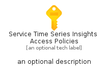
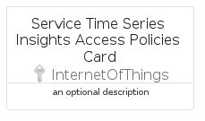

# ServiceTimeSeriesInsightsAccessPolicies


```text
azure-6/Item/InternetOfThings/ServiceTimeSeriesInsightsAccessPolicies
```

```text
include('azure-6/Item/InternetOfThings/ServiceTimeSeriesInsightsAccessPolicies')
```


| Illustration | ServiceTimeSeriesInsightsAccessPolicies | ServiceTimeSeriesInsightsAccessPoliciesCard | ServiceTimeSeriesInsightsAccessPoliciesGroup |
| :---: | :---: | :---: | :---: |
|  |  |  |  |


## ServiceTimeSeriesInsightsAccessPolicies

### Load remotely
```plantuml
@startuml
' configures the library
!global $LIB_BASE_LOCATION="https://raw.githubusercontent.com/tmorin/plantuml-libs/master/distribution"

' loads the library's bootstrap
!include $LIB_BASE_LOCATION/bootstrap.puml

' loads the package bootstrap
include('azure-6/bootstrap')

' loads the Item which embeds the element ServiceTimeSeriesInsightsAccessPolicies
include('azure-6/Item/InternetOfThings/ServiceTimeSeriesInsightsAccessPolicies')

' renders the element
ServiceTimeSeriesInsightsAccessPolicies('ServiceTimeSeriesInsightsAccessPolicies', 'Service Time Series Insights Access Policies', 'an optional tech label', 'an optional description')
@enduml
```

### Load locally
```plantuml
@startuml
' configures the library
!global $INCLUSION_MODE="local"
!global $LIB_BASE_LOCATION="../../.."

' loads the library's bootstrap
!include $LIB_BASE_LOCATION/bootstrap.puml

' loads the package bootstrap
include('azure-6/bootstrap')

' loads the Item which embeds the element ServiceTimeSeriesInsightsAccessPolicies
include('azure-6/Item/InternetOfThings/ServiceTimeSeriesInsightsAccessPolicies')

' renders the element
ServiceTimeSeriesInsightsAccessPolicies('ServiceTimeSeriesInsightsAccessPolicies', 'Service Time Series Insights Access Policies', 'an optional tech label', 'an optional description')
@enduml
```

## ServiceTimeSeriesInsightsAccessPoliciesCard

### Load remotely
```plantuml
@startuml
' configures the library
!global $LIB_BASE_LOCATION="https://raw.githubusercontent.com/tmorin/plantuml-libs/master/distribution"

' loads the library's bootstrap
!include $LIB_BASE_LOCATION/bootstrap.puml

' loads the package bootstrap
include('azure-6/bootstrap')

' loads the Item which embeds the element ServiceTimeSeriesInsightsAccessPoliciesCard
include('azure-6/Item/InternetOfThings/ServiceTimeSeriesInsightsAccessPolicies')

' renders the element
ServiceTimeSeriesInsightsAccessPoliciesCard('ServiceTimeSeriesInsightsAccessPoliciesCard', 'Service Time Series Insights Access Policies Card', 'an optional description')
@enduml
```

### Load locally
```plantuml
@startuml
' configures the library
!global $INCLUSION_MODE="local"
!global $LIB_BASE_LOCATION="../../.."

' loads the library's bootstrap
!include $LIB_BASE_LOCATION/bootstrap.puml

' loads the package bootstrap
include('azure-6/bootstrap')

' loads the Item which embeds the element ServiceTimeSeriesInsightsAccessPoliciesCard
include('azure-6/Item/InternetOfThings/ServiceTimeSeriesInsightsAccessPolicies')

' renders the element
ServiceTimeSeriesInsightsAccessPoliciesCard('ServiceTimeSeriesInsightsAccessPoliciesCard', 'Service Time Series Insights Access Policies Card', 'an optional description')
@enduml
```

## ServiceTimeSeriesInsightsAccessPoliciesGroup

### Load remotely
```plantuml
@startuml
' configures the library
!global $LIB_BASE_LOCATION="https://raw.githubusercontent.com/tmorin/plantuml-libs/master/distribution"

' loads the library's bootstrap
!include $LIB_BASE_LOCATION/bootstrap.puml

' loads the package bootstrap
include('azure-6/bootstrap')

' loads the Item which embeds the element ServiceTimeSeriesInsightsAccessPoliciesGroup
include('azure-6/Item/InternetOfThings/ServiceTimeSeriesInsightsAccessPolicies')

' renders the element
ServiceTimeSeriesInsightsAccessPoliciesGroup('ServiceTimeSeriesInsightsAccessPoliciesGroup', 'Service Time Series Insights Access Policies Group', 'an optional tech label') {
    note as note
        the content of the group
    end note
}
@enduml
```

### Load locally
```plantuml
@startuml
' configures the library
!global $INCLUSION_MODE="local"
!global $LIB_BASE_LOCATION="../../.."

' loads the library's bootstrap
!include $LIB_BASE_LOCATION/bootstrap.puml

' loads the package bootstrap
include('azure-6/bootstrap')

' loads the Item which embeds the element ServiceTimeSeriesInsightsAccessPoliciesGroup
include('azure-6/Item/InternetOfThings/ServiceTimeSeriesInsightsAccessPolicies')

' renders the element
ServiceTimeSeriesInsightsAccessPoliciesGroup('ServiceTimeSeriesInsightsAccessPoliciesGroup', 'Service Time Series Insights Access Policies Group', 'an optional tech label') {
    note as note
        the content of the group
    end note
}
@enduml
```

