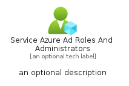

# ServiceAzureAdRolesAndAdministrators


```text
azure-6/Item/Intune/ServiceAzureAdRolesAndAdministrators
```

```text
include('azure-6/Item/Intune/ServiceAzureAdRolesAndAdministrators')
```


| Illustration | ServiceAzureAdRolesAndAdministrators | ServiceAzureAdRolesAndAdministratorsCard | ServiceAzureAdRolesAndAdministratorsGroup |
| :---: | :---: | :---: | :---: |
|  |  |  |  |


## ServiceAzureAdRolesAndAdministrators

### Load remotely
```plantuml
@startuml
' configures the library
!global $LIB_BASE_LOCATION="https://raw.githubusercontent.com/tmorin/plantuml-libs/master/distribution"

' loads the library's bootstrap
!include $LIB_BASE_LOCATION/bootstrap.puml

' loads the package bootstrap
include('azure-6/bootstrap')

' loads the Item which embeds the element ServiceAzureAdRolesAndAdministrators
include('azure-6/Item/Intune/ServiceAzureAdRolesAndAdministrators')

' renders the element
ServiceAzureAdRolesAndAdministrators('ServiceAzureAdRolesAndAdministrators', 'Service Azure Ad Roles And Administrators', 'an optional tech label', 'an optional description')
@enduml
```

### Load locally
```plantuml
@startuml
' configures the library
!global $INCLUSION_MODE="local"
!global $LIB_BASE_LOCATION="../../.."

' loads the library's bootstrap
!include $LIB_BASE_LOCATION/bootstrap.puml

' loads the package bootstrap
include('azure-6/bootstrap')

' loads the Item which embeds the element ServiceAzureAdRolesAndAdministrators
include('azure-6/Item/Intune/ServiceAzureAdRolesAndAdministrators')

' renders the element
ServiceAzureAdRolesAndAdministrators('ServiceAzureAdRolesAndAdministrators', 'Service Azure Ad Roles And Administrators', 'an optional tech label', 'an optional description')
@enduml
```

## ServiceAzureAdRolesAndAdministratorsCard

### Load remotely
```plantuml
@startuml
' configures the library
!global $LIB_BASE_LOCATION="https://raw.githubusercontent.com/tmorin/plantuml-libs/master/distribution"

' loads the library's bootstrap
!include $LIB_BASE_LOCATION/bootstrap.puml

' loads the package bootstrap
include('azure-6/bootstrap')

' loads the Item which embeds the element ServiceAzureAdRolesAndAdministratorsCard
include('azure-6/Item/Intune/ServiceAzureAdRolesAndAdministrators')

' renders the element
ServiceAzureAdRolesAndAdministratorsCard('ServiceAzureAdRolesAndAdministratorsCard', 'Service Azure Ad Roles And Administrators Card', 'an optional description')
@enduml
```

### Load locally
```plantuml
@startuml
' configures the library
!global $INCLUSION_MODE="local"
!global $LIB_BASE_LOCATION="../../.."

' loads the library's bootstrap
!include $LIB_BASE_LOCATION/bootstrap.puml

' loads the package bootstrap
include('azure-6/bootstrap')

' loads the Item which embeds the element ServiceAzureAdRolesAndAdministratorsCard
include('azure-6/Item/Intune/ServiceAzureAdRolesAndAdministrators')

' renders the element
ServiceAzureAdRolesAndAdministratorsCard('ServiceAzureAdRolesAndAdministratorsCard', 'Service Azure Ad Roles And Administrators Card', 'an optional description')
@enduml
```

## ServiceAzureAdRolesAndAdministratorsGroup

### Load remotely
```plantuml
@startuml
' configures the library
!global $LIB_BASE_LOCATION="https://raw.githubusercontent.com/tmorin/plantuml-libs/master/distribution"

' loads the library's bootstrap
!include $LIB_BASE_LOCATION/bootstrap.puml

' loads the package bootstrap
include('azure-6/bootstrap')

' loads the Item which embeds the element ServiceAzureAdRolesAndAdministratorsGroup
include('azure-6/Item/Intune/ServiceAzureAdRolesAndAdministrators')

' renders the element
ServiceAzureAdRolesAndAdministratorsGroup('ServiceAzureAdRolesAndAdministratorsGroup', 'Service Azure Ad Roles And Administrators Group', 'an optional tech label') {
    note as note
        the content of the group
    end note
}
@enduml
```

### Load locally
```plantuml
@startuml
' configures the library
!global $INCLUSION_MODE="local"
!global $LIB_BASE_LOCATION="../../.."

' loads the library's bootstrap
!include $LIB_BASE_LOCATION/bootstrap.puml

' loads the package bootstrap
include('azure-6/bootstrap')

' loads the Item which embeds the element ServiceAzureAdRolesAndAdministratorsGroup
include('azure-6/Item/Intune/ServiceAzureAdRolesAndAdministrators')

' renders the element
ServiceAzureAdRolesAndAdministratorsGroup('ServiceAzureAdRolesAndAdministratorsGroup', 'Service Azure Ad Roles And Administrators Group', 'an optional tech label') {
    note as note
        the content of the group
    end note
}
@enduml
```

