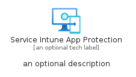
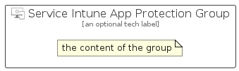

# ServiceIntuneAppProtection


```text
azure-6/Item/Intune/ServiceIntuneAppProtection
```

```text
include('azure-6/Item/Intune/ServiceIntuneAppProtection')
```


| Illustration | ServiceIntuneAppProtection | ServiceIntuneAppProtectionCard | ServiceIntuneAppProtectionGroup |
| :---: | :---: | :---: | :---: |
|  |  |  |  |


## ServiceIntuneAppProtection

### Load remotely
```plantuml
@startuml
' configures the library
!global $LIB_BASE_LOCATION="https://raw.githubusercontent.com/tmorin/plantuml-libs/master/distribution"

' loads the library's bootstrap
!include $LIB_BASE_LOCATION/bootstrap.puml

' loads the package bootstrap
include('azure-6/bootstrap')

' loads the Item which embeds the element ServiceIntuneAppProtection
include('azure-6/Item/Intune/ServiceIntuneAppProtection')

' renders the element
ServiceIntuneAppProtection('ServiceIntuneAppProtection', 'Service Intune App Protection', 'an optional tech label', 'an optional description')
@enduml
```

### Load locally
```plantuml
@startuml
' configures the library
!global $INCLUSION_MODE="local"
!global $LIB_BASE_LOCATION="../../.."

' loads the library's bootstrap
!include $LIB_BASE_LOCATION/bootstrap.puml

' loads the package bootstrap
include('azure-6/bootstrap')

' loads the Item which embeds the element ServiceIntuneAppProtection
include('azure-6/Item/Intune/ServiceIntuneAppProtection')

' renders the element
ServiceIntuneAppProtection('ServiceIntuneAppProtection', 'Service Intune App Protection', 'an optional tech label', 'an optional description')
@enduml
```

## ServiceIntuneAppProtectionCard

### Load remotely
```plantuml
@startuml
' configures the library
!global $LIB_BASE_LOCATION="https://raw.githubusercontent.com/tmorin/plantuml-libs/master/distribution"

' loads the library's bootstrap
!include $LIB_BASE_LOCATION/bootstrap.puml

' loads the package bootstrap
include('azure-6/bootstrap')

' loads the Item which embeds the element ServiceIntuneAppProtectionCard
include('azure-6/Item/Intune/ServiceIntuneAppProtection')

' renders the element
ServiceIntuneAppProtectionCard('ServiceIntuneAppProtectionCard', 'Service Intune App Protection Card', 'an optional description')
@enduml
```

### Load locally
```plantuml
@startuml
' configures the library
!global $INCLUSION_MODE="local"
!global $LIB_BASE_LOCATION="../../.."

' loads the library's bootstrap
!include $LIB_BASE_LOCATION/bootstrap.puml

' loads the package bootstrap
include('azure-6/bootstrap')

' loads the Item which embeds the element ServiceIntuneAppProtectionCard
include('azure-6/Item/Intune/ServiceIntuneAppProtection')

' renders the element
ServiceIntuneAppProtectionCard('ServiceIntuneAppProtectionCard', 'Service Intune App Protection Card', 'an optional description')
@enduml
```

## ServiceIntuneAppProtectionGroup

### Load remotely
```plantuml
@startuml
' configures the library
!global $LIB_BASE_LOCATION="https://raw.githubusercontent.com/tmorin/plantuml-libs/master/distribution"

' loads the library's bootstrap
!include $LIB_BASE_LOCATION/bootstrap.puml

' loads the package bootstrap
include('azure-6/bootstrap')

' loads the Item which embeds the element ServiceIntuneAppProtectionGroup
include('azure-6/Item/Intune/ServiceIntuneAppProtection')

' renders the element
ServiceIntuneAppProtectionGroup('ServiceIntuneAppProtectionGroup', 'Service Intune App Protection Group', 'an optional tech label') {
    note as note
        the content of the group
    end note
}
@enduml
```

### Load locally
```plantuml
@startuml
' configures the library
!global $INCLUSION_MODE="local"
!global $LIB_BASE_LOCATION="../../.."

' loads the library's bootstrap
!include $LIB_BASE_LOCATION/bootstrap.puml

' loads the package bootstrap
include('azure-6/bootstrap')

' loads the Item which embeds the element ServiceIntuneAppProtectionGroup
include('azure-6/Item/Intune/ServiceIntuneAppProtection')

' renders the element
ServiceIntuneAppProtectionGroup('ServiceIntuneAppProtectionGroup', 'Service Intune App Protection Group', 'an optional tech label') {
    note as note
        the content of the group
    end note
}
@enduml
```

