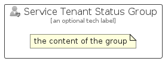

# ServiceTenantStatus


```text
azure-6/Item/Intune/ServiceTenantStatus
```

```text
include('azure-6/Item/Intune/ServiceTenantStatus')
```


| Illustration | ServiceTenantStatus | ServiceTenantStatusCard | ServiceTenantStatusGroup |
| :---: | :---: | :---: | :---: |
|  |  |  |  |


## ServiceTenantStatus

### Load remotely
```plantuml
@startuml
' configures the library
!global $LIB_BASE_LOCATION="https://raw.githubusercontent.com/tmorin/plantuml-libs/master/distribution"

' loads the library's bootstrap
!include $LIB_BASE_LOCATION/bootstrap.puml

' loads the package bootstrap
include('azure-6/bootstrap')

' loads the Item which embeds the element ServiceTenantStatus
include('azure-6/Item/Intune/ServiceTenantStatus')

' renders the element
ServiceTenantStatus('ServiceTenantStatus', 'Service Tenant Status', 'an optional tech label', 'an optional description')
@enduml
```

### Load locally
```plantuml
@startuml
' configures the library
!global $INCLUSION_MODE="local"
!global $LIB_BASE_LOCATION="../../.."

' loads the library's bootstrap
!include $LIB_BASE_LOCATION/bootstrap.puml

' loads the package bootstrap
include('azure-6/bootstrap')

' loads the Item which embeds the element ServiceTenantStatus
include('azure-6/Item/Intune/ServiceTenantStatus')

' renders the element
ServiceTenantStatus('ServiceTenantStatus', 'Service Tenant Status', 'an optional tech label', 'an optional description')
@enduml
```

## ServiceTenantStatusCard

### Load remotely
```plantuml
@startuml
' configures the library
!global $LIB_BASE_LOCATION="https://raw.githubusercontent.com/tmorin/plantuml-libs/master/distribution"

' loads the library's bootstrap
!include $LIB_BASE_LOCATION/bootstrap.puml

' loads the package bootstrap
include('azure-6/bootstrap')

' loads the Item which embeds the element ServiceTenantStatusCard
include('azure-6/Item/Intune/ServiceTenantStatus')

' renders the element
ServiceTenantStatusCard('ServiceTenantStatusCard', 'Service Tenant Status Card', 'an optional description')
@enduml
```

### Load locally
```plantuml
@startuml
' configures the library
!global $INCLUSION_MODE="local"
!global $LIB_BASE_LOCATION="../../.."

' loads the library's bootstrap
!include $LIB_BASE_LOCATION/bootstrap.puml

' loads the package bootstrap
include('azure-6/bootstrap')

' loads the Item which embeds the element ServiceTenantStatusCard
include('azure-6/Item/Intune/ServiceTenantStatus')

' renders the element
ServiceTenantStatusCard('ServiceTenantStatusCard', 'Service Tenant Status Card', 'an optional description')
@enduml
```

## ServiceTenantStatusGroup

### Load remotely
```plantuml
@startuml
' configures the library
!global $LIB_BASE_LOCATION="https://raw.githubusercontent.com/tmorin/plantuml-libs/master/distribution"

' loads the library's bootstrap
!include $LIB_BASE_LOCATION/bootstrap.puml

' loads the package bootstrap
include('azure-6/bootstrap')

' loads the Item which embeds the element ServiceTenantStatusGroup
include('azure-6/Item/Intune/ServiceTenantStatus')

' renders the element
ServiceTenantStatusGroup('ServiceTenantStatusGroup', 'Service Tenant Status Group', 'an optional tech label') {
    note as note
        the content of the group
    end note
}
@enduml
```

### Load locally
```plantuml
@startuml
' configures the library
!global $INCLUSION_MODE="local"
!global $LIB_BASE_LOCATION="../../.."

' loads the library's bootstrap
!include $LIB_BASE_LOCATION/bootstrap.puml

' loads the package bootstrap
include('azure-6/bootstrap')

' loads the Item which embeds the element ServiceTenantStatusGroup
include('azure-6/Item/Intune/ServiceTenantStatus')

' renders the element
ServiceTenantStatusGroup('ServiceTenantStatusGroup', 'Service Tenant Status Group', 'an optional tech label') {
    note as note
        the content of the group
    end note
}
@enduml
```

