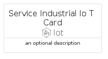
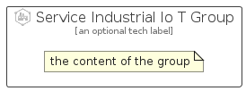

# ServiceIndustrialIoT


```text
azure-6/Item/Iot/ServiceIndustrialIoT
```

```text
include('azure-6/Item/Iot/ServiceIndustrialIoT')
```


| Illustration | ServiceIndustrialIoT | ServiceIndustrialIoTCard | ServiceIndustrialIoTGroup |
| :---: | :---: | :---: | :---: |
|  |  |  |  |


## ServiceIndustrialIoT

### Load remotely
```plantuml
@startuml
' configures the library
!global $LIB_BASE_LOCATION="https://raw.githubusercontent.com/tmorin/plantuml-libs/master/distribution"

' loads the library's bootstrap
!include $LIB_BASE_LOCATION/bootstrap.puml

' loads the package bootstrap
include('azure-6/bootstrap')

' loads the Item which embeds the element ServiceIndustrialIoT
include('azure-6/Item/Iot/ServiceIndustrialIoT')

' renders the element
ServiceIndustrialIoT('ServiceIndustrialIoT', 'Service Industrial Io T', 'an optional tech label', 'an optional description')
@enduml
```

### Load locally
```plantuml
@startuml
' configures the library
!global $INCLUSION_MODE="local"
!global $LIB_BASE_LOCATION="../../.."

' loads the library's bootstrap
!include $LIB_BASE_LOCATION/bootstrap.puml

' loads the package bootstrap
include('azure-6/bootstrap')

' loads the Item which embeds the element ServiceIndustrialIoT
include('azure-6/Item/Iot/ServiceIndustrialIoT')

' renders the element
ServiceIndustrialIoT('ServiceIndustrialIoT', 'Service Industrial Io T', 'an optional tech label', 'an optional description')
@enduml
```

## ServiceIndustrialIoTCard

### Load remotely
```plantuml
@startuml
' configures the library
!global $LIB_BASE_LOCATION="https://raw.githubusercontent.com/tmorin/plantuml-libs/master/distribution"

' loads the library's bootstrap
!include $LIB_BASE_LOCATION/bootstrap.puml

' loads the package bootstrap
include('azure-6/bootstrap')

' loads the Item which embeds the element ServiceIndustrialIoTCard
include('azure-6/Item/Iot/ServiceIndustrialIoT')

' renders the element
ServiceIndustrialIoTCard('ServiceIndustrialIoTCard', 'Service Industrial Io T Card', 'an optional description')
@enduml
```

### Load locally
```plantuml
@startuml
' configures the library
!global $INCLUSION_MODE="local"
!global $LIB_BASE_LOCATION="../../.."

' loads the library's bootstrap
!include $LIB_BASE_LOCATION/bootstrap.puml

' loads the package bootstrap
include('azure-6/bootstrap')

' loads the Item which embeds the element ServiceIndustrialIoTCard
include('azure-6/Item/Iot/ServiceIndustrialIoT')

' renders the element
ServiceIndustrialIoTCard('ServiceIndustrialIoTCard', 'Service Industrial Io T Card', 'an optional description')
@enduml
```

## ServiceIndustrialIoTGroup

### Load remotely
```plantuml
@startuml
' configures the library
!global $LIB_BASE_LOCATION="https://raw.githubusercontent.com/tmorin/plantuml-libs/master/distribution"

' loads the library's bootstrap
!include $LIB_BASE_LOCATION/bootstrap.puml

' loads the package bootstrap
include('azure-6/bootstrap')

' loads the Item which embeds the element ServiceIndustrialIoTGroup
include('azure-6/Item/Iot/ServiceIndustrialIoT')

' renders the element
ServiceIndustrialIoTGroup('ServiceIndustrialIoTGroup', 'Service Industrial Io T Group', 'an optional tech label') {
    note as note
        the content of the group
    end note
}
@enduml
```

### Load locally
```plantuml
@startuml
' configures the library
!global $INCLUSION_MODE="local"
!global $LIB_BASE_LOCATION="../../.."

' loads the library's bootstrap
!include $LIB_BASE_LOCATION/bootstrap.puml

' loads the package bootstrap
include('azure-6/bootstrap')

' loads the Item which embeds the element ServiceIndustrialIoTGroup
include('azure-6/Item/Iot/ServiceIndustrialIoT')

' renders the element
ServiceIndustrialIoTGroup('ServiceIndustrialIoTGroup', 'Service Industrial Io T Group', 'an optional tech label') {
    note as note
        the content of the group
    end note
}
@enduml
```

