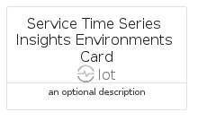

# ServiceTimeSeriesInsightsEnvironments


```text
azure-6/Item/Iot/ServiceTimeSeriesInsightsEnvironments
```

```text
include('azure-6/Item/Iot/ServiceTimeSeriesInsightsEnvironments')
```


| Illustration | ServiceTimeSeriesInsightsEnvironments | ServiceTimeSeriesInsightsEnvironmentsCard | ServiceTimeSeriesInsightsEnvironmentsGroup |
| :---: | :---: | :---: | :---: |
|  |  |  |  |


## ServiceTimeSeriesInsightsEnvironments

### Load remotely
```plantuml
@startuml
' configures the library
!global $LIB_BASE_LOCATION="https://raw.githubusercontent.com/tmorin/plantuml-libs/master/distribution"

' loads the library's bootstrap
!include $LIB_BASE_LOCATION/bootstrap.puml

' loads the package bootstrap
include('azure-6/bootstrap')

' loads the Item which embeds the element ServiceTimeSeriesInsightsEnvironments
include('azure-6/Item/Iot/ServiceTimeSeriesInsightsEnvironments')

' renders the element
ServiceTimeSeriesInsightsEnvironments('ServiceTimeSeriesInsightsEnvironments', 'Service Time Series Insights Environments', 'an optional tech label', 'an optional description')
@enduml
```

### Load locally
```plantuml
@startuml
' configures the library
!global $INCLUSION_MODE="local"
!global $LIB_BASE_LOCATION="../../.."

' loads the library's bootstrap
!include $LIB_BASE_LOCATION/bootstrap.puml

' loads the package bootstrap
include('azure-6/bootstrap')

' loads the Item which embeds the element ServiceTimeSeriesInsightsEnvironments
include('azure-6/Item/Iot/ServiceTimeSeriesInsightsEnvironments')

' renders the element
ServiceTimeSeriesInsightsEnvironments('ServiceTimeSeriesInsightsEnvironments', 'Service Time Series Insights Environments', 'an optional tech label', 'an optional description')
@enduml
```

## ServiceTimeSeriesInsightsEnvironmentsCard

### Load remotely
```plantuml
@startuml
' configures the library
!global $LIB_BASE_LOCATION="https://raw.githubusercontent.com/tmorin/plantuml-libs/master/distribution"

' loads the library's bootstrap
!include $LIB_BASE_LOCATION/bootstrap.puml

' loads the package bootstrap
include('azure-6/bootstrap')

' loads the Item which embeds the element ServiceTimeSeriesInsightsEnvironmentsCard
include('azure-6/Item/Iot/ServiceTimeSeriesInsightsEnvironments')

' renders the element
ServiceTimeSeriesInsightsEnvironmentsCard('ServiceTimeSeriesInsightsEnvironmentsCard', 'Service Time Series Insights Environments Card', 'an optional description')
@enduml
```

### Load locally
```plantuml
@startuml
' configures the library
!global $INCLUSION_MODE="local"
!global $LIB_BASE_LOCATION="../../.."

' loads the library's bootstrap
!include $LIB_BASE_LOCATION/bootstrap.puml

' loads the package bootstrap
include('azure-6/bootstrap')

' loads the Item which embeds the element ServiceTimeSeriesInsightsEnvironmentsCard
include('azure-6/Item/Iot/ServiceTimeSeriesInsightsEnvironments')

' renders the element
ServiceTimeSeriesInsightsEnvironmentsCard('ServiceTimeSeriesInsightsEnvironmentsCard', 'Service Time Series Insights Environments Card', 'an optional description')
@enduml
```

## ServiceTimeSeriesInsightsEnvironmentsGroup

### Load remotely
```plantuml
@startuml
' configures the library
!global $LIB_BASE_LOCATION="https://raw.githubusercontent.com/tmorin/plantuml-libs/master/distribution"

' loads the library's bootstrap
!include $LIB_BASE_LOCATION/bootstrap.puml

' loads the package bootstrap
include('azure-6/bootstrap')

' loads the Item which embeds the element ServiceTimeSeriesInsightsEnvironmentsGroup
include('azure-6/Item/Iot/ServiceTimeSeriesInsightsEnvironments')

' renders the element
ServiceTimeSeriesInsightsEnvironmentsGroup('ServiceTimeSeriesInsightsEnvironmentsGroup', 'Service Time Series Insights Environments Group', 'an optional tech label') {
    note as note
        the content of the group
    end note
}
@enduml
```

### Load locally
```plantuml
@startuml
' configures the library
!global $INCLUSION_MODE="local"
!global $LIB_BASE_LOCATION="../../.."

' loads the library's bootstrap
!include $LIB_BASE_LOCATION/bootstrap.puml

' loads the package bootstrap
include('azure-6/bootstrap')

' loads the Item which embeds the element ServiceTimeSeriesInsightsEnvironmentsGroup
include('azure-6/Item/Iot/ServiceTimeSeriesInsightsEnvironments')

' renders the element
ServiceTimeSeriesInsightsEnvironmentsGroup('ServiceTimeSeriesInsightsEnvironmentsGroup', 'Service Time Series Insights Environments Group', 'an optional tech label') {
    note as note
        the content of the group
    end note
}
@enduml
```

