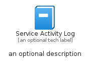
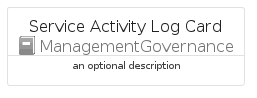
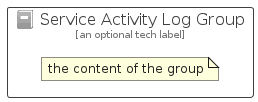

# ServiceActivityLog


```text
azure-6/Item/ManagementGovernance/ServiceActivityLog
```

```text
include('azure-6/Item/ManagementGovernance/ServiceActivityLog')
```


| Illustration | ServiceActivityLog | ServiceActivityLogCard | ServiceActivityLogGroup |
| :---: | :---: | :---: | :---: |
|  |  |  |  |


## ServiceActivityLog

### Load remotely
```plantuml
@startuml
' configures the library
!global $LIB_BASE_LOCATION="https://raw.githubusercontent.com/tmorin/plantuml-libs/master/distribution"

' loads the library's bootstrap
!include $LIB_BASE_LOCATION/bootstrap.puml

' loads the package bootstrap
include('azure-6/bootstrap')

' loads the Item which embeds the element ServiceActivityLog
include('azure-6/Item/ManagementGovernance/ServiceActivityLog')

' renders the element
ServiceActivityLog('ServiceActivityLog', 'Service Activity Log', 'an optional tech label', 'an optional description')
@enduml
```

### Load locally
```plantuml
@startuml
' configures the library
!global $INCLUSION_MODE="local"
!global $LIB_BASE_LOCATION="../../.."

' loads the library's bootstrap
!include $LIB_BASE_LOCATION/bootstrap.puml

' loads the package bootstrap
include('azure-6/bootstrap')

' loads the Item which embeds the element ServiceActivityLog
include('azure-6/Item/ManagementGovernance/ServiceActivityLog')

' renders the element
ServiceActivityLog('ServiceActivityLog', 'Service Activity Log', 'an optional tech label', 'an optional description')
@enduml
```

## ServiceActivityLogCard

### Load remotely
```plantuml
@startuml
' configures the library
!global $LIB_BASE_LOCATION="https://raw.githubusercontent.com/tmorin/plantuml-libs/master/distribution"

' loads the library's bootstrap
!include $LIB_BASE_LOCATION/bootstrap.puml

' loads the package bootstrap
include('azure-6/bootstrap')

' loads the Item which embeds the element ServiceActivityLogCard
include('azure-6/Item/ManagementGovernance/ServiceActivityLog')

' renders the element
ServiceActivityLogCard('ServiceActivityLogCard', 'Service Activity Log Card', 'an optional description')
@enduml
```

### Load locally
```plantuml
@startuml
' configures the library
!global $INCLUSION_MODE="local"
!global $LIB_BASE_LOCATION="../../.."

' loads the library's bootstrap
!include $LIB_BASE_LOCATION/bootstrap.puml

' loads the package bootstrap
include('azure-6/bootstrap')

' loads the Item which embeds the element ServiceActivityLogCard
include('azure-6/Item/ManagementGovernance/ServiceActivityLog')

' renders the element
ServiceActivityLogCard('ServiceActivityLogCard', 'Service Activity Log Card', 'an optional description')
@enduml
```

## ServiceActivityLogGroup

### Load remotely
```plantuml
@startuml
' configures the library
!global $LIB_BASE_LOCATION="https://raw.githubusercontent.com/tmorin/plantuml-libs/master/distribution"

' loads the library's bootstrap
!include $LIB_BASE_LOCATION/bootstrap.puml

' loads the package bootstrap
include('azure-6/bootstrap')

' loads the Item which embeds the element ServiceActivityLogGroup
include('azure-6/Item/ManagementGovernance/ServiceActivityLog')

' renders the element
ServiceActivityLogGroup('ServiceActivityLogGroup', 'Service Activity Log Group', 'an optional tech label') {
    note as note
        the content of the group
    end note
}
@enduml
```

### Load locally
```plantuml
@startuml
' configures the library
!global $INCLUSION_MODE="local"
!global $LIB_BASE_LOCATION="../../.."

' loads the library's bootstrap
!include $LIB_BASE_LOCATION/bootstrap.puml

' loads the package bootstrap
include('azure-6/bootstrap')

' loads the Item which embeds the element ServiceActivityLogGroup
include('azure-6/Item/ManagementGovernance/ServiceActivityLog')

' renders the element
ServiceActivityLogGroup('ServiceActivityLogGroup', 'Service Activity Log Group', 'an optional tech label') {
    note as note
        the content of the group
    end note
}
@enduml
```

