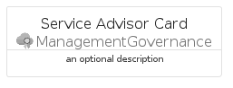

# ServiceAdvisor


```text
azure-6/Item/ManagementGovernance/ServiceAdvisor
```

```text
include('azure-6/Item/ManagementGovernance/ServiceAdvisor')
```


| Illustration | ServiceAdvisor | ServiceAdvisorCard | ServiceAdvisorGroup |
| :---: | :---: | :---: | :---: |
|  |  |  |  |


## ServiceAdvisor

### Load remotely
```plantuml
@startuml
' configures the library
!global $LIB_BASE_LOCATION="https://raw.githubusercontent.com/tmorin/plantuml-libs/master/distribution"

' loads the library's bootstrap
!include $LIB_BASE_LOCATION/bootstrap.puml

' loads the package bootstrap
include('azure-6/bootstrap')

' loads the Item which embeds the element ServiceAdvisor
include('azure-6/Item/ManagementGovernance/ServiceAdvisor')

' renders the element
ServiceAdvisor('ServiceAdvisor', 'Service Advisor', 'an optional tech label', 'an optional description')
@enduml
```

### Load locally
```plantuml
@startuml
' configures the library
!global $INCLUSION_MODE="local"
!global $LIB_BASE_LOCATION="../../.."

' loads the library's bootstrap
!include $LIB_BASE_LOCATION/bootstrap.puml

' loads the package bootstrap
include('azure-6/bootstrap')

' loads the Item which embeds the element ServiceAdvisor
include('azure-6/Item/ManagementGovernance/ServiceAdvisor')

' renders the element
ServiceAdvisor('ServiceAdvisor', 'Service Advisor', 'an optional tech label', 'an optional description')
@enduml
```

## ServiceAdvisorCard

### Load remotely
```plantuml
@startuml
' configures the library
!global $LIB_BASE_LOCATION="https://raw.githubusercontent.com/tmorin/plantuml-libs/master/distribution"

' loads the library's bootstrap
!include $LIB_BASE_LOCATION/bootstrap.puml

' loads the package bootstrap
include('azure-6/bootstrap')

' loads the Item which embeds the element ServiceAdvisorCard
include('azure-6/Item/ManagementGovernance/ServiceAdvisor')

' renders the element
ServiceAdvisorCard('ServiceAdvisorCard', 'Service Advisor Card', 'an optional description')
@enduml
```

### Load locally
```plantuml
@startuml
' configures the library
!global $INCLUSION_MODE="local"
!global $LIB_BASE_LOCATION="../../.."

' loads the library's bootstrap
!include $LIB_BASE_LOCATION/bootstrap.puml

' loads the package bootstrap
include('azure-6/bootstrap')

' loads the Item which embeds the element ServiceAdvisorCard
include('azure-6/Item/ManagementGovernance/ServiceAdvisor')

' renders the element
ServiceAdvisorCard('ServiceAdvisorCard', 'Service Advisor Card', 'an optional description')
@enduml
```

## ServiceAdvisorGroup

### Load remotely
```plantuml
@startuml
' configures the library
!global $LIB_BASE_LOCATION="https://raw.githubusercontent.com/tmorin/plantuml-libs/master/distribution"

' loads the library's bootstrap
!include $LIB_BASE_LOCATION/bootstrap.puml

' loads the package bootstrap
include('azure-6/bootstrap')

' loads the Item which embeds the element ServiceAdvisorGroup
include('azure-6/Item/ManagementGovernance/ServiceAdvisor')

' renders the element
ServiceAdvisorGroup('ServiceAdvisorGroup', 'Service Advisor Group', 'an optional tech label') {
    note as note
        the content of the group
    end note
}
@enduml
```

### Load locally
```plantuml
@startuml
' configures the library
!global $INCLUSION_MODE="local"
!global $LIB_BASE_LOCATION="../../.."

' loads the library's bootstrap
!include $LIB_BASE_LOCATION/bootstrap.puml

' loads the package bootstrap
include('azure-6/bootstrap')

' loads the Item which embeds the element ServiceAdvisorGroup
include('azure-6/Item/ManagementGovernance/ServiceAdvisor')

' renders the element
ServiceAdvisorGroup('ServiceAdvisorGroup', 'Service Advisor Group', 'an optional tech label') {
    note as note
        the content of the group
    end note
}
@enduml
```

