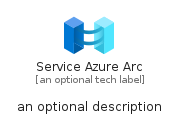
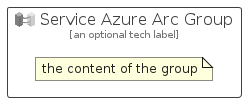

# ServiceAzureArc


```text
azure-6/Item/ManagementGovernance/ServiceAzureArc
```

```text
include('azure-6/Item/ManagementGovernance/ServiceAzureArc')
```


| Illustration | ServiceAzureArc | ServiceAzureArcCard | ServiceAzureArcGroup |
| :---: | :---: | :---: | :---: |
|  |  |  |  |


## ServiceAzureArc

### Load remotely
```plantuml
@startuml
' configures the library
!global $LIB_BASE_LOCATION="https://raw.githubusercontent.com/tmorin/plantuml-libs/master/distribution"

' loads the library's bootstrap
!include $LIB_BASE_LOCATION/bootstrap.puml

' loads the package bootstrap
include('azure-6/bootstrap')

' loads the Item which embeds the element ServiceAzureArc
include('azure-6/Item/ManagementGovernance/ServiceAzureArc')

' renders the element
ServiceAzureArc('ServiceAzureArc', 'Service Azure Arc', 'an optional tech label', 'an optional description')
@enduml
```

### Load locally
```plantuml
@startuml
' configures the library
!global $INCLUSION_MODE="local"
!global $LIB_BASE_LOCATION="../../.."

' loads the library's bootstrap
!include $LIB_BASE_LOCATION/bootstrap.puml

' loads the package bootstrap
include('azure-6/bootstrap')

' loads the Item which embeds the element ServiceAzureArc
include('azure-6/Item/ManagementGovernance/ServiceAzureArc')

' renders the element
ServiceAzureArc('ServiceAzureArc', 'Service Azure Arc', 'an optional tech label', 'an optional description')
@enduml
```

## ServiceAzureArcCard

### Load remotely
```plantuml
@startuml
' configures the library
!global $LIB_BASE_LOCATION="https://raw.githubusercontent.com/tmorin/plantuml-libs/master/distribution"

' loads the library's bootstrap
!include $LIB_BASE_LOCATION/bootstrap.puml

' loads the package bootstrap
include('azure-6/bootstrap')

' loads the Item which embeds the element ServiceAzureArcCard
include('azure-6/Item/ManagementGovernance/ServiceAzureArc')

' renders the element
ServiceAzureArcCard('ServiceAzureArcCard', 'Service Azure Arc Card', 'an optional description')
@enduml
```

### Load locally
```plantuml
@startuml
' configures the library
!global $INCLUSION_MODE="local"
!global $LIB_BASE_LOCATION="../../.."

' loads the library's bootstrap
!include $LIB_BASE_LOCATION/bootstrap.puml

' loads the package bootstrap
include('azure-6/bootstrap')

' loads the Item which embeds the element ServiceAzureArcCard
include('azure-6/Item/ManagementGovernance/ServiceAzureArc')

' renders the element
ServiceAzureArcCard('ServiceAzureArcCard', 'Service Azure Arc Card', 'an optional description')
@enduml
```

## ServiceAzureArcGroup

### Load remotely
```plantuml
@startuml
' configures the library
!global $LIB_BASE_LOCATION="https://raw.githubusercontent.com/tmorin/plantuml-libs/master/distribution"

' loads the library's bootstrap
!include $LIB_BASE_LOCATION/bootstrap.puml

' loads the package bootstrap
include('azure-6/bootstrap')

' loads the Item which embeds the element ServiceAzureArcGroup
include('azure-6/Item/ManagementGovernance/ServiceAzureArc')

' renders the element
ServiceAzureArcGroup('ServiceAzureArcGroup', 'Service Azure Arc Group', 'an optional tech label') {
    note as note
        the content of the group
    end note
}
@enduml
```

### Load locally
```plantuml
@startuml
' configures the library
!global $INCLUSION_MODE="local"
!global $LIB_BASE_LOCATION="../../.."

' loads the library's bootstrap
!include $LIB_BASE_LOCATION/bootstrap.puml

' loads the package bootstrap
include('azure-6/bootstrap')

' loads the Item which embeds the element ServiceAzureArcGroup
include('azure-6/Item/ManagementGovernance/ServiceAzureArc')

' renders the element
ServiceAzureArcGroup('ServiceAzureArcGroup', 'Service Azure Arc Group', 'an optional tech label') {
    note as note
        the content of the group
    end note
}
@enduml
```

