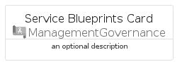

# ServiceBlueprints


```text
azure-6/Item/ManagementGovernance/ServiceBlueprints
```

```text
include('azure-6/Item/ManagementGovernance/ServiceBlueprints')
```


| Illustration | ServiceBlueprints | ServiceBlueprintsCard | ServiceBlueprintsGroup |
| :---: | :---: | :---: | :---: |
|  |  |  |  |


## ServiceBlueprints

### Load remotely
```plantuml
@startuml
' configures the library
!global $LIB_BASE_LOCATION="https://raw.githubusercontent.com/tmorin/plantuml-libs/master/distribution"

' loads the library's bootstrap
!include $LIB_BASE_LOCATION/bootstrap.puml

' loads the package bootstrap
include('azure-6/bootstrap')

' loads the Item which embeds the element ServiceBlueprints
include('azure-6/Item/ManagementGovernance/ServiceBlueprints')

' renders the element
ServiceBlueprints('ServiceBlueprints', 'Service Blueprints', 'an optional tech label', 'an optional description')
@enduml
```

### Load locally
```plantuml
@startuml
' configures the library
!global $INCLUSION_MODE="local"
!global $LIB_BASE_LOCATION="../../.."

' loads the library's bootstrap
!include $LIB_BASE_LOCATION/bootstrap.puml

' loads the package bootstrap
include('azure-6/bootstrap')

' loads the Item which embeds the element ServiceBlueprints
include('azure-6/Item/ManagementGovernance/ServiceBlueprints')

' renders the element
ServiceBlueprints('ServiceBlueprints', 'Service Blueprints', 'an optional tech label', 'an optional description')
@enduml
```

## ServiceBlueprintsCard

### Load remotely
```plantuml
@startuml
' configures the library
!global $LIB_BASE_LOCATION="https://raw.githubusercontent.com/tmorin/plantuml-libs/master/distribution"

' loads the library's bootstrap
!include $LIB_BASE_LOCATION/bootstrap.puml

' loads the package bootstrap
include('azure-6/bootstrap')

' loads the Item which embeds the element ServiceBlueprintsCard
include('azure-6/Item/ManagementGovernance/ServiceBlueprints')

' renders the element
ServiceBlueprintsCard('ServiceBlueprintsCard', 'Service Blueprints Card', 'an optional description')
@enduml
```

### Load locally
```plantuml
@startuml
' configures the library
!global $INCLUSION_MODE="local"
!global $LIB_BASE_LOCATION="../../.."

' loads the library's bootstrap
!include $LIB_BASE_LOCATION/bootstrap.puml

' loads the package bootstrap
include('azure-6/bootstrap')

' loads the Item which embeds the element ServiceBlueprintsCard
include('azure-6/Item/ManagementGovernance/ServiceBlueprints')

' renders the element
ServiceBlueprintsCard('ServiceBlueprintsCard', 'Service Blueprints Card', 'an optional description')
@enduml
```

## ServiceBlueprintsGroup

### Load remotely
```plantuml
@startuml
' configures the library
!global $LIB_BASE_LOCATION="https://raw.githubusercontent.com/tmorin/plantuml-libs/master/distribution"

' loads the library's bootstrap
!include $LIB_BASE_LOCATION/bootstrap.puml

' loads the package bootstrap
include('azure-6/bootstrap')

' loads the Item which embeds the element ServiceBlueprintsGroup
include('azure-6/Item/ManagementGovernance/ServiceBlueprints')

' renders the element
ServiceBlueprintsGroup('ServiceBlueprintsGroup', 'Service Blueprints Group', 'an optional tech label') {
    note as note
        the content of the group
    end note
}
@enduml
```

### Load locally
```plantuml
@startuml
' configures the library
!global $INCLUSION_MODE="local"
!global $LIB_BASE_LOCATION="../../.."

' loads the library's bootstrap
!include $LIB_BASE_LOCATION/bootstrap.puml

' loads the package bootstrap
include('azure-6/bootstrap')

' loads the Item which embeds the element ServiceBlueprintsGroup
include('azure-6/Item/ManagementGovernance/ServiceBlueprints')

' renders the element
ServiceBlueprintsGroup('ServiceBlueprintsGroup', 'Service Blueprints Group', 'an optional tech label') {
    note as note
        the content of the group
    end note
}
@enduml
```

