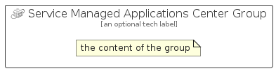

# ServiceManagedApplicationsCenter


```text
azure-6/Item/ManagementGovernance/ServiceManagedApplicationsCenter
```

```text
include('azure-6/Item/ManagementGovernance/ServiceManagedApplicationsCenter')
```


| Illustration | ServiceManagedApplicationsCenter | ServiceManagedApplicationsCenterCard | ServiceManagedApplicationsCenterGroup |
| :---: | :---: | :---: | :---: |
|  |  |  |  |


## ServiceManagedApplicationsCenter

### Load remotely
```plantuml
@startuml
' configures the library
!global $LIB_BASE_LOCATION="https://raw.githubusercontent.com/tmorin/plantuml-libs/master/distribution"

' loads the library's bootstrap
!include $LIB_BASE_LOCATION/bootstrap.puml

' loads the package bootstrap
include('azure-6/bootstrap')

' loads the Item which embeds the element ServiceManagedApplicationsCenter
include('azure-6/Item/ManagementGovernance/ServiceManagedApplicationsCenter')

' renders the element
ServiceManagedApplicationsCenter('ServiceManagedApplicationsCenter', 'Service Managed Applications Center', 'an optional tech label', 'an optional description')
@enduml
```

### Load locally
```plantuml
@startuml
' configures the library
!global $INCLUSION_MODE="local"
!global $LIB_BASE_LOCATION="../../.."

' loads the library's bootstrap
!include $LIB_BASE_LOCATION/bootstrap.puml

' loads the package bootstrap
include('azure-6/bootstrap')

' loads the Item which embeds the element ServiceManagedApplicationsCenter
include('azure-6/Item/ManagementGovernance/ServiceManagedApplicationsCenter')

' renders the element
ServiceManagedApplicationsCenter('ServiceManagedApplicationsCenter', 'Service Managed Applications Center', 'an optional tech label', 'an optional description')
@enduml
```

## ServiceManagedApplicationsCenterCard

### Load remotely
```plantuml
@startuml
' configures the library
!global $LIB_BASE_LOCATION="https://raw.githubusercontent.com/tmorin/plantuml-libs/master/distribution"

' loads the library's bootstrap
!include $LIB_BASE_LOCATION/bootstrap.puml

' loads the package bootstrap
include('azure-6/bootstrap')

' loads the Item which embeds the element ServiceManagedApplicationsCenterCard
include('azure-6/Item/ManagementGovernance/ServiceManagedApplicationsCenter')

' renders the element
ServiceManagedApplicationsCenterCard('ServiceManagedApplicationsCenterCard', 'Service Managed Applications Center Card', 'an optional description')
@enduml
```

### Load locally
```plantuml
@startuml
' configures the library
!global $INCLUSION_MODE="local"
!global $LIB_BASE_LOCATION="../../.."

' loads the library's bootstrap
!include $LIB_BASE_LOCATION/bootstrap.puml

' loads the package bootstrap
include('azure-6/bootstrap')

' loads the Item which embeds the element ServiceManagedApplicationsCenterCard
include('azure-6/Item/ManagementGovernance/ServiceManagedApplicationsCenter')

' renders the element
ServiceManagedApplicationsCenterCard('ServiceManagedApplicationsCenterCard', 'Service Managed Applications Center Card', 'an optional description')
@enduml
```

## ServiceManagedApplicationsCenterGroup

### Load remotely
```plantuml
@startuml
' configures the library
!global $LIB_BASE_LOCATION="https://raw.githubusercontent.com/tmorin/plantuml-libs/master/distribution"

' loads the library's bootstrap
!include $LIB_BASE_LOCATION/bootstrap.puml

' loads the package bootstrap
include('azure-6/bootstrap')

' loads the Item which embeds the element ServiceManagedApplicationsCenterGroup
include('azure-6/Item/ManagementGovernance/ServiceManagedApplicationsCenter')

' renders the element
ServiceManagedApplicationsCenterGroup('ServiceManagedApplicationsCenterGroup', 'Service Managed Applications Center Group', 'an optional tech label') {
    note as note
        the content of the group
    end note
}
@enduml
```

### Load locally
```plantuml
@startuml
' configures the library
!global $INCLUSION_MODE="local"
!global $LIB_BASE_LOCATION="../../.."

' loads the library's bootstrap
!include $LIB_BASE_LOCATION/bootstrap.puml

' loads the package bootstrap
include('azure-6/bootstrap')

' loads the Item which embeds the element ServiceManagedApplicationsCenterGroup
include('azure-6/Item/ManagementGovernance/ServiceManagedApplicationsCenter')

' renders the element
ServiceManagedApplicationsCenterGroup('ServiceManagedApplicationsCenterGroup', 'Service Managed Applications Center Group', 'an optional tech label') {
    note as note
        the content of the group
    end note
}
@enduml
```

