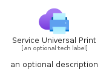
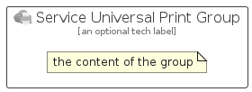

# ServiceUniversalPrint


```text
azure-6/Item/ManagementGovernance/ServiceUniversalPrint
```

```text
include('azure-6/Item/ManagementGovernance/ServiceUniversalPrint')
```


| Illustration | ServiceUniversalPrint | ServiceUniversalPrintCard | ServiceUniversalPrintGroup |
| :---: | :---: | :---: | :---: |
|  |  |  |  |


## ServiceUniversalPrint

### Load remotely
```plantuml
@startuml
' configures the library
!global $LIB_BASE_LOCATION="https://raw.githubusercontent.com/tmorin/plantuml-libs/master/distribution"

' loads the library's bootstrap
!include $LIB_BASE_LOCATION/bootstrap.puml

' loads the package bootstrap
include('azure-6/bootstrap')

' loads the Item which embeds the element ServiceUniversalPrint
include('azure-6/Item/ManagementGovernance/ServiceUniversalPrint')

' renders the element
ServiceUniversalPrint('ServiceUniversalPrint', 'Service Universal Print', 'an optional tech label', 'an optional description')
@enduml
```

### Load locally
```plantuml
@startuml
' configures the library
!global $INCLUSION_MODE="local"
!global $LIB_BASE_LOCATION="../../.."

' loads the library's bootstrap
!include $LIB_BASE_LOCATION/bootstrap.puml

' loads the package bootstrap
include('azure-6/bootstrap')

' loads the Item which embeds the element ServiceUniversalPrint
include('azure-6/Item/ManagementGovernance/ServiceUniversalPrint')

' renders the element
ServiceUniversalPrint('ServiceUniversalPrint', 'Service Universal Print', 'an optional tech label', 'an optional description')
@enduml
```

## ServiceUniversalPrintCard

### Load remotely
```plantuml
@startuml
' configures the library
!global $LIB_BASE_LOCATION="https://raw.githubusercontent.com/tmorin/plantuml-libs/master/distribution"

' loads the library's bootstrap
!include $LIB_BASE_LOCATION/bootstrap.puml

' loads the package bootstrap
include('azure-6/bootstrap')

' loads the Item which embeds the element ServiceUniversalPrintCard
include('azure-6/Item/ManagementGovernance/ServiceUniversalPrint')

' renders the element
ServiceUniversalPrintCard('ServiceUniversalPrintCard', 'Service Universal Print Card', 'an optional description')
@enduml
```

### Load locally
```plantuml
@startuml
' configures the library
!global $INCLUSION_MODE="local"
!global $LIB_BASE_LOCATION="../../.."

' loads the library's bootstrap
!include $LIB_BASE_LOCATION/bootstrap.puml

' loads the package bootstrap
include('azure-6/bootstrap')

' loads the Item which embeds the element ServiceUniversalPrintCard
include('azure-6/Item/ManagementGovernance/ServiceUniversalPrint')

' renders the element
ServiceUniversalPrintCard('ServiceUniversalPrintCard', 'Service Universal Print Card', 'an optional description')
@enduml
```

## ServiceUniversalPrintGroup

### Load remotely
```plantuml
@startuml
' configures the library
!global $LIB_BASE_LOCATION="https://raw.githubusercontent.com/tmorin/plantuml-libs/master/distribution"

' loads the library's bootstrap
!include $LIB_BASE_LOCATION/bootstrap.puml

' loads the package bootstrap
include('azure-6/bootstrap')

' loads the Item which embeds the element ServiceUniversalPrintGroup
include('azure-6/Item/ManagementGovernance/ServiceUniversalPrint')

' renders the element
ServiceUniversalPrintGroup('ServiceUniversalPrintGroup', 'Service Universal Print Group', 'an optional tech label') {
    note as note
        the content of the group
    end note
}
@enduml
```

### Load locally
```plantuml
@startuml
' configures the library
!global $INCLUSION_MODE="local"
!global $LIB_BASE_LOCATION="../../.."

' loads the library's bootstrap
!include $LIB_BASE_LOCATION/bootstrap.puml

' loads the package bootstrap
include('azure-6/bootstrap')

' loads the Item which embeds the element ServiceUniversalPrintGroup
include('azure-6/Item/ManagementGovernance/ServiceUniversalPrint')

' renders the element
ServiceUniversalPrintGroup('ServiceUniversalPrintGroup', 'Service Universal Print Group', 'an optional tech label') {
    note as note
        the content of the group
    end note
}
@enduml
```

