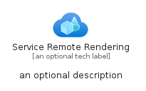
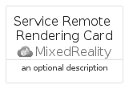

# ServiceRemoteRendering


```text
azure-6/Item/MixedReality/ServiceRemoteRendering
```

```text
include('azure-6/Item/MixedReality/ServiceRemoteRendering')
```


| Illustration | ServiceRemoteRendering | ServiceRemoteRenderingCard | ServiceRemoteRenderingGroup |
| :---: | :---: | :---: | :---: |
|  |  |  |  |


## ServiceRemoteRendering

### Load remotely
```plantuml
@startuml
' configures the library
!global $LIB_BASE_LOCATION="https://raw.githubusercontent.com/tmorin/plantuml-libs/master/distribution"

' loads the library's bootstrap
!include $LIB_BASE_LOCATION/bootstrap.puml

' loads the package bootstrap
include('azure-6/bootstrap')

' loads the Item which embeds the element ServiceRemoteRendering
include('azure-6/Item/MixedReality/ServiceRemoteRendering')

' renders the element
ServiceRemoteRendering('ServiceRemoteRendering', 'Service Remote Rendering', 'an optional tech label', 'an optional description')
@enduml
```

### Load locally
```plantuml
@startuml
' configures the library
!global $INCLUSION_MODE="local"
!global $LIB_BASE_LOCATION="../../.."

' loads the library's bootstrap
!include $LIB_BASE_LOCATION/bootstrap.puml

' loads the package bootstrap
include('azure-6/bootstrap')

' loads the Item which embeds the element ServiceRemoteRendering
include('azure-6/Item/MixedReality/ServiceRemoteRendering')

' renders the element
ServiceRemoteRendering('ServiceRemoteRendering', 'Service Remote Rendering', 'an optional tech label', 'an optional description')
@enduml
```

## ServiceRemoteRenderingCard

### Load remotely
```plantuml
@startuml
' configures the library
!global $LIB_BASE_LOCATION="https://raw.githubusercontent.com/tmorin/plantuml-libs/master/distribution"

' loads the library's bootstrap
!include $LIB_BASE_LOCATION/bootstrap.puml

' loads the package bootstrap
include('azure-6/bootstrap')

' loads the Item which embeds the element ServiceRemoteRenderingCard
include('azure-6/Item/MixedReality/ServiceRemoteRendering')

' renders the element
ServiceRemoteRenderingCard('ServiceRemoteRenderingCard', 'Service Remote Rendering Card', 'an optional description')
@enduml
```

### Load locally
```plantuml
@startuml
' configures the library
!global $INCLUSION_MODE="local"
!global $LIB_BASE_LOCATION="../../.."

' loads the library's bootstrap
!include $LIB_BASE_LOCATION/bootstrap.puml

' loads the package bootstrap
include('azure-6/bootstrap')

' loads the Item which embeds the element ServiceRemoteRenderingCard
include('azure-6/Item/MixedReality/ServiceRemoteRendering')

' renders the element
ServiceRemoteRenderingCard('ServiceRemoteRenderingCard', 'Service Remote Rendering Card', 'an optional description')
@enduml
```

## ServiceRemoteRenderingGroup

### Load remotely
```plantuml
@startuml
' configures the library
!global $LIB_BASE_LOCATION="https://raw.githubusercontent.com/tmorin/plantuml-libs/master/distribution"

' loads the library's bootstrap
!include $LIB_BASE_LOCATION/bootstrap.puml

' loads the package bootstrap
include('azure-6/bootstrap')

' loads the Item which embeds the element ServiceRemoteRenderingGroup
include('azure-6/Item/MixedReality/ServiceRemoteRendering')

' renders the element
ServiceRemoteRenderingGroup('ServiceRemoteRenderingGroup', 'Service Remote Rendering Group', 'an optional tech label') {
    note as note
        the content of the group
    end note
}
@enduml
```

### Load locally
```plantuml
@startuml
' configures the library
!global $INCLUSION_MODE="local"
!global $LIB_BASE_LOCATION="../../.."

' loads the library's bootstrap
!include $LIB_BASE_LOCATION/bootstrap.puml

' loads the package bootstrap
include('azure-6/bootstrap')

' loads the Item which embeds the element ServiceRemoteRenderingGroup
include('azure-6/Item/MixedReality/ServiceRemoteRendering')

' renders the element
ServiceRemoteRenderingGroup('ServiceRemoteRenderingGroup', 'Service Remote Rendering Group', 'an optional tech label') {
    note as note
        the content of the group
    end note
}
@enduml
```

