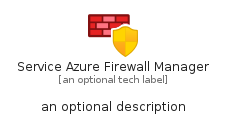
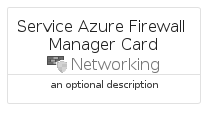
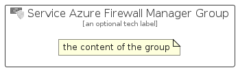

# ServiceAzureFirewallManager


```text
azure-6/Item/Networking/ServiceAzureFirewallManager
```

```text
include('azure-6/Item/Networking/ServiceAzureFirewallManager')
```


| Illustration | ServiceAzureFirewallManager | ServiceAzureFirewallManagerCard | ServiceAzureFirewallManagerGroup |
| :---: | :---: | :---: | :---: |
|  |  |  |  |


## ServiceAzureFirewallManager

### Load remotely
```plantuml
@startuml
' configures the library
!global $LIB_BASE_LOCATION="https://raw.githubusercontent.com/tmorin/plantuml-libs/master/distribution"

' loads the library's bootstrap
!include $LIB_BASE_LOCATION/bootstrap.puml

' loads the package bootstrap
include('azure-6/bootstrap')

' loads the Item which embeds the element ServiceAzureFirewallManager
include('azure-6/Item/Networking/ServiceAzureFirewallManager')

' renders the element
ServiceAzureFirewallManager('ServiceAzureFirewallManager', 'Service Azure Firewall Manager', 'an optional tech label', 'an optional description')
@enduml
```

### Load locally
```plantuml
@startuml
' configures the library
!global $INCLUSION_MODE="local"
!global $LIB_BASE_LOCATION="../../.."

' loads the library's bootstrap
!include $LIB_BASE_LOCATION/bootstrap.puml

' loads the package bootstrap
include('azure-6/bootstrap')

' loads the Item which embeds the element ServiceAzureFirewallManager
include('azure-6/Item/Networking/ServiceAzureFirewallManager')

' renders the element
ServiceAzureFirewallManager('ServiceAzureFirewallManager', 'Service Azure Firewall Manager', 'an optional tech label', 'an optional description')
@enduml
```

## ServiceAzureFirewallManagerCard

### Load remotely
```plantuml
@startuml
' configures the library
!global $LIB_BASE_LOCATION="https://raw.githubusercontent.com/tmorin/plantuml-libs/master/distribution"

' loads the library's bootstrap
!include $LIB_BASE_LOCATION/bootstrap.puml

' loads the package bootstrap
include('azure-6/bootstrap')

' loads the Item which embeds the element ServiceAzureFirewallManagerCard
include('azure-6/Item/Networking/ServiceAzureFirewallManager')

' renders the element
ServiceAzureFirewallManagerCard('ServiceAzureFirewallManagerCard', 'Service Azure Firewall Manager Card', 'an optional description')
@enduml
```

### Load locally
```plantuml
@startuml
' configures the library
!global $INCLUSION_MODE="local"
!global $LIB_BASE_LOCATION="../../.."

' loads the library's bootstrap
!include $LIB_BASE_LOCATION/bootstrap.puml

' loads the package bootstrap
include('azure-6/bootstrap')

' loads the Item which embeds the element ServiceAzureFirewallManagerCard
include('azure-6/Item/Networking/ServiceAzureFirewallManager')

' renders the element
ServiceAzureFirewallManagerCard('ServiceAzureFirewallManagerCard', 'Service Azure Firewall Manager Card', 'an optional description')
@enduml
```

## ServiceAzureFirewallManagerGroup

### Load remotely
```plantuml
@startuml
' configures the library
!global $LIB_BASE_LOCATION="https://raw.githubusercontent.com/tmorin/plantuml-libs/master/distribution"

' loads the library's bootstrap
!include $LIB_BASE_LOCATION/bootstrap.puml

' loads the package bootstrap
include('azure-6/bootstrap')

' loads the Item which embeds the element ServiceAzureFirewallManagerGroup
include('azure-6/Item/Networking/ServiceAzureFirewallManager')

' renders the element
ServiceAzureFirewallManagerGroup('ServiceAzureFirewallManagerGroup', 'Service Azure Firewall Manager Group', 'an optional tech label') {
    note as note
        the content of the group
    end note
}
@enduml
```

### Load locally
```plantuml
@startuml
' configures the library
!global $INCLUSION_MODE="local"
!global $LIB_BASE_LOCATION="../../.."

' loads the library's bootstrap
!include $LIB_BASE_LOCATION/bootstrap.puml

' loads the package bootstrap
include('azure-6/bootstrap')

' loads the Item which embeds the element ServiceAzureFirewallManagerGroup
include('azure-6/Item/Networking/ServiceAzureFirewallManager')

' renders the element
ServiceAzureFirewallManagerGroup('ServiceAzureFirewallManagerGroup', 'Service Azure Firewall Manager Group', 'an optional tech label') {
    note as note
        the content of the group
    end note
}
@enduml
```

