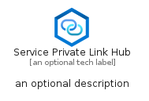

# ServicePrivateLinkHub


```text
azure-6/Item/Networking/ServicePrivateLinkHub
```

```text
include('azure-6/Item/Networking/ServicePrivateLinkHub')
```


| Illustration | ServicePrivateLinkHub | ServicePrivateLinkHubCard | ServicePrivateLinkHubGroup |
| :---: | :---: | :---: | :---: |
|  |  |  |  |


## ServicePrivateLinkHub

### Load remotely
```plantuml
@startuml
' configures the library
!global $LIB_BASE_LOCATION="https://raw.githubusercontent.com/tmorin/plantuml-libs/master/distribution"

' loads the library's bootstrap
!include $LIB_BASE_LOCATION/bootstrap.puml

' loads the package bootstrap
include('azure-6/bootstrap')

' loads the Item which embeds the element ServicePrivateLinkHub
include('azure-6/Item/Networking/ServicePrivateLinkHub')

' renders the element
ServicePrivateLinkHub('ServicePrivateLinkHub', 'Service Private Link Hub', 'an optional tech label', 'an optional description')
@enduml
```

### Load locally
```plantuml
@startuml
' configures the library
!global $INCLUSION_MODE="local"
!global $LIB_BASE_LOCATION="../../.."

' loads the library's bootstrap
!include $LIB_BASE_LOCATION/bootstrap.puml

' loads the package bootstrap
include('azure-6/bootstrap')

' loads the Item which embeds the element ServicePrivateLinkHub
include('azure-6/Item/Networking/ServicePrivateLinkHub')

' renders the element
ServicePrivateLinkHub('ServicePrivateLinkHub', 'Service Private Link Hub', 'an optional tech label', 'an optional description')
@enduml
```

## ServicePrivateLinkHubCard

### Load remotely
```plantuml
@startuml
' configures the library
!global $LIB_BASE_LOCATION="https://raw.githubusercontent.com/tmorin/plantuml-libs/master/distribution"

' loads the library's bootstrap
!include $LIB_BASE_LOCATION/bootstrap.puml

' loads the package bootstrap
include('azure-6/bootstrap')

' loads the Item which embeds the element ServicePrivateLinkHubCard
include('azure-6/Item/Networking/ServicePrivateLinkHub')

' renders the element
ServicePrivateLinkHubCard('ServicePrivateLinkHubCard', 'Service Private Link Hub Card', 'an optional description')
@enduml
```

### Load locally
```plantuml
@startuml
' configures the library
!global $INCLUSION_MODE="local"
!global $LIB_BASE_LOCATION="../../.."

' loads the library's bootstrap
!include $LIB_BASE_LOCATION/bootstrap.puml

' loads the package bootstrap
include('azure-6/bootstrap')

' loads the Item which embeds the element ServicePrivateLinkHubCard
include('azure-6/Item/Networking/ServicePrivateLinkHub')

' renders the element
ServicePrivateLinkHubCard('ServicePrivateLinkHubCard', 'Service Private Link Hub Card', 'an optional description')
@enduml
```

## ServicePrivateLinkHubGroup

### Load remotely
```plantuml
@startuml
' configures the library
!global $LIB_BASE_LOCATION="https://raw.githubusercontent.com/tmorin/plantuml-libs/master/distribution"

' loads the library's bootstrap
!include $LIB_BASE_LOCATION/bootstrap.puml

' loads the package bootstrap
include('azure-6/bootstrap')

' loads the Item which embeds the element ServicePrivateLinkHubGroup
include('azure-6/Item/Networking/ServicePrivateLinkHub')

' renders the element
ServicePrivateLinkHubGroup('ServicePrivateLinkHubGroup', 'Service Private Link Hub Group', 'an optional tech label') {
    note as note
        the content of the group
    end note
}
@enduml
```

### Load locally
```plantuml
@startuml
' configures the library
!global $INCLUSION_MODE="local"
!global $LIB_BASE_LOCATION="../../.."

' loads the library's bootstrap
!include $LIB_BASE_LOCATION/bootstrap.puml

' loads the package bootstrap
include('azure-6/bootstrap')

' loads the Item which embeds the element ServicePrivateLinkHubGroup
include('azure-6/Item/Networking/ServicePrivateLinkHub')

' renders the element
ServicePrivateLinkHubGroup('ServicePrivateLinkHubGroup', 'Service Private Link Hub Group', 'an optional tech label') {
    note as note
        the content of the group
    end note
}
@enduml
```

