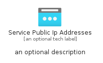
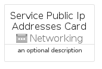
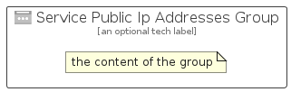

# ServicePublicIpAddresses


```text
azure-6/Item/Networking/ServicePublicIpAddresses
```

```text
include('azure-6/Item/Networking/ServicePublicIpAddresses')
```


| Illustration | ServicePublicIpAddresses | ServicePublicIpAddressesCard | ServicePublicIpAddressesGroup |
| :---: | :---: | :---: | :---: |
|  |  |  |  |


## ServicePublicIpAddresses

### Load remotely
```plantuml
@startuml
' configures the library
!global $LIB_BASE_LOCATION="https://raw.githubusercontent.com/tmorin/plantuml-libs/master/distribution"

' loads the library's bootstrap
!include $LIB_BASE_LOCATION/bootstrap.puml

' loads the package bootstrap
include('azure-6/bootstrap')

' loads the Item which embeds the element ServicePublicIpAddresses
include('azure-6/Item/Networking/ServicePublicIpAddresses')

' renders the element
ServicePublicIpAddresses('ServicePublicIpAddresses', 'Service Public Ip Addresses', 'an optional tech label', 'an optional description')
@enduml
```

### Load locally
```plantuml
@startuml
' configures the library
!global $INCLUSION_MODE="local"
!global $LIB_BASE_LOCATION="../../.."

' loads the library's bootstrap
!include $LIB_BASE_LOCATION/bootstrap.puml

' loads the package bootstrap
include('azure-6/bootstrap')

' loads the Item which embeds the element ServicePublicIpAddresses
include('azure-6/Item/Networking/ServicePublicIpAddresses')

' renders the element
ServicePublicIpAddresses('ServicePublicIpAddresses', 'Service Public Ip Addresses', 'an optional tech label', 'an optional description')
@enduml
```

## ServicePublicIpAddressesCard

### Load remotely
```plantuml
@startuml
' configures the library
!global $LIB_BASE_LOCATION="https://raw.githubusercontent.com/tmorin/plantuml-libs/master/distribution"

' loads the library's bootstrap
!include $LIB_BASE_LOCATION/bootstrap.puml

' loads the package bootstrap
include('azure-6/bootstrap')

' loads the Item which embeds the element ServicePublicIpAddressesCard
include('azure-6/Item/Networking/ServicePublicIpAddresses')

' renders the element
ServicePublicIpAddressesCard('ServicePublicIpAddressesCard', 'Service Public Ip Addresses Card', 'an optional description')
@enduml
```

### Load locally
```plantuml
@startuml
' configures the library
!global $INCLUSION_MODE="local"
!global $LIB_BASE_LOCATION="../../.."

' loads the library's bootstrap
!include $LIB_BASE_LOCATION/bootstrap.puml

' loads the package bootstrap
include('azure-6/bootstrap')

' loads the Item which embeds the element ServicePublicIpAddressesCard
include('azure-6/Item/Networking/ServicePublicIpAddresses')

' renders the element
ServicePublicIpAddressesCard('ServicePublicIpAddressesCard', 'Service Public Ip Addresses Card', 'an optional description')
@enduml
```

## ServicePublicIpAddressesGroup

### Load remotely
```plantuml
@startuml
' configures the library
!global $LIB_BASE_LOCATION="https://raw.githubusercontent.com/tmorin/plantuml-libs/master/distribution"

' loads the library's bootstrap
!include $LIB_BASE_LOCATION/bootstrap.puml

' loads the package bootstrap
include('azure-6/bootstrap')

' loads the Item which embeds the element ServicePublicIpAddressesGroup
include('azure-6/Item/Networking/ServicePublicIpAddresses')

' renders the element
ServicePublicIpAddressesGroup('ServicePublicIpAddressesGroup', 'Service Public Ip Addresses Group', 'an optional tech label') {
    note as note
        the content of the group
    end note
}
@enduml
```

### Load locally
```plantuml
@startuml
' configures the library
!global $INCLUSION_MODE="local"
!global $LIB_BASE_LOCATION="../../.."

' loads the library's bootstrap
!include $LIB_BASE_LOCATION/bootstrap.puml

' loads the package bootstrap
include('azure-6/bootstrap')

' loads the Item which embeds the element ServicePublicIpAddressesGroup
include('azure-6/Item/Networking/ServicePublicIpAddresses')

' renders the element
ServicePublicIpAddressesGroup('ServicePublicIpAddressesGroup', 'Service Public Ip Addresses Group', 'an optional tech label') {
    note as note
        the content of the group
    end note
}
@enduml
```

