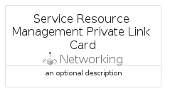

# ServiceResourceManagementPrivateLink


```text
azure-6/Item/Networking/ServiceResourceManagementPrivateLink
```

```text
include('azure-6/Item/Networking/ServiceResourceManagementPrivateLink')
```


| Illustration | ServiceResourceManagementPrivateLink | ServiceResourceManagementPrivateLinkCard | ServiceResourceManagementPrivateLinkGroup |
| :---: | :---: | :---: | :---: |
|  |  |  |  |


## ServiceResourceManagementPrivateLink

### Load remotely
```plantuml
@startuml
' configures the library
!global $LIB_BASE_LOCATION="https://raw.githubusercontent.com/tmorin/plantuml-libs/master/distribution"

' loads the library's bootstrap
!include $LIB_BASE_LOCATION/bootstrap.puml

' loads the package bootstrap
include('azure-6/bootstrap')

' loads the Item which embeds the element ServiceResourceManagementPrivateLink
include('azure-6/Item/Networking/ServiceResourceManagementPrivateLink')

' renders the element
ServiceResourceManagementPrivateLink('ServiceResourceManagementPrivateLink', 'Service Resource Management Private Link', 'an optional tech label', 'an optional description')
@enduml
```

### Load locally
```plantuml
@startuml
' configures the library
!global $INCLUSION_MODE="local"
!global $LIB_BASE_LOCATION="../../.."

' loads the library's bootstrap
!include $LIB_BASE_LOCATION/bootstrap.puml

' loads the package bootstrap
include('azure-6/bootstrap')

' loads the Item which embeds the element ServiceResourceManagementPrivateLink
include('azure-6/Item/Networking/ServiceResourceManagementPrivateLink')

' renders the element
ServiceResourceManagementPrivateLink('ServiceResourceManagementPrivateLink', 'Service Resource Management Private Link', 'an optional tech label', 'an optional description')
@enduml
```

## ServiceResourceManagementPrivateLinkCard

### Load remotely
```plantuml
@startuml
' configures the library
!global $LIB_BASE_LOCATION="https://raw.githubusercontent.com/tmorin/plantuml-libs/master/distribution"

' loads the library's bootstrap
!include $LIB_BASE_LOCATION/bootstrap.puml

' loads the package bootstrap
include('azure-6/bootstrap')

' loads the Item which embeds the element ServiceResourceManagementPrivateLinkCard
include('azure-6/Item/Networking/ServiceResourceManagementPrivateLink')

' renders the element
ServiceResourceManagementPrivateLinkCard('ServiceResourceManagementPrivateLinkCard', 'Service Resource Management Private Link Card', 'an optional description')
@enduml
```

### Load locally
```plantuml
@startuml
' configures the library
!global $INCLUSION_MODE="local"
!global $LIB_BASE_LOCATION="../../.."

' loads the library's bootstrap
!include $LIB_BASE_LOCATION/bootstrap.puml

' loads the package bootstrap
include('azure-6/bootstrap')

' loads the Item which embeds the element ServiceResourceManagementPrivateLinkCard
include('azure-6/Item/Networking/ServiceResourceManagementPrivateLink')

' renders the element
ServiceResourceManagementPrivateLinkCard('ServiceResourceManagementPrivateLinkCard', 'Service Resource Management Private Link Card', 'an optional description')
@enduml
```

## ServiceResourceManagementPrivateLinkGroup

### Load remotely
```plantuml
@startuml
' configures the library
!global $LIB_BASE_LOCATION="https://raw.githubusercontent.com/tmorin/plantuml-libs/master/distribution"

' loads the library's bootstrap
!include $LIB_BASE_LOCATION/bootstrap.puml

' loads the package bootstrap
include('azure-6/bootstrap')

' loads the Item which embeds the element ServiceResourceManagementPrivateLinkGroup
include('azure-6/Item/Networking/ServiceResourceManagementPrivateLink')

' renders the element
ServiceResourceManagementPrivateLinkGroup('ServiceResourceManagementPrivateLinkGroup', 'Service Resource Management Private Link Group', 'an optional tech label') {
    note as note
        the content of the group
    end note
}
@enduml
```

### Load locally
```plantuml
@startuml
' configures the library
!global $INCLUSION_MODE="local"
!global $LIB_BASE_LOCATION="../../.."

' loads the library's bootstrap
!include $LIB_BASE_LOCATION/bootstrap.puml

' loads the package bootstrap
include('azure-6/bootstrap')

' loads the Item which embeds the element ServiceResourceManagementPrivateLinkGroup
include('azure-6/Item/Networking/ServiceResourceManagementPrivateLink')

' renders the element
ServiceResourceManagementPrivateLinkGroup('ServiceResourceManagementPrivateLinkGroup', 'Service Resource Management Private Link Group', 'an optional tech label') {
    note as note
        the content of the group
    end note
}
@enduml
```

